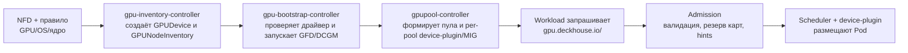

<!--
Copyright 2025 Flant JSC

Licensed under the Apache License, Version 2.0 (the "License");
you may not use this file except in compliance with the License.
You may obtain a copy of the License at

    http://www.apache.org/licenses/LICENSE-2.0

Unless required by applicable law or agreed to in writing, software
distributed under the License is distributed on an "AS IS" BASIS,
WITHOUT WARRANTIES OR CONDITIONS OF ANY KIND, either express or implied.
See the License for the specific language governing permissions and
limitations under the License.
-->

# ADR (короткая версия): GPU control plane DKP

## 1. Описание

Модуль GPU control plane автоматически инвентаризирует GPU-узлы, запускает необходимый стек (GFD, DCGM, device-plugin/MIG manager) только там, где это нужно, и выдаёт ресурсы через CR `GPUPool`. Пользователи запрашивают GPU стандартным способом (`resources.limits`), а модуль берёт на себя подготовку карт, нарезку MIG/time-slice и соблюдение политик доступа.

## 2. Контекст и мотивация

- Сегодня GPU подключают ручной настройкой NodeGroup и DaemonSet'ов. Статуса готовности карт и общих политик нет.
- Требования: централизованный жизненный цикл карты (обнаружение → подготовка → эксплуатация → вывод), соблюдение квот и доступов (Dex/namespace), встроенный мониторинг и минимальные ручные операции.
- В DKP уже есть NFD, GFD, DCGM и device-plugin — их переиспользуем, добавив управляющие контроллеры.

## 3. Архитектура решения

| Компонент                  | Роль                                                                                              |
| -------------------------- | ------------------------------------------------------------------------------------------------- |
| `gpu-inventory-controller` | Читает `Node`/`NodeFeature`, создаёт `GPUDevice`, агрегирует состояние узла в `GPUNodeInventory`. |
| `gpu-bootstrap-controller` | Проверяет драйвер/toolkit, запускает GFD/DCGM, отмечает готовность `ReadyForPooling`.             |
| `gpupool-controller`       | Управляет `GPUPool`, конфигурирует per-pool device-plugin/MIG-manager, ведёт статусы.             |
| `gpu-admission-webhook`    | Валидирует доступ, резервирует устройства, добавляет подсказки для scheduler.                     |

Все служебные ресурсы живут в `d8-gpu-operator`. ModuleConfig включает модуль и подтягивает
шаблон NodeFeatureRule для GPU и ОС/ядра; остальные параметры используют значения по умолчанию.

## 4. Ключевые сущности (только покартовый режим)

- **`GPUDevice`** – один CR на PCI-устройство. `status` хранит `inventoryID`, аппаратные атрибуты, состояние (`Unassigned/Reserved/Assigned/Faulted`) и телеметрию DCGM.
- **`GPUNodeInventory`** – агрегат по узлу: список устройств, информация о драйвере/toolkit, bootstrap/monitoring и очереди `pools.pending[]`/`assigned[]`; управление выполняется только покартово.
- **`GPUPool`** – логический пул карт. Важные поля: `resource.name` (`gpu.deckhouse.io/<pool>`), `deviceSelector` (какие карты брать), `allocation` (Exclusive/MIG/TimeSlice), `access`/`scheduling`.
- **Shared-пул** и автоматическое заимствование карточек — выносится в следующий этап (см. «Дальнейшие шаги»).

## 5. Базовый поток

Новый узел после bootstrap получает карты в `pending[]`. Подтверждение (или автоматика) ставит аннотацию `gpu.deckhouse.io/assignment=<pool>` на каждую карту, и device-plugin публикует ресурс `gpu.deckhouse.io/<pool>`.

## 6. Операции

- **Подтвердить карту** – в UI или PATCH добавить аннотацию `gpu.deckhouse.io/assignment=<pool>`; при `requireAnnotation=false` это делает контроллер.
- **Обновление device-plugin** – `gpupool-controller` ведёт ConfigMap с перечнем доступных `inventoryID` и при изменениях перезапускает per-pool device-plugin, чтобы kubelet видел актуальный набор карт (работающие Pod'ы не прерываются).
- **Maintenance** – изменение `spec.allocation` автоматически переводит пул в `Maintenance`: новые запросы отклоняются, текущие Pod'ы завершают работу, контроллер ждёт `status.capacity.used=0`, перестраивает DaemonSet и снимает maintenance.
- **Переназначить карту** – удалить текущую аннотацию, дождаться `Unassigned`, затем поставить новую.

## 7. Мониторинг и алерты

- Метрики: `gpupool_capacity_*`, `gpu_device_unassigned_total`, `gpu_device_reserved_total`, `kube_node_status_allocatable`.
- Алерты: `GPUDriverMissing`, `GPUNodeWithoutPool`, `GPUPoolCapacityLow`, `GPUReservationExpired`, `Maintenance`, `Misconfigured` – всё дублируется в Kubernetes Events и лог-стеке DKP.

## 8. Риски и меры

| Риск                                          | Митигирование                                                                                  |
| --------------------------------------------- | ---------------------------------------------------------------------------------------------- |
| Некорректные лейблы NFD → карта не распознана | e2e `gpu-nfd-coverage`, condition `InventoryIncomplete` блокирует выдачу.                      |
| Расхождение MIG/конфигурации                  | Автоматический `Maintenance`, событие `Misconfigured`, ручное подтверждение после исправления. |
| Зависшие брони                                | TTL на `Reserved`, метрики и алерт `GPUReservationExpired`.                                    |
| Кандидаты без решения оператора               | `GPUNodeWithoutPool`, ручное подтверждение площадок.                                           |
| Ошибки доступа                                | Admission + OperationPolicy; управляемые поля защищены от ручных правок.                       |

## 9. Статус и дальнейшие шаги

- OpenAPI для `GPUDevice`, `GPUNodeInventory`, `GPUPool` и `ModuleConfig` описаны.
- Прототипы контроллеров проходят ревью; unit/e2e тесты и мониторинг в работе.
- В планах: поддержка дополнительных вендоров, NUMA-aware размещение, shared-пул с автоматическим заимствованием карт, интеграция с HAMi/Volcano, автоматизация обновления драйверов.
