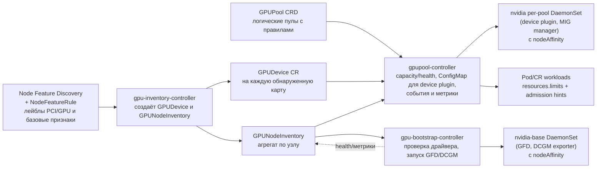
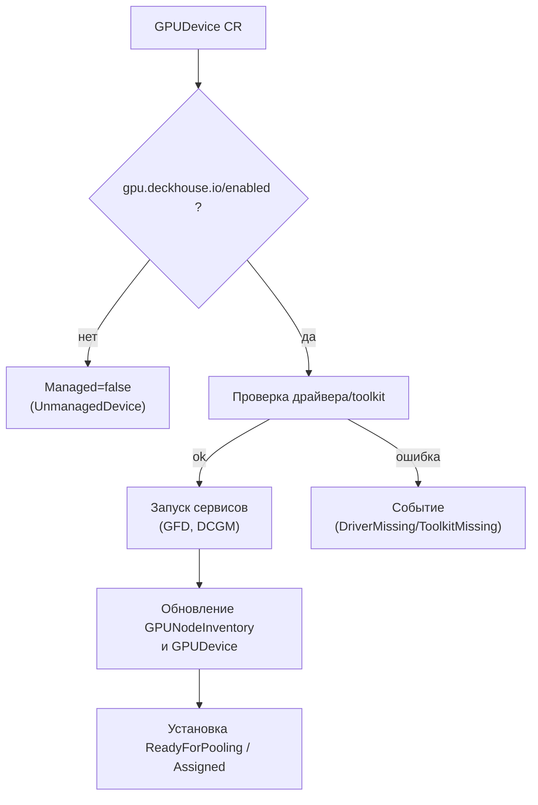
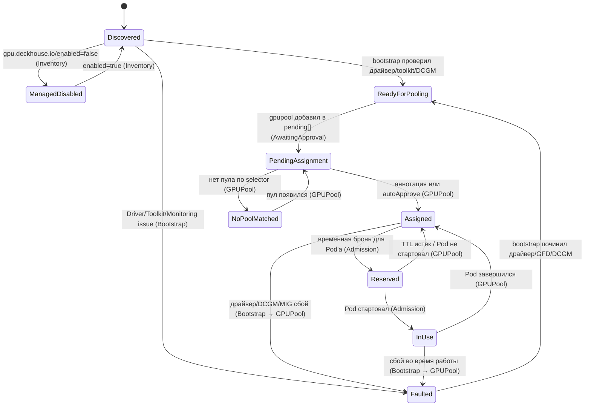
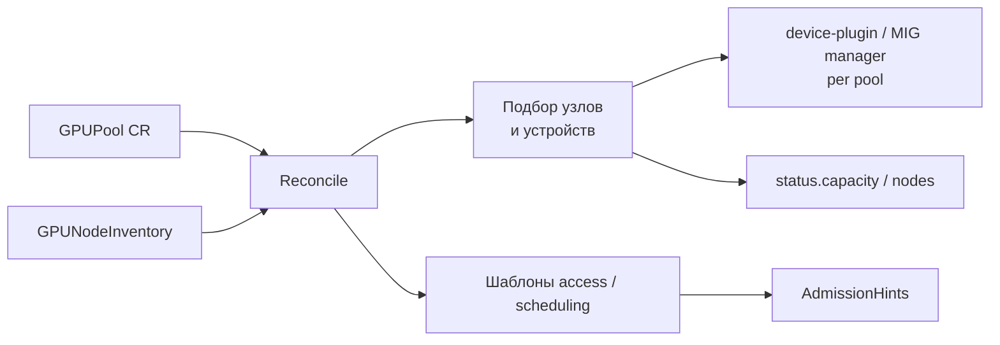
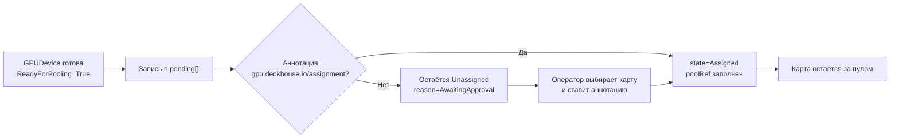
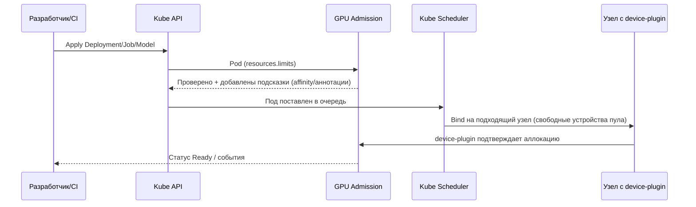

<!--
Copyright 2025 Flant JSC

Licensed under the Apache License, Version 2.0 (the "License");
you may not use this file except in compliance with the License.
You may obtain a copy of the License at

    http://www.apache.org/licenses/LICENSE-2.0

Unless required by applicable law or agreed to in writing, software
distributed under the License is distributed on an "AS IS" BASIS,
WITHOUT WARRANTIES OR CONDITIONS OF ANY KIND, either express or implied.
See the License for the specific language governing permissions and
limitations under the License.
-->

# ADR: GPU control plane DKP

## Описание

Строим модуль GPU control plane, который:

1. Автоматически обнаруживает GPU на узлах кластера, используя существующий модуль Node Feature Discovery.
2. Инициирует необходимые сервисы (GFD, DCGM, device plugin, MIG manager) только на тех узлах, где они нужны.
3. Управляет конфигурацией GPU через декларативный CR `GPUPool`, описывающий правила нарезки, доступ и алгоритм подготовки карты.
4. Предоставляет привычный для Kubernetes интерфейс запроса ресурсов (`resources.limits`), одновременно поддерживая расширенные сценарии (MIG, time-slicing) и контроль доступа/квот.

## Контекст

- В текущих конфигурациях GPU-узлы описываются вручную: администратор заранее знает, где есть ускорители, настраивает NodeGroup, после чего включается GFD/DCGM/device plugin на всех узлах выбранной группы. Прикладные модули сами следят за taint/label и ёмкостью.
- Такой подход не масштабируется: сложно добавлять новые узлы/карты, нет прозрачного статуса "драйвер не установлен", "MIG не настроен", "карта простаивает".
- В DKP уже есть инфраструктурные строительные блоки: `nvidia-device-plugin`, `nvidia-mig-manager`, `nvidia-dcgm`, `nvidia-gpu-feature-discovery` (GFD), `node-feature-discovery` (NFD). Мы переиспользуем их, но строим поверх них новую архитектуру control plane, которая централизует управление, а не повторяет текущие подходы NodeGroup.
- Обнаружение железа по-прежнему выполняет Node Feature Discovery (NFD) со своими правилами, однако дальнейшая логика подготовки, нарезки и выдачи ресурсов переносится в новый GPU-контроллер.
- Enterprise-требования: полная видимость жизненного цикла GPU (обнаружение → подготовка → эксплуатация → вывод), контроль доступа/квот, встроенный мониторинг ресурсов и health-состояния, интеграция с текущими DKP-политиками, возможность расширения без переписывания архитектуры.

## Мотивация / Боль

- Инженерам не хватает централизованной инвентаризации GPU: трудно определить, на каких узлах карты готовы к работе, какие требуют драйвера или внимания.
- Команды приложений вынуждены обращаться к конкретным нодам и вручную управлять taint/label, что усложняет масштабирование и миграции.
- Политики доступа и квоты реализуются ad-hoc: Dex-группы, namespaces и проекты не синхронизированы между собой.
- Наблюдаемость приходит «в нагрузку» с отдельными компонентами, но нет единого места, где можно увидеть состояние карт, пулов и их загрузку.

## Область

- Управление жизненным циклом GPU на уровне Kubernetes: обнаружение (`GPUDevice`), агрегирование (`GPUNodeInventory`), формирование пулов (`GPUPool`) и интеграция с admission.
- Автоматизация запуска GFD/DCGM/device plugin/MIG manager только на узлах, где карты подтверждены и отмечены как управляемые.
- Интеграция с модулями DKP (multitenancy, observability, policy-engine), публикация статусов и метрик для внешних модулей.
- Не включает установку проприетарных драйверов и инструментов на узлы, а также разработку пользовательских UI — эти области закрываются другими инициативами.

## Цели

- Автоматизировать цепочку "узел → наличие GPU → готовность к работе → включение в пул" без ручных описаний.
- Обеспечить безопасное и явное конфигурирование GFD/DCGM/device plugin/MIG manager на уровне control plane, а не через NodeGroup.
- Ввести понятие `GPUPool`, через которое описывается нарезка (целая карта, MIG, time-slicing), доступ и lifecycle карт.
- Дать стандартизированный способ запрашивать ресурсы.
- Построить поэтапный путь: сначала обнаружение и диагностика, затем bootstrap, далее пулы и, наконец, расширенные сценарии (например, автоматическая установка драйверов).

## Не цели

- Не заменяем существующие компоненты NVIDIA (device plugin, MIG manager, GFD, DCGM) — мы управляём их запуском.
- Не внедряем внешние scheduler/extender (Volcano, HAMi) — рассматриваем их позже, если появится потребность, которую нельзя закрыть стандартным scheduler.
- На первом этапе не устанавливаем драйвер автоматически: подсвечиваем проблему и предоставляем операторам регламент ручного обновления.

## Пользовательские сценарии

- **Кластерный администратор.**

  - Включает модуль, заполняет минимальный `ModuleConfig`; все обнаруженные узлы считаются управляемыми, если их явно не отключить.
  - Проектирует и сопровождает `GPUPool`: задаёт `deviceSelector`, режим выделения (`Exclusive/MIG/TimeSlice`), политики `deviceAssignment`, проверяет работу auto-attach.
  - Добавляет новые GPU-узлы: достаточно дождаться `ReadyForPooling`; при необходимости исключить узел - задаёт `gpu.deckhouse.io/enabled=false`.
  - Перераспределяет карты: анализирует `GPUNodeInventory.status.pools.pending[]`/`assigned[]` и события `GPUNodeWithoutPool`, при необходимости обновляет `deviceSelector` или создаёт новые пулы.
  - Выводит узлы из эксплуатации: переводит пул/узел в `Maintenance`, устанавливает `gpu.deckhouse.io/enabled=false`, дожидается освобождения workloads, остановки DaemonSet’ов и очистки ресурсов.
  - Обновляет драйверы/toolkit: реагирует на `DriverMissing`, координирует обновления, подтверждает возвращение узлов в пулы.
  - Управляет аварийными ситуациями (например, критические Xid (ошибки драйвера NVIDIA)): помечает узлы на обслуживание, координирует замену карт; `UnassignedDevice` после восстановления исчезает автоматически, когда контроллер подтверждает готовность устройства.

- **Разработчик приложения.**

  - Создаёт workload, указывая `resources.limits` с нужным пулом, и проверяет, что admission добавил подсказки и Pod запустился.
  - Масштабирует приложение: меняет лимиты, следит за появлением событий `Insufficient gpu.deckhouse.io/<pool>` или успешным выделением нескольких карт.
  - Переключает модель на другой пул (например, MIG ←→ Exclusive), обновляет deployment, следит за событиями и алертами при миграции.
  - Диагностирует проблемы: читает условия Pod и события (`UnassignedDevice`, `ManagedDisabled`), обращается к платформенной команде при нехватке ресурсов.

- **SRE.**
  - Работает с мониторингом: использует автоматически включённые дашборды по `gpupool_capacity_*`, `gpu_device_unassigned_total`, следит за трендами utilization.
  - Реагирует на алерты (`GPUUnassignedDevice`, `GPUNodeWithoutPool`, `GPUPoolCapacityLow`, `GPUDeviceDegraded`): связывается с платформенной командой, помогает оценить влияние.
  - Проводит post-mortem: анализирует события/статусы `GPUDevice` и `GPUPool` после инцидента, фиксирует рекомендации (например, автоматизировать метки).
  - Поддерживает SLO: собирает метрики availability пулов, планирует capacity, инициирует расширение кластера или перераспределение workload’ов.

## Решение

- Архитектура состоит из трёх последовательных этапов: обнаружение устройств (NFD → `GPUDevice`/`GPUNodeInventory`), подготовка узлов (bootstrap-контроллер, запуск GFD/DCGM) и управление пулами (`GPUPool` + admission).
- Все вспомогательные сервисы поставляются модулем и запускаются только тогда, когда карта прошла bootstrap; оператор управляет поведением через `ModuleConfig`.
- Логика распределения устройств опирается на покартовое управление (`Device`): каждая карта подтверждается отдельно и становится доступной для workload через `resources.limits`.

- Модуль GPU control plane зависит от Node Feature Discovery (NFD) версии 0.17
  или новее. При
  включении проверяем, что NFD активирован (через модуль `node-feature-discovery`).
  Если нет — выставляем условие `PrerequisiteNotMet` с рекомендацией включить
  NFD и блокируем дальнейшую инициализацию до устранения требования.
- Базовое правило NFD мы доставляем сами: при включении модуля hook
  создаёт/обновляет CR `NodeFeatureRule`, который помечает устройства
  vendor=0x10de/class=0x0300, фиксирует версии драйверов/ОС и публикует
  вспомогательные метаданные.
  - Лейблы и их назначение:
    | Лейбл | Что означает | Кем используется |
    | --- | --- | --- |
    | `gpu.deckhouse.io/present` | На узле обнаружен хотя бы один поддерживаемый адаптер | `gpu-bootstrap-controller` (решение о подготовке), `gpupool-controller` (фильтрация кандидатов), DaemonSet'ы (affinity) |
    | `gpu.deckhouse.io/device-count` | Количество найденных адаптеров | `gpupool-controller` (расчёт слотов), admission-webhook (валидация запросов) |
    | `gpu.deckhouse.io/device.<NN>.vendor` / `device` / `class` | PCI-идентификаторы конкретного устройства | `gpupool-controller` (сопоставление с `spec.deviceSelector`), `gpu-bootstrap-controller` (условия `DriverMissing`, диагностика) |
    | `gpu.deckhouse.io/driver.name` | Тип установленного драйвера (по умолчанию `nvidia`) | Мониторинг, расследование инцидентов, подготовка к поддержке других вендоров |
    | `feature.node.kubernetes.io/kernel-version.*` / `system-os_release.*` | Версии ядра и ОС, транслируемые в стандартные feature-лейблы | Bootstrap/diagnostics, чтобы эти признаки были доступны даже там, где NFD не публикует их по умолчанию |
  - В `ModuleConfig` GPU control plane оператор управляет только прикладными
    параметрами (метка управляемых узлов, авто-аппрув кандидатов, дефолтные
    стратегии планирования). Сервисные компоненты (GFD, DCGM, device-plugin)
    включаются модулем автоматически и не требуют ручных флагов.
  - Если на узле нет подходящих PCI-устройств, правило не срабатывает: лейблы
    `gpu.deckhouse.io/*` не появляются, что позволяет выбирать только GPU-ноды.
- Процесс включения:
  1. Администратор применяет `ModuleConfig` с обязательными полями.
  2. Контроллер NFD подтягивает правила и начинает навешивать лейблы/NodeFeature.
  3. `gpu-inventory-controller` на их основе создаёт/обновляет `GPUDevice` и `GPUNodeInventory`.
  4. Bootstrap-контроллер видит готовые устройства и запускает подготовку узлов.

#### 1.1 ModuleConfig (включение)

`ModuleConfig` включает модуль GPU control plane и управляет только прикладными
параметрами: какой меткой помечать управляемые узлы
(`spec.settings.managedNodes.labelKey`), включать ли узлы по умолчанию
(`enabledByDefault`), как подтверждать новые устройства
(`spec.settings.deviceApproval.mode` и селектор при режиме `Selector`), какие
подсказки планировщику задавать (`spec.settings.scheduling.*`) и какой
интервал пересинхронизации использовать
(`spec.settings.inventory.resyncPeriod`). Если оставить настройки пустыми,
модуль применяет значения по умолчанию.

При необходимости оператор может явно задать режим высокой доступности через
`spec.settings.highAvailability`. Когда параметр не указан, модуль следует
глобальным правилам Deckhouse (по доступности control-plane). Значение `true`
принудительно включает HA (две реплики контроллера и активный leader election), значение
`false` — фиксирует одиночный экземпляр даже в кластере с распределённым
control-plane.

##### 1.1.1 Минимальная конфигурация

```yaml
apiVersion: deckhouse.io/v1alpha1
kind: ModuleConfig
metadata:
  name: gpu-control-plane # имя модуля фиксированное
spec:
  enabled: true # запускаем GPU control plane с настройками по умолчанию
  settings:
    highAvailability: true
    managedNodes:
      labelKey: gpu.deckhouse.io/enabled
      enabledByDefault: true
    deviceApproval:
      mode: Manual
    scheduling:
      defaultStrategy: Spread
      topologyKey: topology.kubernetes.io/zone
    inventory:
      resyncPeriod: "30s"
  version: 1
```

- Hook модуля автоматически создаёт `NodeFeatureRule` и поддерживает его в
  актуальном состоянии.
- GFD, DCGM и device-plugin запускаются автоматически и получают `nodeAffinity`
  только на управляемые GPU-узлы после успешной проверки драйвера.
- Per-pool DaemonSet'ы (`nvidia-device-plugin`, `nvidia-mig-manager`) и
  ScrapeConfig используют встроенные образы и метки DKP; никаких
  дополнительных шагов не требуется.

- Поведение admission (время жизни брони, повторные попытки) фиксировано дефолтами
  модуля и не настраивается через ModuleConfig на стартовом этапе. При необходимости
  оператор может расширить `settings`, но базовая конфигурация в них не нуждается.

### Контракт управления ресурсами

- CRD `GPUDevice`, `GPUNodeInventory` и `GPUPool` (далее — публичные CR) рассматриваются как внешний API. Наши контроллеры:
  - не изменяют `spec`, `metadata.labels` и `metadata.annotations`, заданные пользователем;
  - могут добавлять/удалять только финалайзеры (`metadata.finalizers`) и `metadata.ownerReferences`
    (ссылки на владельца ресурса, которые Kubernetes использует для каскадного удаления);
  - заполняют `status` (типизированные поля и служебные условия) и хранят там внутреннее состояние, необходимое для корректного reconcile.
- Любые дополнительные служебные ресурсы (ConfigMap/DaemonSet/Job/TLS-секреты) считаются backend-API и полностью управляются контроллерами GPU. Внешние изменения таких объектов не поддерживаются.
- При удалении публичного CR контроллер сначала выполняет очистку (hooks, остановка DaemonSet), затем удаляет собственный финалайзер — это гарантирует, что состояние кластера останется консистентным.

### Архитектура

Модуль состоит из набора контроллеров, которые управляют жизненным циклом GPU
и сопутствующих сервисов, и DaemonSet'ов, которые запускаются только на узлах
с видеокартами. Вся служебная нагрузка размещается в пространстве имён
`d8-gpu-operator`.

#### Компоненты модуля

| Имя                          | Тип        | Назначение                                                                                    |
| ---------------------------- | ---------- | --------------------------------------------------------------------------------------------- |
| `gpu-inventory-controller-*` | Deployment | Создаёт `GPUDevice`, `GPUNodeInventory`, публикует события/метрики по инвентаризации.         |
| `gpu-bootstrap-controller-*` | Deployment | Проверяет драйвер/toolkit, запускает nvidia-оператор и базовые сервисы, меняет статусы узлов. |
| `gpupool-controller-*`       | Deployment | Управляет `GPUPool`, запускает per-pool device-plugin, следит за ёмкостью пула.               |
| `gpu-admission-webhook-*`    | Deployment | Admission webhook: валидация доступа, бронирование и очистка устройств.                       |
| `gpu-feature-discovery`      | DaemonSet  | Наклеивает GPU-лейблы и NodeFeature, используется inventory/bootstrap.                        |
| `gpu-dcgm-exporter`          | DaemonSet  | Снимает телеметрию DCGM на всех GPU-узлах и отдаёт её в Prometheus.                           |
| `gpu-device-plugin-<pool>`   | DaemonSet  | Публикует ресурс `gpu.deckhouse.io/<pool>` на узлах пула; создаётся для каждого пула.         |

`gpu-bootstrap-controller` управляет базовыми DaemonSet'ами (`nvidia-gpu-feature-discovery`,
`nvidia-dcgm-exporter`), а `gpupool-controller` —
пер-пуловыми (`nvidia-device-plugin-<pool>`, `nvidia-mig-manager-<pool>`).

Каждый контроллерный pod дополнительно содержит сайдкар `kube-api-rewriter`.
Сейчас он работает в режиме pass-through: проксирует запросы на
`https://kubernetes.default.svc`, собирает метрики (`/proxy/metrics`) и держит
единую точку, куда можно добавить лёгкие преобразования (например, скрыть
третьесторонние API за `internal.gpu.deckhouse.io`, подсунуть служебные поля,
подготовить интеграцию с admission/webhook). Благодаря этому контроллеры остаются
примитивными HTTP-клиентами и не знают о дополнительных alias-ах.

Все control-plane компоненты используют self-signed TLS, выпускаемый hook'ом модуля и
хранящийся в `gpu-control-plane-controller-tls` и `gpu-control-plane-ca` секретах. Это
позволяет безопасно подключать admission webhook и gRPC endpoints без внешних
зависимостей.

Контроллеры (`gpu-inventory`, `gpu-bootstrap`, `gpupool`) запускаются как
stateless Deployment'ы. В режиме HA (по умолчанию наследуется от Deckhouse,
но может быть принудительно задан через `highAvailability`) разворачиваются две
реплики, использующие один и тот же leader election (Lease в namespace модуля),
что гарантирует ровно один активный цикл reconcile при сохранении быстрого
фейловера.



#### 1. Обнаружение через NFD

- Модуль требует активный Node Feature Discovery. При включении модуля webhook
  подключает `NodeFeatureRule`, который помечает GPU и базовые характеристики на
  уровне узла. Используемые источники: `pci`, `kernel.loadedmodule`,
  `kernel.version`, `system.osrelease` и лейблы GFD (`nvidia.com/*`).
- MIG-стратегии GFD интерпретируются так: `none` — описываем целые GPU,
  `single` — все карты в одном профиле, `mixed` — публикуем отдельные лейблы
  `nvidia.com/mig-<gi>g.<mem>gb.*`; мы сохраняем агрегаты в `profilesSupported`
  и `mig.types[]`.
- Базовое `NodeFeatureRule` автоматически навешивает метки `gpu.deckhouse.io/*`
  и фиксирует версии ядра/ОС. Шаблон, который модуль применяет автоматически:

```yaml
apiVersion: nfd.k8s-sigs.io/v1alpha1
kind: NodeFeatureRule
metadata:
  name: deckhouse-gpu-kernel-os
spec:
  rules:
    - name: deckhouse.gpu.nvidia
      matchFeatures:
        - feature: pci.device
          matchExpressions:
            vendor:
              op: In
              value: ["10de"]
            class:
              op: In
              value: ["0300", "0302"]
      labelsTemplate: |
        {{- $devices := index . "pci.device" -}}
        {{- if $devices }}
        gpu.deckhouse.io/present=true
        gpu.deckhouse.io/device-count={{ len $devices }}
        {{- range $idx, $dev := $devices }}
        {{- $slot := printf "%02d" $idx -}}
        {{- $attrs := $dev.Attributes -}}
        gpu.deckhouse.io/device.{{ $slot }}.vendor={{ index $attrs "vendor" }}
        gpu.deckhouse.io/device.{{ $slot }}.device={{ index $attrs "device" }}
        gpu.deckhouse.io/device.{{ $slot }}.class={{ index $attrs "class" }}
        {{- end }}
        {{- end }}
    - name: deckhouse.gpu.nvidia-driver
      matchFeatures:
        - feature: kernel.loadedmodule
          matchExpressions:
            nvidia:
              op: Exists
      labels:
        gpu.deckhouse.io/driver.name: nvidia
        gpu.deckhouse.io/driver.module.nvidia: "true"
    - name: deckhouse.gpu.nvidia-modeset
      matchFeatures:
        - feature: kernel.loadedmodule
          matchExpressions:
            nvidia_modeset:
              op: Exists
      labels:
        gpu.deckhouse.io/driver.module.nvidia_modeset: "true"
    - name: deckhouse.gpu.nvidia-uvm
      matchFeatures:
        - feature: kernel.loadedmodule
          matchExpressions:
            nvidia_uvm:
              op: Exists
      labels:
        gpu.deckhouse.io/driver.module.nvidia_uvm: "true"
    - name: deckhouse.gpu.nvidia-drm
      matchFeatures:
        - feature: kernel.loadedmodule
          matchExpressions:
            nvidia_drm:
              op: Exists
      labels:
        gpu.deckhouse.io/driver.module.nvidia_drm: "true"
    - name: deckhouse.system.kernel-os
      matchFeatures:
        - feature: kernel.version
          matchExpressions:
            major:
              op: Exists
            minor:
              op: Exists
            full:
              op: Exists
        - feature: system.osrelease
          matchExpressions:
            ID:
              op: Exists
            VERSION_ID:
              op: Exists
      labelsTemplate: |
        {{- $kernel := index . "kernel.version" -}}
        {{- $os := index . "system.osrelease" -}}
        {{- $kattrs := index $kernel "elements" -}}
        {{- $oattrs := index $os "elements" -}}
        gpu.deckhouse.io/kernel.version.full={{ index $kattrs "full" }}
        gpu.deckhouse.io/kernel.version.major={{ index $kattrs "major" }}
        gpu.deckhouse.io/kernel.version.minor={{ index $kattrs "minor" }}
        gpu.deckhouse.io/os.id={{ index $oattrs "ID" }}
        gpu.deckhouse.io/os.version_id={{ index $oattrs "VERSION_ID" }}
```

- Правило обеспечивает единые лейблы для планировщика и DaemonSet'ов; подробные
  характеристики карты переносим в CR, чтобы не перегружать метки.
- Для контроля покрытия модуль запускает e2e-job `gpu-nfd-coverage`, который
  сравнивает ожидаемые лейблы с фактическими и подсвечивает редкие модели.

#### 2. Контроллер инвентаризации GPU

**Назначение.** `gpu-inventory-controller` наблюдает `Node`, `NodeFeature`
и выгрузки GFD/DCGM, создаёт по карте `GPUDevice`, агрегирует данные по узлу в
`GPUNodeInventory` и сигнализирует остальным контроллерам о готовности.
Он не принимает решений о назначении (`UnassignedDevice`, `Assigned`) — только
фиксирует фактическое состояние железа и health-коды, которыми затем пользуются
bootstrap и gpupool.

- Для каждого PCI-устройства с vendor=0x10de создаётся `GPUDevice`. У ресурса
  нет `spec`; ключевые поля находятся в `status`:

  | Поле                 | Содержимое                                                                                                                           | Комментарий                                                                   |
  | -------------------- | ------------------------------------------------------------------------------------------------------------------------------------ | ----------------------------------------------------------------------------- |
  | `status.nodeName`    | Узел, на котором найдена карта                                                                                                       | Используется при подборе пула                                                 |
  | `status.inventoryID` | Уникальный идентификатор `<node>/<pci>`                                                                                              | Совпадает с записями в `GPUNodeInventory` и пулах                             |
  | `status.product`     | Человекочитаемое название GPU                                                                                                        | На основе лейблов `nvidia.com/gpu.product`                                    |
  | `status.hardware.*`  | Аппаратные характеристики: `memoryMiB`, `computeCapability`, поддерживаемые `precision`, NUMA/NVLink, `profilesSupported`, `types[]` | Нужны admission и `gpupool-controller` для проверки совместимости и учёта MIG |
| `status.state`       | `Unassigned` / `Reserved` / `Assigned` / `InUse` / `Faulted`                                                                          | Отражает текущее состояние устройства (в пуле свободно, зарезервировано, под нагрузкой, авария) |
  | `status.autoAttach`  | Флаг автоматического подключения к пулу                                                                                              | Управляется политиками `GPUPool`                                              |
  | `status.poolRef`     | Ссылка на пул и публикуемый ресурс                                                                                                   | Заполняется при назначении                                                    |
  | `status.managed`     | Признак управления модулем                                                                                                           | `false`, если узел отключён меткой `gpu.deckhouse.io/enabled=false`           |
  | `status.health.*`    | Телеметрия DCGM (температура, ECC, Xid, throttling) с отметками времени                                                              | Используется мониторингом и контроллерами для диагностики                     |

  При исчезновении карты ресурс удаляется вместе с финалайзером; ручное
  редактирование не поддерживается.

- Контроллер отслеживает метку `gpu.deckhouse.io/enabled`. Если она выставлена в
  `false`, соответствующие `GPUDevice` помечаются как `managed=false`, а в
  `GPUNodeInventory` фиксируется condition `ManagedDisabled`. При отсутствии метки
  (значение по умолчанию) узел считается управляемым, и карты попадают в очередь
  на подготовку автоматически.
- `GPUNodeInventory` хранит агрегированное состояние узла:

| Поле                                          | Содержимое                                                                                   | Комментарий                                                                              |
| --------------------------------------------- | -------------------------------------------------------------------------------------------- | ---------------------------------------------------------------------------------------- |
| `status.hw.present`                           | Есть ли на узле поддерживаемые GPU                                                           | Используется bootstrap'ом и мониторингом                                                 |
| `status.hw.devices[]`                         | Список устройств с зеркалированием ключевых атрибутов `GPUDevice`                            | Позволяет быстро увидеть состав узла                                                     |
| `status.driver.{version,cudaVersion,toolkit}` | Данные о драйвере и toolkit                                                                  | Bootstrap обновляет при проверке совместимости                                           |
| `status.pools.assigned[]`                     | Список подтверждённых пулов: `{poolName, resource, since}`                                   | Заполняется `gpupool-controller`, используется admission и мониторинг                    |
| `status.pools.pending[]`                      | Подсказки `{poolName, autoApproved, reason}`                                                 | Используется UI для полуавтоматической выдачи; при чисто ручной работе может быть пустым |
| `status.conditions`                           | `ManagedDisabled`, `InventoryIncomplete`, `ReadyForPooling` и сигналы от других контроллеров | Отражает готовность и проблемы узла                                                      |

- Причины (`reason`) в `pending[]` — фиксированный набор:

  - `AwaitingApproval` — карта/узел готов(ы), требуется решение оператора;
  - `NoPoolMatched` — ни один `GPUPool` не подошёл по селекторам;
  - `OutOfSelector` — устройство исключено фильтром `spec.deviceSelector`;
  - `Declined` — оператор отклонил предложение (через UI).
    Добавлять произвольные значения не нужно: контроллер использует этот перечень для отображения в UI и формирования триггеров.

- Управление выполняется только на уровне карты. Подсказки `pending[]` помогают
  ускорить выдачу: оператор подтверждает карту через аннотацию
  `gpu.deckhouse.io/assignment=<pool>` (UI делает это автоматически), после чего
  запись перемещается в `assigned[]`. При `requireAnnotation=false` подтверждение
  не требуется: контроллер сам переводит устройство в `Assigned`.
- Если карта не закреплена за пулом, она остаётся в состоянии `Unassigned` и
  подсвечивается condition `UnassignedDevice`; событие `GPUNodeWithoutPool`
  напоминает оператору о простаивающих ресурсах.
- Для диагностики контроллер публикует события `GPUDeviceDetected`,
  `GPUDeviceRemoved`, `GPUInventoryOutdated` и метрики `gpu_device_unassigned_total`.
  Если правило NFD не заполнило обязательные атрибуты, контроллер выставляет
  `InventoryIncomplete=True`, блокирует выдачу карты и поднимает предупреждение —
  это предотвращает «тихий» пропуск устройств. Лейблы `gpu.deckhouse.io/*`
  остаются на ноде для селекторов DaemonSet'ов и планировщика.

#### 3. GPU Bootstrap Controller

**Назначение.** Согласовывает состояние узла и отдельных GPUDevice: проверяет
драйвер/инструментарий, метку `gpu.deckhouse.io/enabled`, разворачивает
вспомогательные DaemonSet'ы и переводит устройства в состояние `Managed=true`,
чтобы их можно было назначать в пулы.



#### Основные шаги

1. **Проверка управляемости.** Если на узле явно задано `gpu.deckhouse.io/enabled=false`,
   все связанные `GPUDevice` остаются в состоянии `Managed=false`, получают
   condition `ManagedDisabled`, а в `GPUNodeInventory` фиксируется предупреждение.
   Если значение возвращают в `true`, контроллер автоматически переводит устройства
   в очередь и инициирует дальнейшие проверки.
2. **Драйвер и toolkit.** Контроллер считывает `GPUNodeInventory.status.driver`,
   `NodeFeature` и состояние `GPUDevice`, а также запускает короткоживущий
   диагностический Pod на узле (probe), который проверяет наличие загруженных
   модулей `nvidia*`, исполняемого `nvidia-smi`, версию CUDA/toolkit. При
   несоответствии поддерживаемым версиям создаёт события (`DriverMissing`,
   `DriverOutdated`, `ToolkitMissing`), оставляет узел в
   `ReadyForPooling=false` и переводит устройства в `state=Faulted`
   (`poolRef` будет снят `gpupool-controller`), пока оператор не выполнит
   обновление.
3. **Развёртывание базового стека.** После успешной проверки запускает (или
   повторно синхронизирует) DaemonSet'ы GFD и DCGM, ограничивая их `nodeAffinity`
   конкретным узлом.
   - GFD — обязательный компонент: он дополняет `NodeFeature` картами,
     NUMA/PCI-метаданными и используется inventory/admission.
   - DCGM запускается даже если глобальный мониторинг отключён: его данные нужны
     для health-проверок, автоскейлера и расчёта capacity. Если мониторинг DKP
     включён, bootstrap добавляет Service/ServiceMonitor и exporter публикует
     метрики в Prometheus; иначе DaemonSet работает только как источник
     телеметрии для контроллеров.
   Пер-пуловые DaemonSet'ы (`nvidia-device-plugin-<pool>`,
   `nvidia-mig-manager-<pool>`) разворачивает уже `gpupool-controller` при
   очередном reconcile пула. Готовность DCGM отражается в condition
   `MonitoringMissing=false`.
4. **Device plugin не активируется на этом этапе.** Пока карта не назначена в
   `GPUPool`, ни один `nvidia-device-plugin` на узел не ставится: GPU остаётся в
   состоянии `ReadyForPooling`, но недоступна для Pod'ов. Это гарантирует, что
   workload не сможет занять карту до подтверждения пулом.
5. **Синхронизация статусов.** Контроллер обновляет `GPUDevice.status` и
   `GPUNodeInventory.status.hw.devices` (UUID, температура, поддержка MIG/TimeSlice,
   `state`, `autoAttach`), выставляет conditions `ReadyForPooling`,
   `MonitoringMissing` и др., но не управляет
   `UnassignedDevice` — этим занимается `gpupool-controller`.
6. **Снятие блокировок и деградации.** Когда все устройства на узле удовлетворяют требованиям,
   `GPUNodeInventory` получает `ReadyForPooling=true`, а карты переходят в
   `state=Unassigned`. `gpu-inventory-controller` добавляет подходящие пулы в
   `status.pools.pending[]`, после чего `gpupool-controller` ждёт подтверждения.
   Как только пул утвердит кандидата, карты переводятся в `Assigned` и
   перемещаются в `status.pools.assigned[]`.
   Если bootstrap вновь фиксирует ошибку (драйвер пропал,
   `MonitoringMissing=True`, DCGM сообщил `Faulted`), он снимает
   `ReadyForPooling`, возвращает устройство в `state=Faulted` и публикует событие,
   после чего `gpupool-controller` исключает карту из `assigned[]`, пересобирает
   ConfigMap/DaemonSet и уменьшает capacity пула.

#### Валидация и консистентность

- Контроллер запрещает ручные изменения `GPUDevice.status` и `GPUNodeInventory.status`
  (действия фиксируются предупреждениями в событиях).
- Состояние признаётся корректным, если одновременно выполняются условия
  `DriverMissing=False`, `ToolkitMissing=False`, `MonitoringMissing=False`,
  `ManagedDisabled=False`.
- Любые нарушения переводят устройства в `state=Unassigned` и предотвращают их
  выдачу пулу, пока оператор не устранит проблему — это обеспечивает согласованность
  между реальным состоянием узла и описанием в `GPUPool`.

#### Жизненный цикл `GPUDevice`



- **Inventory** создаёт `GPUDevice`, отслеживает `gpu.deckhouse.io/enabled` и
  выставляет `ManagedDisabled`, но не переводит карту в `ReadyForPooling`.
- **Bootstrap** управляет переходами `Discovered ⇄ Faulted ⇄ ReadyForPooling`,
  выставляя conditions `DriverMissing/ToolkitMissing/MonitoringMissing`.
- Если проверка проходит сразу, карта идёт по «зелёной» ветке:
  `Discovered → ReadyForPooling → PendingAssignment → Assigned`.
- **GPUPool** берёт карты с `ReadyForPooling=true` и отвечает за condition
  `UnassignedDevice`: `AwaitingApproval`, `NoPoolMatched`, `Faulted`. После
  утверждения карта становится `Assigned` (свободна, но принадлежит пулу). Если
  admission временно бронирует ресурс, `state=Reserved` — короткий цикл для
  предотвращения гонок; карта остаётся привязанной к пулу. После запуска Pod'а
  начинается `InUse`, а по завершении workload возвращаемся в `Assigned`.
- **Admission/kube-scheduler** используют стандартные PriorityClass и preemption:
  мы не внедряем свой приоритет, а опираемся на базовый механизм Kubernetes.

#### 4. GPUPool

`GPUPool` описывает логический пул GPU-ресурсов и правила работы с отдельными картами.
Пока карта находится в состоянии `ReadyForPooling` и не подтверждена пулом, на
узле работают только базовые DaemonSet'ы bootstrap (GFD/DCGM). Пер-пуловые
`nvidia-device-plugin-*` и `nvidia-mig-manager-*` запускаются **только после**
назначения карты, чтобы workloads не могли запросить ресурс до решения оператора.
Ключевые элементы `spec`:

> **Минимальный сценарий.** Чтобы начать работать, достаточно создать хотя бы один
> `GPUPool` с базовыми полями (`resource`). Как только пул существует, все готовые
> карты попадают в `pending[]` и отображаются в UI — оператор просто подтверждает
> нужные устройства. `nodeSelector`, `deviceSelector`, автоматические политики и
> другие поля включаются только при необходимости.

- Управление осуществляется **только на уровне карты**. Каждый `GPUDevice` подтверждается
  отдельно; узловой scope не поддерживается, пул никогда не закрепляет весь узел целиком.
- **resource** — имя публичного ресурса и единица учёта:
  - `name`: строка `gpu.deckhouse.io/<pool>`, указывается в `resources.limits`;
  - `unit`: человекочитаемая единица (`card`, `mig-partition`, `timeslice`).
- **nodeSelector** — `LabelSelector` для узлов-кандидатов. Им описываем площадку
  (зону, класс узлов, тип GPU), на которой допускаем размещение пула. Как только
  узел готов, контроллер сам выставляет техническую метку
  `gpu.deckhouse.io/ready=true`; в базовом сценарии `nodeSelector` можно не задавать.
- **deviceSelector** (опционально) — фильтр по атрибутам `GPUDevice`. Поддерживает
  `include`/`exclude` с ключами `inventoryIDs`, `pciIDs`, `indexes`, а также
  произвольные label'ы:
  - без фильтра — пул берёт все управляемые карты узла;
  - атрибутивный фильтр (vendor, product, precision) — вместимость автоматически
    растёт при появлении подходящих устройств;
  - явные `indexes`/`inventoryIDs` — контроллер использует только перечисленные
    карты, остальные остаются с condition `UnassignedDevice` до обновления списка.
- **deviceAssignment** — политика подключения. Для базового сценария достаточно
  оставить значения по умолчанию и подтверждать кандидатов вручную.
  - `requireAnnotation` (по умолчанию `true`) — пока не подтверждено, карта остаётся
    в `pending[]`. Подтверждение делает оператор через UI Deckhouse или вручную через
    Kubernetes API, ставя аннотацию `gpu.deckhouse.io/assignment=<pool>` на `GPUDevice`.
    Значение `false` делает пул полностью автоматическим и позволяет контроллеру
    ставить аннотации без участия оператора.
  - `autoApproveSelector` — можно указать только если нужно автоматически подключать
    карты с определёнными атрибутами; в обычном случае поле не задаётся.
- **Общее поведение по режимам управления**:

- **allocation** — режим выдачи ресурсов:
  - `mode`: `Exclusive`, `MIG` или `TimeSlice`;
  - `maxDevicesPerNode`: ограничение устройств с одного узла;
  - `migProfile`: профиль MIG при `mode=MIG`;
  - `timeSlice`: параметры тайм-шеринг (`maxSlicesPerDevice`).
- **access** — дефолтные списки namespaces/Dex-групп/ServiceAccount. Заполняется
  модулем multitenancy/admission-policy и редко меняется вручную.
- **scheduling** — подсказки для размещения (`Spread`, `BinPack`, `topologyKey`,
  дополнительные affinity/tolerations). По умолчанию пул использует только
  `nodeAffinity`; если требуется жёсткая изоляция, оператор может описать taint
  и соответствующий toleration внутри `spec.scheduling.taints[]` — контроллер
  применит их автоматически. Глобальные toleration'ы и taint'ы (NodeGroup,
  OperationPolicy) не дублируются: admission подхватывает их так же, как и для
  остальных workloads в DKP.
- **hooks** — `prepare`/`cleanup` (списки Job/Command), выполняемые при включении
  или выводе узлов/устройств.

##### Операции с пулом и картами

- **Подключение карт.** После bootstrap карты попадают в `pending[]`. Оператор подтверждает их через UI (ставится аннотация `gpu.deckhouse.io/assignment=<pool>`), либо контроллер делает это автоматически при `requireAnnotation=false`/`autoApproveSelector`. Отклонённые устройства получают аннотацию `gpu.deckhouse.io/ignore=true`.
- **Управление состояниями.** Контроллер отвечает за condition `UnassignedDevice`:
  - `AwaitingApproval` — карта готова (`ReadyForPooling=true`), ждёт подтверждения;
  - `NoPoolMatched` — ни один пул не подходит под `nodeSelector/deviceSelector`;
  - `Faulted`/`Maintenance` — bootstrap снял `ReadyForPooling`, карта исключена из `assigned[]`.
  Inventory сообщает фактические данные, bootstrap — health, а gpupool фиксирует, кому карта доступна.
- **Управление узлом.** Метка `gpu.deckhouse.io/enabled=true|false` включает или выключает подготовку узла. При отключении bootstrap снимает сервисные DaemonSet'ы, карты получают condition `ManagedDisabled`. Отдельные устройства можно временно исключить через `gpu.deckhouse.io/ignore=true`.
- **Отвязка и перенос.** Удаление аннотации `assignment` переводит карту в `state=Unassigned` и возвращает запись в `pending[]`; после этого устройство можно назначить другому пулу.
- **Переразметка (`spec.allocation`).** Контроллер переводит пул в `Maintenance`, ждёт `status.capacity.used=0`, перезапускает per-pool device-plugin и (при необходимости) `nvidia-mig-manager` с новой конфигурацией. После успешной переподготовки публикуется событие `GPUPoolReconfigured`, maintenance снимается.
- **Контроль аннотаций.** `gpupool-controller` регулярно сверяет состояние. Если обнаружена "висячая" аннотация (например, `assignment` без пула), создаётся событие `GPUAnnotationMismatch`, после чего лишние метки удаляются автоматически.
- **Приоритеты workloads.** Распределение GPU не переопределяет стандартный механизм Kubernetes: Pod может задавать `priorityClassName`, kube-scheduler решает, кого вытеснить, а admission лишь проверяет наличие свободного ресурса пула. Дополнительные правила (например, резерв слотов под high-priority) описываются в `spec.access`/OperationPolicy.

#### 5. GPUPool Controller



Контроллер отвечает за то, чтобы описание пула и фактическое состояние кластера
совпадали.

#### Основные обязанности

- **Отслеживание аннотаций.** Контроллер реагирует на появление аннотаций
  `gpu.deckhouse.io/assignment=<pool>` на `GPUDevice`. Это минимальный путь: оператор
  или UI задаёт аннотацию — контроллер воспринимает это как подтверждение и выполняет
  остальные действия. При автоматическом подключении (`requireAnnotation=false`,
  `autoApproveSelector`) контроллер проставляет аннотацию самостоятельно.
- **Фильтрация узлов.** Для каждого `GPUPool` контроллер берёт узлы с
  `ReadyForPooling=true`, сопоставляет их с `spec.nodeSelector` и `spec.deviceSelector`
  (всегда для карточного режима). Если `allocation.maxDevicesPerNode` ограничивает число
  устройств, контроллер учитывает это при выборе. Любое изменение `GPUNodeInventory`
  (появление/исчезновение карт, обновление MIG) инициирует повторный reconcile; контроллер
  следит, чтобы устройства не пересекались между пулами.
  - **Назначение устройств.** Контроллер подготавливает список карт, удовлетворяющих
    `deviceSelector`, и добавляет их в `pending[]`. Пока нет подтверждения, карты остаются в
    `state=Unassigned` и подсвечиваются condition `UnassignedDevice` (причина
    `AwaitingApproval`). После утверждения карта переходит в `Assigned`. При
    `spec.deviceAssignment.requireAnnotation=false` подтверждение не требуется —
    карта сразу попадает в `Assigned`. Если `deviceSelector` фиксирует конкретные
    индексы, остальные карты получают причину `OutOfSelector`.
  - **Подтверждение кандидата.** При утверждении карты `gpupool-controller` выполняет набор действий:
    - обновляет `GPUNodeInventory.status.pools` и `GPUDevice.status.poolRef`, переводя записи из `pending[]` в `assigned[]`;
    - сверяет аннотацию `gpu.deckhouse.io/assignment=<pool>`: при ручном подтверждении её ставит UI, при `autoApproveSelector`/`requireAnnotation=false` — сам контроллер;
    - синхронизирует ConfigMap и DaemonSet `nvidia-device-plugin-<pool>` (и при необходимости `nvidia-mig-manager-<pool>`), чтобы kubelet увидел новый ресурс;
    - обновляет `GPUPool.status.nodes[]`/`devices[]`, пересчитывает ёмкость и снимает причины ожидания.
      Для отклонения кандидатуры оператор может удалить запись из `pending[]` через UI —
      контроллер ставит метку `gpu.deckhouse.io/ignore=true` на устройство, чтобы оно не
      предлагалось повторно без изменений.
- **Конфигурация устройств.** В зависимости от `allocation.mode` он:
  - генерирует ConfigMap с перечнем устройств и запускает отдельный DaemonSet
    `nvidia-device-plugin` с `nodeAffinity` только на узлы пула. Шаблон поставляется
    модулем и проходит валидацию: контроллер отказывает reconcile, если сокет
    `/var/lib/kubelet/device-plugins/<pool>.sock` уже занят или конфигурация
    переписывает системные параметры kubelet. Для каждого пула поддерживается ConfigMap
    вида:
    ```yaml
    apiVersion: v1
    kind: ConfigMap
    metadata:
      name: gpu-device-plugin-a100-mig
      namespace: d8-gpu-operator
    data:
      DP_ALLOWED_DEVICES: |
        worker-01-0000:17:00.0
        worker-02-0000:65:00.0
    ```
    При изменении состава карт (например, карта ушла в `Faulted`, появилась новая)
    `gpupool-controller` пересобирает ConfigMap, перезапускает DaemonSet и в `preStop`
    аккуратно закрывает сокет, чтобы kubelet увидел новую картину. Запущенные Pod'ы при
    этом продолжают работу: устройство уже закреплено, и kubelet не отбирает его.
  - при `mode=MIG` размещает `nvidia-mig-manager` с нужным профилем и контролирует,
    что actual MIG-конфигурация совпадает с `spec.allocation.migProfile`;
  - при `mode=TimeSlice` конфигурирует device plugin/вебхуки на тайм-слоты с учётом
    `timeSlice.maxSlicesPerDevice`.
    Для предотвращения коллизий контроллер ставит аннотацию
    `gpu.deckhouse.io/assignment=<pool>` на ресурс `GPUDevice` и фиксирует факт
    назначения в `GPUPool.status.devices[]`. Если другой пул пытается забрать ту же карту,
    reconcile завершается `Misconfigured`. Taint/toleration, описанные в
    `spec.scheduling`, применяются к узлу; по умолчанию используем только label/affinity и
    существующие taint'ы площадки.
- **Операционные действия.** Подтверждение карт происходит через аннотацию `gpu.deckhouse.io/assignment=<pool>` (UI или автоподтверждение). Метка `gpu.deckhouse.io/enabled` выводит узел из управления, `gpu.deckhouse.io/ignore` временно исключает устройство. Удаление аннотаций возвращает карту в `pending[]`. При изменении `spec.allocation` контроллер автоматически переводит пул в `Maintenance`, ждёт `status.capacity.used=0`, перезапускает per-pool device-plugin/MIG-manager и после события `GPUPoolReconfigured` возобновляет выдачу. Регулярная сверка аннотаций устраняет "висячие" записи (событие `GPUAnnotationMismatch`).
- **Финалайзеры.** При создании пула контроллер добавляет финалайзер
  `gpupool-controller.deckhouse.io/finalizer`, чтобы гарантировать автоматическое
  выполнение `hooks.cleanup`, остановку пер-пуловых DaemonSet и освобождение
  устройств перед удалением CR.
- **Хуки подготовки.** Контроллер автоматически запускает `hooks.prepare` перед
  назначением узла и `hooks.cleanup` при его выводе. В случае ошибки выставляется
  condition `Maintenance`.
- **Статус и метрики.** Контроллер агрегирует данные в `status.capacity`,
  `status.nodes[]` и `status.devices[]` (состояние каждой карты) и обновляет
  Prometheus-метрики (`gpupool_capacity_total/available`,
  `gpupool_assignments`, `gpu_device_unassigned_total`).
- **Настройки доступа.** Генерирует вспомогательные объекты (Quota шаблоны,
  OperationPolicy, фрагменты affinity) для admission, основываясь на блоках
  `access`, `scheduling` и `hooks`.

##### Поток распределения карты



- Модуль работает только в карточном режиме: после bootstrap каждое устройство
  подтверждается отдельно.
- Любые несоответствия (карта занята другим пулом, MIG профиль не применился,
  аннотация отсутствует) фиксируются condition'ами `Misconfigured` или `CapacityLow`.
  Пока проблема не устранена, admission отклоняет
  запросы ресурсов соответствующего пула.

#### 6. Запрос ресурсов рабочей нагрузкой



- Каждый Pod может указать **только один** ресурс вида `gpu.deckhouse.io/<pool>`.
  Дополнительные единицы того же пула задаются числом (`limits: {gpu.deckhouse.io/a100: 2}`).
  Попытка смешать разные пулы в одном Pod завершается ошибкой admission
  (`MixedPoolRequest`).
- Admission сверяет доступ (`spec.access`), наличие свободных устройств и
  `allocation`‑ограничения. Когда ресурсов хватает, он:
  1. подбирает узел и конкретные `inventoryID`, подходящие под `deviceSelector`;
  2. фиксирует временное бронирование — помечает выбранные `GPUDevice`
     состоянием `Reserved` и генерирует идентификатор запроса;
  3. патчит Pod: добавляет `nodeAffinity`, toleration'ы из `spec.scheduling`,
     аннотацию `gpu.deckhouse.io/request-id`, а также список `inventoryID`, который
     device-plugin должен выдать kubelet'у.
     Обновлённый перечень устройств также попадает в ConfigMap per-pool device-plugin'а
     (см. раздел про GPUPool Controller). Если доступные карты изменились, контроллер
     успевает пересобрать ConfigMap и перезапустить DaemonSet до запуска Pod'а, поэтому
     kubelet всегда видит актуальный набор GPU для пула.
     Если подходящих узлов нет, admission возвращает ошибку `InsufficientCapacity`.
- Стандартный kube-scheduler видит `gpu.deckhouse.io/<pool>` как обычный
  extended-resource: он учитывает запрос по ресурсу и добавленный admission
  `nodeAffinity/tolerations`, подбирая узел, на котором device-plugin опубликовал
  нужный объём. Scheduler не знает о понятии "пул"; проверку выполняет admission и
  device-plugin. Для предотвращения гонок admission использует оптимистичную
  блокировку (`resourceVersion`) при смене `state=Reserved`. Контроллер следит за
  жизненным циклом Pod'ов: после успешного `Bind` и старта контейнера переводит устройства в
  `InUse`, а при ошибке (Pod удалён, не удалось привязать, истёк таймаут)
  автоматически снимает бронирование и возвращает их в `Assigned`. Таймаут брони по умолчанию составляет
  2 минуты; при его превышении устройство возвращается в `Unassigned`, а событие
  `GPUReservationExpired` помогает расследовать причину. Если kube-scheduler
  возвращает отказ, admission ждёт фиксированный backoff и повторяет попытку,
  сохраняя бронирование.
- Для переключения на другой набор устройств достаточно изменить ресурс в Pod
  (или модели): `gpu.deckhouse.io/<новый_пул>`. Автоматической "горизонтальной"
  миграции между пулами нет — workloads нужно пересоздать с новым ресурсом.

#### Пример запроса

```yaml
containers:
  - name: inference
    resources:
      limits:
        gpu.deckhouse.io/a100-mig-2g20gb: 2 # берём две MIG-партиции из пула
```

#### 7. Мониторинг и эксплуатация

- **Метрики.** `gpu_node_inventory_condition{...}`, `gpupool_capacity_*`, `gpupool_assignments`, `gpu_device_unassigned_total`, `gpu_device_reserved_total`, `kube_node_status_allocatable` и другие собирают состояние устройств, ёмкость пулов и резервации. `gpu_bootstrap_ready` показывает, что базовый стек (GFD/DCGM) активен.
- **Алерты.** `GPUDriverMissing`, `GPUNodeWithoutPool`, `GPUPoolCapacityLow`, `GPUReservationExpired`, `GPUDeviceDegraded`, `GPUPoolVPARecommendation` сигнализируют о типовых проблемах; события `Maintenance`, `Misconfigured`, `GPUAnnotationMismatch` дублируются в Kubernetes Events и в logging-стеке DKP.
- **Эксплуатация.**
  - Подтверждать карты из `pending[]` (UI/автоподтверждение) и следить за `UnassignedDevice`.
  - Использовать метку `gpu.deckhouse.io/enabled` для вывода узлов и аннотации `assignment`/`ignore` для управления картами.
  - При смене `spec.allocation` контроллер сам переводит пул в `Maintenance`, ждёт освобождения карт и перезапускает per-pool device-plugin/MIG-manager; после события `GPUPoolReconfigured` новые запросы продолжаются.
  - DCGM остаётся основным источником телеметрии. При критических Xid, перегреве или ECC-контроле контроллер помечает устройство, выводит его из пула и требует ручного возвращения.
  - Сценарии наподобие "разделить узел на два пула" настраиваются через `deviceSelector` и `spec.scheduling`; контроллер гарантирует, что множества карт не пересекаются.

#### 10. Интеграция с инструментами Kubernetes и DKP

- **Scheduler**. Работает с extended-resources: пока `gpu.deckhouse.io/<pool>`
  доступен, Pod будет размещён на узлах пула. Стратегии (BinPack/Spread)
  задаём через affinity/tolerations и PodTopologySpread, поэтому стандартного
  kube-scheduler достаточно. Поддержку TopologyAware/NUMA вынесем в отдельный
  этап. PriorityClass и PodTopologySpread функционируют штатно.
- **Device Plugin**. Для каждого пула запускается DaemonSet `device-plugin-<pool>`
  с уникальным сокетом `/var/lib/kubelet/device-plugins/<pool>.sock`. ConfigMap
  содержит список устройств пула; плагин регистрирует ресурс `gpu.deckhouse.io/<pool>`
  и отдаёт только выбранные GPU/MIG. Несколько плагинов не конфликтуют.
- **MIG manager**. Если указан `spec.allocation.migProfile`, контроллер стартует
  `nvidia-mig-manager-<pool>` на нужных узлах. Менеджер настраивает профиль и
  отслеживает состояние; при выводе из пула выполняет rollback.
- **GFD / NFD**. Модуль GPU control plane требует активного Node Feature
- Discovery. При включении hook модуля сам создаёт/поддерживает `NodeFeatureRule`
  для vendor=10de/class=0x0300. Bootstrap запускает GFD только
  на узлах с картой и опирается на лейблы, появившиеся из этого правила.
- **OperationPolicy**. Поставляем preset: проверять наличие ресурса
  `gpu.deckhouse.io/<pool>`, запрещать несанкционированные изменения,
  контролировать обязательные аннотации (owner, environment и т.д.). Политики
  подключаются через модуль admission-policy-engine.
- **Multitenancy-manager**. Проекты могут ссылаться на пул: шаблон создаёт
  `ResourceQuota` по `gpu.deckhouse.io/<pool>`, добавляет tolerations/labels, чтобы
  workloads проекта попадали на нужные узлы.
- **HPA / VPA**. Контроллер публикует шаблоны HPA/VPA для целевых workloads:
  HPA масштабирует реплики согласно нагрузке и ограничению `min/maxReplicas`;
  когда пул выдаёт свободные слоты, новые Pod размещаются, при исчерпании
  ёмкости остаются в Pending с событием `Insufficient gpu.deckhouse.io/<pool>`.
  VPA работает в режиме `recommendation-only` и при попытке повысить лимит GPU
  вызывает пересоздание Pod, что отражается в статусе пула.
- **PriorityClass / PDB**. Для сервисов, зависящих от пула, контроллер создаёт
  `PriorityClass` и `PodDisruptionBudget`. При эвакуации узлов и переключении пулов
  он учитывает эти ограничения, чтобы не нарушить доступность workloads.
- **Monitoring**. Используем DCGM exporter + Prometheus/Grafana. Добавляем
  метрики `gpupool_capacity_total/used`, `gpupool_node_slots`, события в
  Kubernetes. Алерты: `GPUPoolCapacityLow`, `GPUNodeDriverMissing`,
  `GPUNodeFeatureMissing`, `GPUDeviceDegraded`.

## План внедрения

| Этап | Цель             | Действия                                                                               | Выходные данные                                                                                   |
| ---- | ---------------- | -------------------------------------------------------------------------------------- | ------------------------------------------------------------------------------------------------- |
| 0    | Обнаружить GPU   | Включить Node Feature Discovery и правила, собрать `GPUNodeInventory`                  | Список узлов, драйверов, условий                                                                  |
| 1    | Подготовить узлы | Включить `gpu-bootstrap-controller`: запуск GFD/DCGM/device plugin/MIG manager точечно | Узлы готовы к работе, есть события о проблемах                                                    |
| 2    | Управлять пулами | Создать CR `GPUPool`, контроллер capacity, admission, квоты                            | Workloads указывают `gpu.deckhouse.io/<pool>` напрямую, admission валидирует и применяет политики |
| 3    | Расширить        | Авто-MIG, диагностика, резервирование, (позже) драйвера                                | Дополнительные возможности без ломки API                                                          |

Разработка и тестирование следуют той же последовательности: unit/integration
для каждого контроллера, e2e в рамках этапа, chaos для проверки устойчивости.

## Приложение A. Примеры CR

### Структура `GPUDevice`

```yaml
apiVersion: gpu.deckhouse.io/v1alpha1
kind: GPUDevice
metadata:
  name: worker-01-0000-17-00-0
  labels:
    gpu.deckhouse.io/product: a100
    gpu.deckhouse.io/vendor: nvidia
    gpu.deckhouse.io/precision.fp16: "true"
spec: {}
status:
  nodeName: worker-01
  inventoryID: worker-01-0000:17:00.0
  managed: true
  state: Assigned
  autoAttach: true
  poolRef:
    name: a100-full
    resource: gpu.deckhouse.io/a100-full
  hardware:
    product: NVIDIA A100-PCIE-40GB
    pci:
      vendor: "10de"
      device: "2203"
      class: "0300"
    memoryMiB: 40960
    computeCapability:
      major: 8
      minor: 0
    precision:
      supported: [fp32, fp16, bf16]
    mig:
      capable: true
      profilesSupported:
        - 1g.10gb
        - 2g.20gb
  health:
    temperatureC: 64
    eccErrorsTotal: 0
    lastUpdated: 2025-01-15T10:05:00Z
```

### Структура `GPUNodeInventory`

```yaml
apiVersion: gpu.deckhouse.io/v1alpha1
kind: GPUNodeInventory
spec:
  nodeName: <имя узла>
status:
  hw:
    present: <bool>
    devices:
      - inventoryID: <node>-<pci-id>
        pci:
          vendor: <hex>
          device: <hex>
          class: <hex>
        product: <строка>
        memoryMiB: <int>
        mig:
          capable: <bool>
          strategy: <none|single|mixed>
          profilesSupported: [<профили>]
          types:
            - name: <mig-profile>
              count: <int>
        uuid: <GPU-...>
        computeCapability:
          major: <int>
          minor: <int>
        precision:
          supported: [<fp32>, <fp16>, ...]
        health:
          temperatureC: <int>
          eccErrorsTotal: <int>
          lastUpdated: <timestamp>
  driver:
    version: <string>
    cudaVersion: <string>
    toolkitInstalled: <bool>
  monitoring:
    dcgmReady: <bool>
    lastHeartbeat: <timestamp>
  bootstrap:
    gfdReady: <bool>
    toolkitReady: <bool>
    lastRun: <timestamp>
  pools:
    assigned:
      - name: <gpupool>
        resource: <resource-name>
        slotsReserved: <int>
    pending:
      - pool: <gpupool>
        autoApproved: <bool>
        reason: <AwaitingApproval|...>
        annotationHint: <ключ=значение>
  conditions:
    - type: <ConditionType>
      status: <True|False>
      lastTransitionTime: <timestamp>
      message: <optional>
```

`GPUNodeInventory` (единый источник данных по GPU-узлу):

```yaml
apiVersion: gpu.deckhouse.io/v1alpha1
kind: GPUNodeInventory
metadata:
  name: worker-01
spec:
  nodeName: worker-01
status:
  hw:
    present: true # карта найдена (по NFD)
    devices:
      - inventoryID: worker-01-0000:17:00.0 # уникальный ID (host+PCI)
        pci:
          vendor: "10de"
          device: "2203"
          class: "0300"
        product: "NVIDIA A100-PCIE-40GB" # nvidia.com/gpu.product
        memoryMiB: 40960 # nvidia.com/gpu.memory
        mig:
          capable: true
          strategy: "mixed" # nvidia.com/mig.strategy
          profilesSupported:
            - "1g.10gb"
            - "2g.20gb"
          types:
            - name: "mig-2g.20gb"
              count: 2
              memoryMiB: 20480
              multiprocessors: 56
              partition:
                gpuInstance: 1
                computeInstance: 1
              engines:
                copy: 2
                encoder: 2
                decoder: 2
                ofa: 0
            - name: "mig-1g.10gb"
              count: 1
              memoryMiB: 10240
              multiprocessors: 28
              partition:
                gpuInstance: 1
                computeInstance: 1
              engines:
                copy: 1
                encoder: 1
                decoder: 1
                ofa: 0
        uuid: "GPU-3d45..." # из nvidia-smi/DCGM
        computeCapability:
          major: 8 # nvidia.com/gpu.compute.major
          minor: 0 # nvidia.com/gpu.compute.minor
        precision:
          supported: # выводится из compute capability (карта поддерживает FP16/BF16 и т.д.)
            - fp32
            - fp16
            - bf16
        state: Assigned
        autoAttach: true
      - inventoryID: worker-01-0000:65:00.0 # новая карта, пока не распределена
        pci:
          vendor: "10de"
          device: "2235"
          class: "0300"
        product: "NVIDIA L40S"
        memoryMiB: 46080
        state: Unassigned
        autoAttach: true
      - inventoryID: worker-01-0000:3b:00.0 # карта временно отключена оператором
        product: NVIDIA A100
        state: Unassigned
        autoAttach: false
        reason: AwaitingAssignment
        health:
          temperatureC: 64
          eccErrorsTotal: 0
          lastUpdated: 2025-01-15T10:05:00Z
  driver:
    version: "550.40.07"
    cudaVersion: "12.3"
    toolkitInstalled: true
  monitoring:
    dcgmReady: true
    lastHeartbeat: 2025-01-15T10:06:12Z
  bootstrap:
    gfdReady: true
    toolkitReady: true
    lastRun: 2025-01-15T10:04:30Z
  pools:
    assigned:
      - name: a100-full
        resource: gpu.deckhouse.io/a100-full
        slotsReserved: 1
    pending:
      - pool: a100-mig-2g20gb
        autoApproved: false
        reason: AwaitingApproval
        annotationHint: gpu.deckhouse.io/assignment=a100-mig-2g20gb
  conditions:
    - type: DriverMissing
      status: "False"
    - type: DriverOutdated
      status: "False"
    - type: CudaOutdated
      status: "False"
    - type: ToolkitMissing
      status: "False"
    - type: MonitoringMissing
      status: "False"
    - type: ReadyForPooling
      status: "True"
      lastTransitionTime: 2025-01-15T10:06:15Z
    - type: UnassignedDevice
      status: "True"
      lastTransitionTime: 2025-01-15T10:06:15Z
      message: "worker-01-0000:65:00.0 ожидает аннотацию gpu.deckhouse.io/assignment"
```

**Кто использует:**

- `status.hw.*` — bootstrap-контроллер (проверка наличия карт), `gpupool-controller` (сопоставление с `spec.deviceSelector`), мониторинг (health).
  - `memoryMiB` — объём памяти адаптера (для квот/алертов и расчёта вместимости).
  - `computeCapability` — admission/контроллер могут запрещать workload’ы, если требуется, скажем, `compute >= 8.9`.
  - `precision.supported` — список вычислительных точностей (например, `fp16`, `bf16`), нужен admission и владельцам workload’ов для проверки совместимости модели/движка.
  - `mig.types[*]` — gpupool-controller сравнивает с `spec.allocation.migProfile`, считает доступные партиции; monitoring строит capacity по типам.
  - `state` — `Unassigned`, `Reserved`, `Assigned` или `Faulted`; admission использует
    `Reserved` для бронирования, контроллер освобождает карты после завершения Pod'ов.
- `status.driver.*` — bootstrap (решает, нужно ли ставить/обновлять), admission (совместимость с пулом), алерты (`gpu_driver_version_info`).
- `status.monitoring` — bootstrap (ожидает готовности DCGM), monitoring/alerts.
- `status.bootstrap` — bootstrap (управляет повторными попытками), `gpupool-controller` (ждёт `ReadyForPooling`), оператор (диагностика).
- `status.pools.assigned[]` — `gpupool-controller` (учёт выданных слотов), admission (валидация запрошенных ресурсов), monitoring (использование).
- `status.pools.pending[]` — UI (подтверждение кандидатов), `gpupool-controller` (управление авто-назначением), monitoring (контроль простаивающих площадок).
- `status.conditions` — события, алерты, UI (например, `ManagedDisabled`, `UnassignedDevice` с причинами `NoPoolMatched`/`AwaitingApproval`, `DriverMissing`).
  Базовые переключатели, которые позволяют оператору управлять картами до стадии пулов:

1. **Отключить узел целиком:** задать метку `gpu.deckhouse.io/enabled=false`
   (по умолчанию узлы считаются управляемыми). При значении `false`
   контроллер выставляет `GPUDevice.status.managed=false`, а в `GPUNodeInventory`
   появляется condition `ManagedDisabled=True`, поэтому карты не попадут в кандидаты пулов.
2. **Игнорировать отдельные устройства:** добавить на `GPUDevice`
   аннотацию/label `gpu.deckhouse.io/ignore=true`. Контроллер выставляет
   `InventoryIncomplete=True`, карта не выдаётся.
3. **Оставить узел в ожидании:** пока bootstrap не снял `DriverMissing`,
   `ToolkitMissing`, `MonitoringMissing`, condition `ReadyForPooling=False` —
   карта отображается, но привязать её к пулу нельзя.
   `GPUPool` (MIG-пул):

```yaml
apiVersion: gpu.deckhouse.io/v1alpha1
kind: GPUPool
metadata:
  name: a100-mig-2g20gb
spec:
  resource:
    name: gpu.deckhouse.io/a100-mig-2g20gb
    unit: mig-partition
  nodeSelector:
    matchExpressions:
      - key: kubernetes.io/hostname
        operator: In
        values: ["worker-01", "worker-02"]
  deviceSelector:
    include:
      indexes: ["0-1"] # по две карты с каждого узла
  allocation:
    mode: MIG
    migProfile: all-2g.20gb
    maxDevicesPerNode: 2
  deviceAssignment:
    requireAnnotation: false # доверяем обработчику автоматом подключать новые карты
  access:
    namespaces: ["prod-inference"]
  scheduling:
    strategy: BinPack
    topologyKey: topology.kubernetes.io/zone
status:
  capacity:
    total: 4
    used: 0
    available: 4
  unit: mig-partition
  nodes:
    - name: worker-01
      totalDevices: 2
      assignedDevices: 0
      health: Healthy
      lastEvent: "2025-01-15T10:06:30Z"
    - name: worker-02
      totalDevices: 2
      assignedDevices: 0
      health: Healthy
      lastEvent: "2025-01-15T10:06:30Z"
  candidates:
    - name: worker-03
      pools:
        - pool: a100-mig-2g20gb
          reason: AwaitingApproval
          autoApproved: false
          annotationHint: gpu.deckhouse.io/assignment=a100-mig-2g20gb
      lastEvent: "2025-01-15T10:06:30Z"
  devices:
    - inventoryID: worker-01-0000:17:00.0
      node: worker-01
      state: Assigned
      autoAttach: true
    - inventoryID: worker-02-0000:65:00.0
      node: worker-02
      state: Assigned
      autoAttach: true
  conditions:
    - type: Available
      status: "True"
```

## Механизмы снижения рисков

- **Защита инвентаризации.** `gpu-inventory-controller` блокирует выдачу устройств
  с неполными данными (`InventoryIncomplete=True`) и запускает e2e-проверку, если
  правило NFD не сработало. Пока condition не снят, bootstrap и gpupool не смогут
  назначить карту.
- **Управляемое включение узлов.** После готовности узла записи попадают в
  `GPUNodeInventory.status.pools.pending[]`, а `gpupool-controller` отражает их в
  `GPUPool.status.candidates[]`. Пока оператор не подтвердит назначение, ресурсы
  остаются в ожидании; событие `GPUNodeWithoutPool` подсвечивает простаивающие площадки.
- **Автоматический maintenance.** Конфликты (MIG-профиль не применился, карта
  пропала, двойное назначение) приводят к `Maintenance=True` и блокировке выдач.
  Оператор обязан подтвердить исправление, прежде чем пул снова станет `Available`.
- **Политики доступа и валидация.** Admission и OperationPolicy проверяют, что
  namespace/Dex-группы соответствуют `spec.access`, а webhook запрещает менять
  управляемые поля (`spec.resource`, `spec.allocation`, auto-labels) без
  положенных прав.
- **Мониторинг как prerequisite.** Пока bootstrap видит `MonitoringMissing=True`
  (DCGM или GFD не готовы), узел не получает `ReadyForPooling`, а device-plugin не
  стартует — исключаем GPU без наблюдаемости.
- **Отчётность и алерты.** Метрики `gpu_device_unassigned_total`,
  `gpupool_capacity_*`, condition `UnassignedDevice` (с причинами `AwaitingApproval`/`NoPoolMatched`)
  и событие `GPUNodeWithoutPool` дают
  дежурным быстрый сигнал о проблемах до появления инцидента у workloads.

## Минусы внедрения решения

- **Рост сложности control plane.** Появляется несколько специализированных контроллеров и пер-пуловые DaemonSet'ы, что требует строгих тестов и наблюдаемости.
- **Дополнительные фоновые сервисы.** GFD, DCGM и device plugin запускаются точечно, но всё равно увеличивают footprint на GPU-узлах.
- **Операционные действия остаются критичными.** Управление метками/аннотациями (`gpu.deckhouse.io/enabled`, `gpu.deckhouse.io/assignment`) требует регламентов; без них карты остаются в `ManagedDisabled` или `UnassignedDevice`.

## Рассмотренные альтернативы

### Полностью использовать NVIDIA GPU Operator

**Почему отклонено.**

- Оператор генерирует все манифесты (driver, toolkit, device-plugin, GFD/DCGM) сам, ожидая ClusterPolicy и полный контроль над узлом. Это противоречит архитектуре ADR, где bootstrap и gpupool управляют жизненным циклом по этапам и поддерживают несколько вендоров.
- Требует повышенных прав и навязывает свой CRD/модель конфигурации, тогда как нам нужна единая DKP-политика (`ModuleConfig`, `GPUPool`, admission). Встраивание привело бы к дублированию CR и сложным синхронизациям.
- Включает только NVIDIA-специфику. Добавление vGPU manager, GPUDirect, future AMD/Intel карт означало бы форк с большим количеством патчей, теряется ценность “коробочного” оператора.

**Компромисс.**

Мы заимствуем отдельные компоненты GPU Operator (например, `nvidia-validator`, DaemonSet'ы, scripts) и собираем их как самостоятельные контейнеры в модуле. При этом контроль пайплайна (inventory → bootstrap → пул) остаётся за нашими контроллерами, что позволяет масштабировать решение на разные вендоры и сценарии.

### Назначать GPU через NodeSelector/taint вручную

**Почему отклонено.**

- Минимальные изменения (метки/taint вручную), но отсутствует единый статус устройств, квоты и автоматическая подготовка. Любая ошибка оператора приводит к простоям или выдаче не той карты.
- Невозможно централизованно учесть MIG/time-slicing, health и политики доступа — всё остаётся в виде инструкций для дежурных.

**Вывод.** Такой подход не масштабируется и не даёт автоматизации lifecycle.

### Интегрироваться с HAMi/Volcano

**Почему не базовое решение.**

- HAMi/Volcano решают ускоренное планирование, но не покрывают требования по Dex/namespace-доступу, OpenAI proxy и observability.
- Встраивание scheduler’а усложняет стек, а вопросы bootstrap/inventory/device-plugin остаются открытыми.

**Вывод.** Рассматриваем как опциональное расширение позже, но не как основу control plane.

## Риски

- **Неверная классификация устройств.** Если `NodeFeatureRule` не покрывает
  редкий GPU, `GPUNodeInventory` останется пустым и пул не получит слоты.
  _Снижение:_ модуль ставит e2e-проверку `gpu-nfd-coverage`, которая сравнивает
  ожидаемые лейблы с фактическими, хранит шаблон правила рядом с кодом и
  выставляет `InventoryIncomplete=True`, что блокирует выдачу до тех пор, пока
  оператор не дополнит правило.
- **Разъезд пулов и фактических конфигураций.** Случайное изменение MIG профиля
  или изменение количества карт приводит к `Misconfigured`, и workloads
  застревают. _Снижение:_ контроллер автоматически ставит `Maintenance` и создаёт
  событие, operator должен устранить и подтвердить.
- **Пер-пуловые DaemonSet'ы.** Для каждого пула запускаются отдельные экземпляры
  device-plugin и (при необходимости) MIG manager. Неверная конфигурация может
  повредить kubelet или удалить существующий плагин. _Снижение:_ контроллер
  применяет проверенные шаблоны, сравнивает итоговый `DaemonSet` с контрольной
  суммой, гарантирует уникальность сокета `/var/lib/kubelet/device-plugins/<pool>.sock`
  и при ошибках переводит узел в `Maintenance`, требуя ручного подтверждения.
- **Выход карты из строя под нагрузкой.** Если драйвер/DCGM фиксирует fault уже
  на рабочем пуле, device-plugin может потерять сокет. _Снижение:_ bootstrap
  возвращает устройство в `state=Faulted`, gpupool автоматически удаляет его из
  `assigned[]`, пересобирает ConfigMap и уменьшает capacity; ReplicaSet/Job
  механизмы Kubernetes перезапускают Pod на оставшихся картах, а алерт
  `GPUPoolCapacityLow` сигнализирует о дефиците.
- **Перераздача ресурсов при тайм-шеринге.** Неверные параметры `timeSlice`
  могут привести к деградации latency. _Снижение:_ контроллер подставляет
  безопасное значение по умолчанию (`maxSlicesPerDevice=8`) и собирает метрики
  DCGM/алерты `GPUPoolCapacityLow`/`LatencySpikes`.
- **Зависшие брони.** При сбоях admission или kube-scheduler карты могут
  остаться в состоянии `Reserved` и недоступными для новых запросов.
  _Снижение:_ бронирование меняется с оптимистичной блокировкой, контроллер
  отслеживает Pending Pod'ы, а встроенный TTL автоматически возвращает карты
  в `Unassigned`. Метрики `gpu_device_reserved_total` и
  `gpu_device_reservation_age_seconds`, а также алерт `GPUReservationExpired`
  подсвечивают рост "зависших" броней.
- **Зависимость от административных действий.** Если узел подготовлен, но не
  назначен в пул, ресурсы простаивают. _Снижение:_ узел отражается в
  `status.pools.pending[]`, condition `UnassignedDevice` получает причину
  `AwaitingApproval`, публикуется событие `GPUNodeWithoutPool`, отдельный
  дашборд подсвечивает свободные узлы. По умолчанию требуется ручное подтверждение
  новых площадок.
- **Ошибки в конфигурации доступа.** Неправильные `spec.access` или политики
  могут открыть пул не тем проектам. _Снижение:_ модуль генерирует
  `OperationPolicy` и шаблоны ResourceQuota/Toleration через multitenancy-manager,
  а admission проверяет namespace/Dex-группы перед выдачей ресурса.
- **Потеря наблюдаемости.** Если DCGM или Prometheus не собирают метрики, мы не
  увидим деградацию GPU. _Снижение:_ Bootstrap отслеживает `MonitoringMissing`,
  а правила `GPUDriverMissing`/`GPUPoolCapacityLow`/`GPUDeviceDegraded`
  сигнализируют об исчезновении данных.

## Статус

- OpenAPI-схемы `GPUDevice`, `GPUNodeInventory`, `GPUPool` и `ModuleConfig` описаны и согласованы.
- Прототипы `gpu-inventory-controller` и `gpu-bootstrap-controller` проходят ревью: реализован watch `NodeFeature`, сбор телеметрии DCGM и запуск GFD/DCGM per-node.
- `gpupool-controller`, admission вебхуки и интеграция с multitenancy-manager находятся в разработке; unit/e2e тесты запланированы на ближайший спринт.

## Вопросы на будущее и дальнейшие планы

- Автоматическая установка и обновление драйверов/Toolkit по сигналам bootstrap-контроллера.
- Поддержка дополнительных вендоров и гетерогенных кластеров (AMD, Intel) при сохранении API.
- Интеграция с расширенными планировщиками (HAMi/Volcano) и NUMA-aware размещением.
- Shared-пул и автоматическое перераспределение карт между пулами (заимствование, возврат, лимиты).
- Финансовые квоты и авто-релокация GPU между пулами на основе фактической утилизации.

## Ответственные контактные лица

- AI Playground team — `~dev-ml-ai`.
