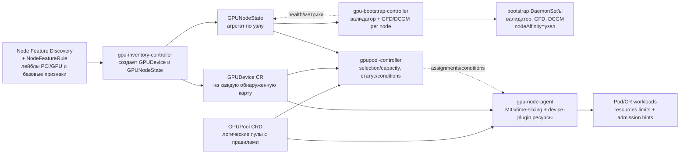
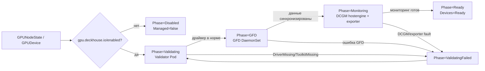
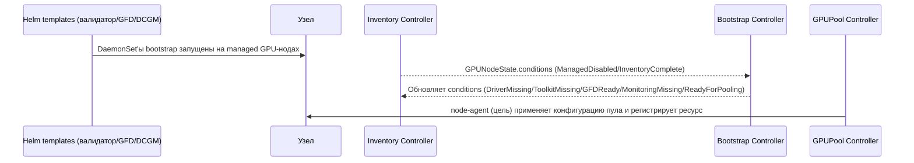
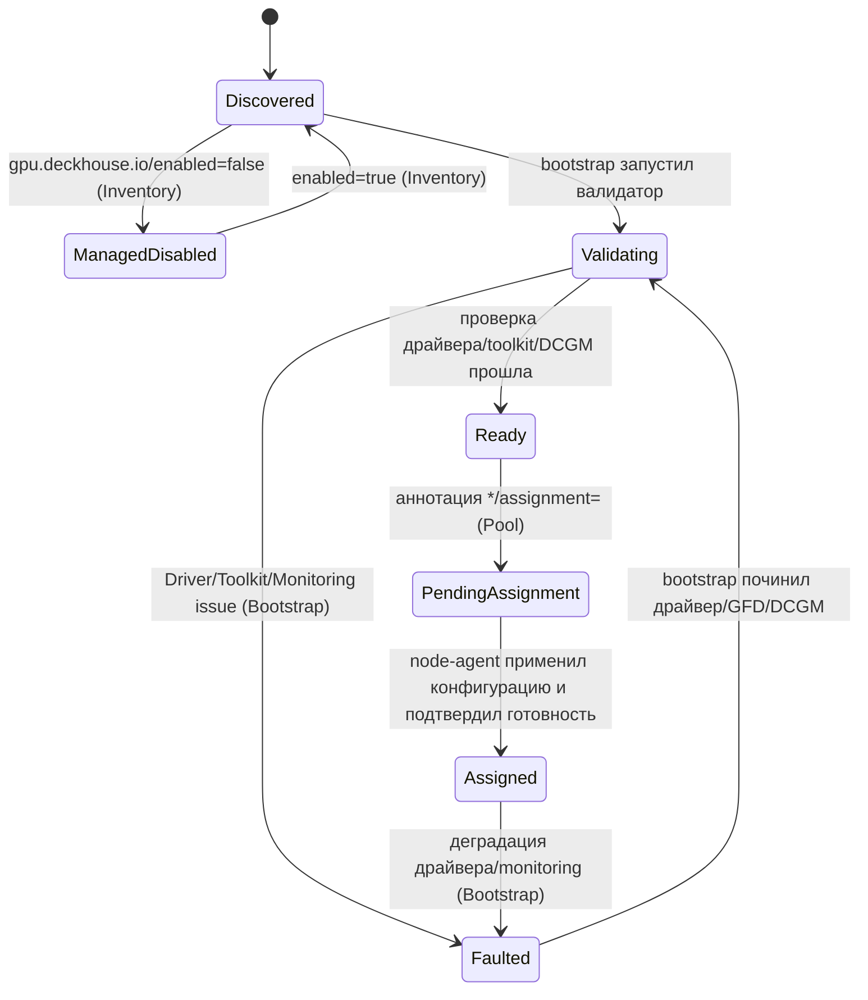
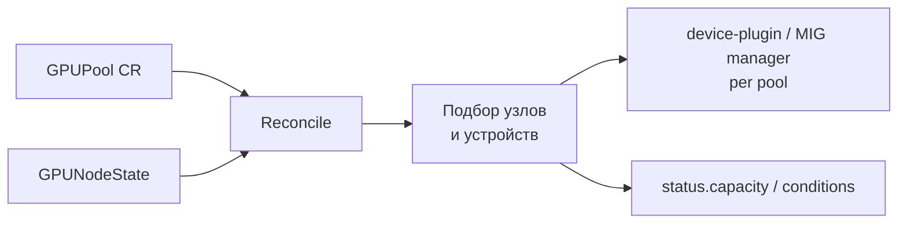
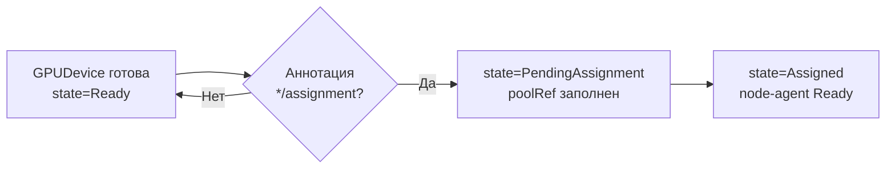
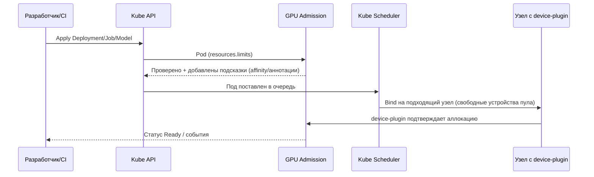

<!--
Copyright 2025 Flant JSC

Licensed under the Apache License, Version 2.0 (the "License");
you may not use this file except in compliance with the License.
You may obtain a copy of the License at

    http://www.apache.org/licenses/LICENSE-2.0

Unless required by applicable law or agreed to in writing, software
distributed under the License is distributed on an "AS IS" BASIS,
WITHOUT WARRANTIES OR CONDITIONS OF ANY KIND, either express or implied.
See the License for the specific language governing permissions and
limitations under the License.
-->

# ADR: GPU control plane DKP

## Связанные решения (актуально)

- `docs/adr/ADR-scaling-ha.ru.md` — масштабирование/HA (1000 namespaces/pools), отказ от per-pool DaemonSet модели в пользу node-agent.
- `docs/adr/gpupool-backends.ru.md` — провайдеры/бэкенды пулов и эволюция реализации.

## Описание

Строим модуль GPU control plane, который:

1. Автоматически обнаруживает GPU на узлах кластера, используя существующий модуль Node Feature Discovery.
2. Инициирует валидатор/GFD/DCGM только на тех узлах, где они нужны; **node-agent** на GPU‑нодах применяет MIG/time-slicing и регистрирует per-pool ресурсы в kubelet на основе назначений/конфигурации пулов.
3. Управляет конфигурацией GPU через декларативный CR `GPUPool`, описывающий правила нарезки, доступ и алгоритм подготовки карты.
4. Предоставляет привычный для Kubernetes интерфейс запроса ресурсов (`resources.limits`), одновременно поддерживая расширенные сценарии (MIG, time-slicing) и контроль доступа/квот.

## Контекст

- В текущих конфигурациях GPU-узлы описываются вручную: администратор заранее знает, где есть ускорители, настраивает NodeGroup, после чего включается GFD/DCGM/device plugin на всех узлах выбранной группы. Прикладные модули сами следят за taint/label и ёмкостью.
- Такой подход не масштабируется: сложно добавлять новые узлы/карты, нет прозрачного статуса "драйвер не установлен", "MIG не настроен", "карта простаивает".
- В DKP уже есть инфраструктурные строительные блоки: `nvidia-device-plugin`, `nvidia-mig-manager`, `nvidia-dcgm`, `nvidia-gpu-feature-discovery` (GFD), `node-feature-discovery` (NFD). Мы переиспользуем их, но строим поверх них новую архитектуру control plane, которая централизует управление, а не повторяет текущие подходы NodeGroup.
- Обнаружение железа по-прежнему выполняет Node Feature Discovery (NFD) со своими правилами, однако дальнейшая логика подготовки, нарезки и выдачи ресурсов переносится в новый GPU-контроллер.
- Enterprise-требования: полная видимость жизненного цикла GPU (обнаружение → подготовка → эксплуатация → вывод), контроль доступа/квот, встроенный мониторинг ресурсов и health-состояния, интеграция с текущими DKP-политиками, возможность расширения без переписывания архитектуры.

## Мотивация / Боль

- Инженерам не хватает централизованной инвентаризации GPU: трудно определить, на каких узлах карты готовы к работе, какие требуют драйвера или внимания.
- Команды приложений вынуждены обращаться к конкретным нодам и вручную управлять taint/label, что усложняет масштабирование и миграции.
- Политики доступа и квоты реализуются ad-hoc: Dex-группы, namespaces и проекты не синхронизированы между собой.
- Наблюдаемость приходит «в нагрузку» с отдельными компонентами, но нет единого места, где можно увидеть состояние карт, пулов и их загрузку.

## Область

- Управление жизненным циклом GPU на уровне Kubernetes: обнаружение (`GPUDevice`), агрегирование (`GPUNodeState`), формирование пулов (`ClusterGPUPool`/`GPUPool`) и интеграция с admission.
- Автоматизация запуска GFD/DCGM/device plugin/MIG manager только на узлах, где карты подтверждены и отмечены как управляемые.
- Интеграция с модулями DKP (multitenancy, observability, policy-engine), публикация статусов и метрик для внешних модулей.
- Не включает установку проприетарных драйверов и инструментов на узлы, а также разработку пользовательских UI — эти области закрываются другими инициативами.

## Цели

- Автоматизировать цепочку "узел → наличие GPU → готовность к работе → включение в пул" без ручных описаний.
- Обеспечить безопасное и явное конфигурирование GFD/DCGM/device plugin/MIG manager на уровне control plane, а не через NodeGroup.
- Ввести понятие `GPUPool`, через которое описывается нарезка (целая карта, MIG, time-slicing), доступ и lifecycle карт.
- Дать стандартизированный способ запрашивать ресурсы.
- Построить поэтапный путь: сначала обнаружение и диагностика, затем bootstrap, далее пулы и, наконец, расширенные сценарии (например, автоматическая установка драйверов).

## Не цели

- Не заменяем существующие компоненты NVIDIA (device plugin, MIG manager, GFD, DCGM) — мы управляём их запуском.
- Не внедряем внешние scheduler/extender (Volcano, HAMi) — рассматриваем их позже, если появится потребность, которую нельзя закрыть стандартным scheduler.
- На первом этапе не устанавливаем драйвер автоматически: подсвечиваем проблему и предоставляем операторам регламент ручного обновления.

## Пользовательские сценарии

- **Кластерный администратор.**

  - Включает модуль, заполняет минимальный `ModuleConfig`; все обнаруженные узлы считаются управляемыми, если их явно не отключить.
  - Проектирует и сопровождает `GPUPool`: задаёт `deviceSelector`, режим выделения (`Exclusive/MIG/TimeSlice`), политики `deviceAssignment`, проверяет работу auto-attach.

- Добавляет новые GPU-узлы: достаточно дождаться `phase=Ready` и карт в состоянии `Ready`; при необходимости исключить узел - задаёт `gpu.deckhouse.io/enabled=false`.

  - Перераспределяет карты: анализирует `GPUDevice.status.state`/`poolRef` и `GPUPool.status.capacity`, при необходимости обновляет `deviceSelector` или создаёт новые пулы.
  - Выводит узлы из эксплуатации: переводит пул/узел в `Maintenance`, устанавливает `gpu.deckhouse.io/enabled=false`, дожидается освобождения workloads, остановки DaemonSet’ов и очистки ресурсов.

- Обновляет драйверы/toolkit: реагирует на `DriverMissing`, координирует обновления, подтверждает возвращение узлов в пулы.
- Управляет аварийными ситуациями (например, критические Xid (ошибки драйвера NVIDIA)): помечает узлы на обслуживание, координирует замену карт; после восстановления готовность отражается в `GPUNodeState.status.conditions` и `GPUDevice.status.state`.

- **Разработчик приложения.**
  - Создаёт workload, указывая `resources.limits` с нужным пулом, и проверяет, что admission добавил подсказки и Pod запустился.

### Управление доступом (control plane + workload)

Цели: а) не дать произвольно менять инвентаризацию (`GPUDevice/GPUNodeState`), б) дать явные «крутилки» для админов и тенантов, без дублирования политик.

Слои:

1. **Системный guard:** ValidatingAdmissionPolicy `gpu-control-plane-restricted-access` запрещает CREATE/UPDATE/DELETE `GPUDevice`/`GPUNodeState` всем, кроме сервис-аккаунтов модуля/`kube-system`/`d8-system`/`system:masters`.
2. **Управление пулами через user-authz:** поставляются ClusterRole’ы (аннотации `user-authz.deckhouse.io/access-level` по паттерну виртуализации):
   - `d8:user-authz:gpu-control-plane:user` — `get/list/watch` `GPUPool`.
   - `d8:user-authz:gpu-control-plane:editor` — CRUD `GPUPool`.
   - `d8:user-authz:gpu-control-plane:cluster-admin` — break-glass: CRUD `GPUPool`, `get/list/watch/delete` `GPUDevice/GPUNodeState`.
     Назначение прав — обычным ClusterRoleBinding/Subject (Dex-группа, SA проекта).
3. **Доступ workloads к пулам:** пул выбирается через extended-resource имя:
   - namespaced `GPUPool` — `gpu.deckhouse.io/<ns-pool>` (используется только в своём namespace; ограничение — RBAC/quotas).
   - cluster `ClusterGPUPool` — `cluster.gpu.deckhouse.io/<cluster-pool>` (доступен во всех namespaces; ограничение — RBAC/quotas).
     Binding-модели нет (в отличие от Virtualization, где CVI и VI независимы); admission определяет тип пула по префиксу ресурса (`gpu.deckhouse.io/` → `GPUPool` в namespace Pod’а, `cluster.gpu.deckhouse.io/` → `ClusterGPUPool`). Чтобы аннотация `*/assignment=<poolName>` и ресурс `*/<poolName>` были недвусмысленными, **имена пулов уникальны в кластере** (между namespace’ами и между `GPUPool`/`ClusterGPUPool`), enforcing через validating webhook.
4. **Практики DKP (рекомендации, опционально):**
   - **OperationPolicy** — навешивать на namespace с GPU workload через метку `operation-policy.deckhouse.io/gpu-control-plane=true`; модуль кладёт готовый `OperationPolicy/gpu-control-plane-baseline` (requests/limits CPU+memory, запрет `:latest`, обязательные probes, проверка DNSPolicy при hostNetwork).
   - **SecurityPolicy** — на те же ns лейбл `security.deckhouse.io/gpu-control-plane=restricted`; модуль кладёт `SecurityPolicy/gpu-control-plane-restricted` (без host\*, без privileged, baseline-разрешения на volumes).
   - **ResourceQuota/LimitRange** — задавать квоты на `gpu.deckhouse.io/<ns-pool>` и/или `cluster.gpu.deckhouse.io/<cluster-pool>` (в зависимости от типа пула) и whitelist priorityClass через OperationPolicy, чтобы ограничивать потребление кластерных ресурсов в многотенантных ns.

Типичные манифесты для админов/тенантов:

```yaml
# Выдать группе разработчиков право создавать пулы
apiVersion: rbac.authorization.k8s.io/v1
kind: ClusterRoleBinding
metadata:
  name: gpupool-edit-devs
roleRef:
  apiGroup: rbac.authorization.k8s.io
  kind: ClusterRole
  name: d8:user-authz:gpu-control-plane:editor
subjects:
  - kind: Group
    name: devs@example.com # Dex группа
---
# Namespace с GPU workload под базовые Operation/Security policy
apiVersion: v1
kind: Namespace
metadata:
  name: ml-team-a
  labels:
    operation-policy.deckhouse.io/gpu-control-plane: "true" # включает OperationPolicy gpu-control-plane-baseline
    security.deckhouse.io/gpu-control-plane: "restricted" # включает SecurityPolicy gpu-control-plane-restricted
```

Принцип: минимально инвазивно — политики не навязываются, но готовы из коробки; инвентаризация защищена, выдача ресурсов контролируется через RBAC/user-authz и квоты/полиси.

- **Разработчик приложения.**
  - Создаёт workload, указывая `resources.limits` с нужным пулом, и проверяет, что admission добавил подсказки и Pod запустился.
  - Назначает карту в пул (контроллер возьмёт только устройства с этой аннотацией и подходящие под `spec.deviceSelector`):
    - `GPUPool`: `kubectl annotate gpudevice <name> gpu.deckhouse.io/assignment=<pool> --overwrite`
    - `ClusterGPUPool`: `kubectl annotate gpudevice <name> cluster.gpu.deckhouse.io/assignment=<pool> --overwrite`

#### Пример для кластера (две карты, два пула)

Данные карт:

- `k8s-w1-gpu-apiac-ru-0-10de-2203` — RTX 3090 Ti.
- `k8s-w2-gpu-apiac-ru-0-10de-2204` — RTX 3090.

Шаги (кластерный пул + локальный пул):

```bash
# ns и SA
kubectl create namespace gpu-team-a
kubectl create namespace gpu-team-b
kubectl create namespace gpu-team-local
kubectl create sa gpu-user -n gpu-team-a
kubectl create sa gpu-user -n gpu-team-b
kubectl create sa gpu-user -n gpu-team-local

# Включить политики (опционально)
kubectl label ns gpu-team-a operation-policy.deckhouse.io/gpu-control-plane=true security.deckhouse.io/gpu-control-plane=restricted
kubectl label ns gpu-team-b operation-policy.deckhouse.io/gpu-control-plane=true security.deckhouse.io/gpu-control-plane=restricted
kubectl label ns gpu-team-local operation-policy.deckhouse.io/gpu-control-plane=true security.deckhouse.io/gpu-control-plane=restricted

# Назначить карты в пул (аннотация на GPUDevice)
kubectl annotate gpudevice k8s-w1-gpu-apiac-ru-0-10de-2203 cluster.gpu.deckhouse.io/assignment=cluster-a --overwrite
kubectl annotate gpudevice k8s-w2-gpu-apiac-ru-0-10de-2204 cluster.gpu.deckhouse.io/assignment=cluster-a --overwrite
kubectl annotate gpudevice k8s-w3-gpu-apiac-ru-0-10de-2203 gpu.deckhouse.io/assignment=local-x --overwrite
```

Манифесты пулов и квоты:

```yaml
# Кластерный пул: ресурс cluster.gpu.deckhouse.io/cluster-a доступен во всех ns
apiVersion: gpu.deckhouse.io/v1alpha1
kind: ClusterGPUPool
metadata:
  name: cluster-a
spec:
  provider: Nvidia
  backend: DevicePlugin
  resource:
    unit: Card
  deviceSelector:
    include:
      pciVendors: ["10de"]
      pciDevices:
        - "2203" # GA102 / RTX 3090 Ti
        - "2204" # GA102 / RTX 3090
  scheduling:
    strategy: Spread
    topologyKey: topology.kubernetes.io/zone
---
# Локальный пул только в ns gpu-team-local
apiVersion: gpu.deckhouse.io/v1alpha1
kind: GPUPool
metadata:
  name: local-x
  namespace: gpu-team-local
spec:
  provider: Nvidia
  backend: DevicePlugin
  resource:
    unit: Card
  deviceSelector:
    include:
      pciVendors: ["10de"] # NVIDIA
      pciDevices: ["2203"]
  scheduling:
    strategy: Spread
    topologyKey: topology.kubernetes.io/zone
---
# Квоты на кластерный пул в ns gpu-team-a/b
apiVersion: v1
kind: ResourceQuota
metadata:
  name: gpu-cluster-a
  namespace: gpu-team-a
spec:
  hard:
    cluster.gpu.deckhouse.io/cluster-a: "2"
---
apiVersion: v1
kind: ResourceQuota
metadata:
  name: gpu-cluster-a
  namespace: gpu-team-b
spec:
  hard:
    cluster.gpu.deckhouse.io/cluster-a: "1"
```

Пример Pod’ов:

```yaml
apiVersion: v1
kind: Pod
metadata:
  name: demo-a
  namespace: gpu-team-a
spec:
  serviceAccountName: gpu-user
  containers:
    - name: c
      image: nvcr.io/nvidia/k8s/cuda-sample:vectoradd-cuda11.7.1
      resources:
        limits:
          cluster.gpu.deckhouse.io/cluster-a: "1"
---
apiVersion: v1
kind: Pod
metadata:
  name: demo-b
  namespace: gpu-team-b
spec:
  serviceAccountName: gpu-user
  containers:
    - name: c
      image: nvcr.io/nvidia/k8s/cuda-sample:vectoradd-cuda11.7.1
      resources:
        limits:
          cluster.gpu.deckhouse.io/cluster-a: "1"
---
# Pod с локальным пулом
apiVersion: v1
kind: Pod
metadata:
  name: demo-local
  namespace: default
spec:
  restartPolicy: Never
  containers:
    - name: cuda-container
      image: nvcr.io/nvidia/k8s/cuda-sample:vectoradd-cuda11.7.1
      resources:
        limits:
          gpu.deckhouse.io/local-x: "1" # requesting 1 GPU
```

- Масштабирует приложение: меняет лимиты, следит за появлением событий `Insufficient gpu.deckhouse.io/<ns-pool>` / `Insufficient cluster.gpu.deckhouse.io/<cluster-pool>` или успешным выделением нескольких карт.
- Переключает модель на другой пул (например, MIG ←→ Exclusive), обновляет deployment, следит за событиями и алертами при миграции.
- Диагностирует проблемы: читает события и conditions (`ReadyForPooling`, `InfraDegraded`, `ManagedDisabled`), обращается к платформенной команде при нехватке ресурсов.

- **SRE.**
  - Работает с мониторингом: использует автоматически включённые дашборды по `gpupool_capacity_*`, `gpu_device_unassigned_total`, следит за трендами utilization.
  - Реагирует на алерты (`GPUUnassignedDevice`, `GPUNodeWithoutPool`, `GPUPoolCapacityLow`, `GPUDeviceDegraded`): связывается с платформенной командой, помогает оценить влияние.
  - Проводит post-mortem: анализирует события/статусы `GPUDevice` и `GPUPool` после инцидента, фиксирует рекомендации (например, автоматизировать метки).
  - Поддерживает SLO: собирает метрики availability пулов, планирует capacity, инициирует расширение кластера или перераспределение workload’ов.

## Решение

- Архитектура состоит из трёх последовательных этапов: обнаружение устройств (NFD → `GPUDevice`/`GPUNodeState`), подготовка узлов (bootstrap-контроллер, запуск GFD/DCGM) и управление пулами (`GPUPool` + admission).
- Все вспомогательные сервисы поставляются модулем и запускаются только тогда, когда карта прошла bootstrap; оператор управляет поведением через `ModuleConfig`.
- Логика распределения устройств опирается на покартовое управление (`Device`): каждая карта подтверждается отдельно и становится доступной для workload через `resources.limits`.
- Модуль работает “из коробки”: любая нода считается управляемой, пока на ней нет явного `gpu.deckhouse.io/enabled=false`. Как только NFD навешивает GPU-лейблы, контроллер автоматически создаёт `GPUDevice` и `GPUNodeState`. Чтобы исключить узел, достаточно проставить `enabled=false` (или изменить `labelKey` через `ModuleConfig`); дополнительных “крутилок” не требуется.

- Модуль GPU control plane зависит от Node Feature Discovery (NFD) версии 0.17
  или новее. При
  включении проверяем, что NFD активирован (через модуль `node-feature-discovery`).
  Если нет — выставляем условие `PrerequisiteNotMet` с рекомендацией включить
  NFD и блокируем дальнейшую инициализацию до устранения требования.
- Базовое правило NFD мы доставляем сами: при включении модуля hook
  создаёт/обновляет CR `NodeFeatureRule`, который помечает устройства
  vendor=0x10de/class=0x0300, фиксирует версии драйверов/ОС и публикует
  вспомогательные метаданные.
  - Лейблы и их назначение:
    | Лейбл | Что означает | Кем используется |
    | --- | --- | --- |
    | `gpu.deckhouse.io/present` | На узле обнаружен хотя бы один поддерживаемый адаптер | `gpu-bootstrap-controller` (решение о подготовке), `gpupool-controller` (фильтрация кандидатов), DaemonSet'ы (affinity) |
    | `gpu.deckhouse.io/device-count` | Количество найденных адаптеров | `gpupool-controller` (расчёт слотов), admission-webhook (валидация запросов) |
    | `gpu.deckhouse.io/device.<NN>.vendor` / `device` / `class` | PCI-идентификаторы конкретного устройства | `gpupool-controller` (сопоставление с `spec.deviceSelector`), `gpu-bootstrap-controller` (условия `DriverMissing`, диагностика) |
    | `gpu.deckhouse.io/driver.name` | Тип установленного драйвера (по умолчанию `nvidia`) | Мониторинг, расследование инцидентов, подготовка к поддержке других вендоров |
    | `feature.node.kubernetes.io/kernel-version.*` / `system-os_release.*` | Версии ядра и ОС, транслируемые в стандартные feature-лейблы | Bootstrap/diagnostics, чтобы эти признаки были доступны даже там, где NFD не публикует их по умолчанию |
  - В `ModuleConfig` GPU control plane оператор управляет только прикладными
    параметрами (метка управляемых узлов, авто-аппрув кандидатов, дефолтные
    стратегии планирования). Сервисные компоненты (GFD, DCGM, device-plugin)
    включаются модулем автоматически и не требуют ручных флагов.
  - Если на узле нет подходящих PCI-устройств, правило не срабатывает: лейблы
    `gpu.deckhouse.io/*` не появляются, что позволяет выбирать только GPU-ноды.
- Процесс включения:
  1. Администратор применяет `ModuleConfig` (можно без overrides — используются дефолты `gpu.deckhouse.io/enabled=true` и автоматическое одобрение устройств).
  2. Hook доставляет `NodeFeatureRule`, NFD начинает публиковать лейблы (`gpu.deckhouse.io/device.*`, `nvidia.com/gpu.*`, `nvidia.com/mig.*`) и `NodeFeature` c подробностями железа.
  3. `gpu-inventory-controller` наблюдает и `Node`, и `NodeFeature`: он фильтрует только те, где появился GPU-хардварный лейбл, собирает снапшот (лейблы `Node` + `NodeFeature`), создаёт/обновляет `GPUDevice` и агрегирует их в `GPUNodeState`. Если на узле уже нет карт, `GPUNodeState` сохраняется, но помечается `hardware.present=false` и больше не попадает в reconcile, пока NFD снова не вернёт GPU-лейблы. Orphan `GPUDevice` удаляются только после удаления `Node` (по `deletionTimestamp`), чтобы не терять историю при временной потере лейблов.
  4. После появления `GPUDevice` с `status.state=Discovered` bootstrap-контроллер подхватывает `GPUNodeState` и запускает подготовку: валидатор, драйверные проверки, GFD/DCGM и дальнейшие фазы.

#### 1.1 ModuleConfig (включение)

`ModuleConfig` включает модуль GPU control plane и управляет только прикладными
параметрами: какой меткой помечать управляемые узлы
(`spec.settings.managedNodes.labelKey`), включать ли узлы по умолчанию
(`enabledByDefault`), как подтверждать новые устройства
(`spec.settings.deviceApproval.mode` и селектор при режиме `Selector`), какие
подсказки планировщику задавать (`spec.settings.scheduling.*`) и какой
интервал пересинхронизации использовать
(`spec.settings.inventory.resyncPeriod`). Если оставить настройки пустыми,
модуль применяет значения по умолчанию.

Если `ModuleConfig.spec.enabled=false`, модуль считается выключенным: контроллеры
inventory/bootstrap/gpupool пропускают reconcile и не создают requeue, а связанные
метрики очищаются. Helm-шаблоны при выключенном модуле не рендерят сервисные
DaemonSet’ы bootstrap (валидатор, GFD, DCGM), поэтому кластеры не держат лишние
workload’ы, пока модуль отключён.

При необходимости оператор может явно задать режим высокой доступности через
`spec.settings.highAvailability`. Когда параметр не указан, модуль следует
глобальным правилам Deckhouse (по доступности control-plane). Значение `true`
принудительно включает HA (две реплики контроллера и активный leader election), значение
`false` — фиксирует одиночный экземпляр даже в кластере с распределённым
control-plane.

##### 1.1.1 Минимальная конфигурация

```yaml
apiVersion: deckhouse.io/v1alpha1
kind: ModuleConfig
metadata:
  name: gpu-control-plane # имя модуля фиксированное
spec:
  enabled: true # запускаем GPU control plane с настройками по умолчанию
  settings:
    highAvailability: true
    managedNodes:
      labelKey: gpu.deckhouse.io/enabled
      enabledByDefault: true
    deviceApproval:
      mode: Manual
    scheduling:
      defaultStrategy: Spread
      topologyKey: topology.kubernetes.io/zone
    inventory:
      resyncPeriod: "30s"
  version: 1
```

- Hook модуля автоматически создаёт `NodeFeatureRule` и поддерживает его в
  актуальном состоянии.
- GFD, DCGM и device-plugin запускаются автоматически и получают `nodeAffinity`
  только на управляемые GPU-узлы после успешной проверки драйвера.
- per-pool DaemonSet модель в control-plane **не является целевой** и будет удалена: целевая архитектура для пулов — **единый `gpu-node-agent` DaemonSet** на GPU‑нодах (без per-pool DaemonSet’ов в control-plane; см. `docs/adr/ADR-scaling-ha.ru.md`).

- Поведение admission (статическая валидация Pod’ов и детерминированные подсказки планировщику) фиксировано дефолтами
  модуля и не настраивается через ModuleConfig на стартовом этапе. При необходимости
  оператор может расширить `settings`, но базовая конфигурация в них не нуждается.

### Контракт управления ресурсами

- CRD `GPUDevice`, `GPUNodeState` и `GPUPool` (далее — публичные CR) рассматриваются как внешний API. Наши контроллеры:
  - не изменяют `spec`, `metadata.labels` и `metadata.annotations`, заданные пользователем;
  - могут добавлять/удалять только финалайзеры (`metadata.finalizers`) и `metadata.ownerReferences`
    (ссылки на владельца ресурса, которые Kubernetes использует для каскадного удаления);
  - заполняют `status` (типизированные поля и служебные условия) и хранят там внутреннее состояние, необходимое для корректного reconcile.
- Любые дополнительные служебные ресурсы (ConfigMap/DaemonSet/Job/TLS-секреты) считаются backend-API и полностью управляются контроллерами GPU. Внешние изменения таких объектов не поддерживаются.
- При удалении публичного CR контроллер сначала выполняет очистку (hooks, остановка DaemonSet), затем удаляет собственный финалайзер — это гарантирует, что состояние кластера останется консистентным.

### Целевой API: CRD без телеметрии (делаем сразу)

Цель: оставить в CRD только поля, необходимые для декларативного управления и диагностики по паттернам Kubernetes. Любая «живущая» телеметрия (DCGM/NVML, usage, температуры/питание) остаётся в Prometheus/Events и **не хранится в CRD**.

#### `GPUDevice` (cluster-scoped)

- `spec`: пустой (зарезервирован под будущие крутилки, если появится обоснованная необходимость).
- `status` (минимум):
  - `nodeName`, `inventoryID`, `managed`
  - `state`: `Discovered` → `Ready` → `PendingAssignment` → `Assigned` (или `Faulted`)
  - `poolRef {name, namespace}` — внутренняя ссылка на пул для адресного доступа node-agent’а (внешний контракт аннотаций/ресурсов не меняется)
  - `hardware` — только инвентаризационные факты, необходимые для селектора/идентификации (например `pci.vendor/device/address`, `product`, `mig.capable`, `mig.profilesSupported`)
  - `conditions[]` — высокоуровневые флаги (например `ManagedDisabled`, `Ignored`, `Configured`, `Faulted`)

#### `GPUNodeState` (cluster-scoped)

- `spec`: `nodeName`
- `status` (минимум):
  - `conditions[]` — агрегированная готовность узла (пример типов: `ManagedDisabled`, `InventoryComplete`, `DriverReady`, `ToolkitReady`, `GFDReady`, `MonitoringReady`, `ReadyForPooling`, `InfraDegraded`, `DegradedWorkloads`)
- Любые «пошаговые» подробности bootstrap (attempts, списки устройств, timestamps, версии драйвера) не являются частью CRD: вместо этого публикуем Events и метрики.

#### `GPUPool` (namespaced) / `ClusterGPUPool` (cluster-scoped)

- `spec` (строго и минимально):
  - `provider` (`Nvidia`) и `backend` (`DevicePlugin` | `DRA`)
  - `resource`:
    - `unit` (`Card` | `MIG`)
    - при `unit=MIG` пул описывает **один** MIG профиль (без смешивания разных профилей внутри одного пула)
    - `slicesPerUnit` (>=1) как единственная декларация oversubscription/time-slicing для ресурса пула
    - семантика ёмкости: `Card` → `кол-во GPU * slicesPerUnit`, `MIG` → `кол-во MIG-партиций выбранного профиля * slicesPerUnit` (Pod запрашивает единицы именно в этих «юнитах»)
    - mixed‑профили MIG на одной карте в рамках одного пула не поддерживаем: если нужны разные профили — делаем разные пулы (и распределяем карты между пулами через `*/assignment`)
  - `nodeSelector`, `deviceSelector` (immutable), `scheduling` (taints/strategy) — по необходимости
- `status`:
  - `capacity.total`
  - `capacity.used/available` — информационные поля (по назначенным Pod’ам), admission по ним не принимает решений
  - `conditions[]` (пример: `Supported`, `Misconfigured`, `Configured`)

### Примечание про отсутствие миграции

Продукт ещё не выводился в production, поэтому обратная совместимость и «миграционные» этапы не требуются: правим существующие CRD/контроллеры напрямую под целевую схему.

### Архитектура

Модуль состоит из набора контроллеров, которые управляют жизненным циклом GPU
и сопутствующих сервисов, и DaemonSet'ов, которые запускаются только на узлах
с видеокартами. Вся служебная нагрузка размещается в пространстве имён
`d8-gpu-operator`.

#### Компоненты модуля

| Имя                          | Тип        | Назначение                                                                                                                                         |
| ---------------------------- | ---------- | -------------------------------------------------------------------------------------------------------------------------------------------------- |
| `gpu-inventory-controller-*` | Deployment | Создаёт `GPUDevice`, `GPUNodeState`, публикует события/метрики по инвентаризации.                                                                  |
| `gpu-bootstrap-controller-*` | Deployment | Проверяет драйвер/toolkit, запускает nvidia-оператор и базовые сервисы, меняет статусы узлов.                                                      |
| `gpupool-controller-*`       | Deployment | Управляет `GPUPool/ClusterGPUPool`: выбор/назначение устройств, расчёт capacity, статусы/conditions.                                               |
| `gpu-admission-webhook-*`    | Deployment | Admission webhook: статическая валидация Pod/GPU запросов + mutating подсказки (tolerations/affinity); без бронирования устройств.                 |
| `gpu-feature-discovery`      | DaemonSet  | Наклеивает GPU-лейблы и NodeFeature, используется inventory/bootstrap.                                                                             |
| `gpu-dcgm-exporter`          | DaemonSet  | Снимает телеметрию DCGM на всех GPU-узлах и отдаёт её в Prometheus.                                                                                |
| `gpu-node-agent`             | DaemonSet  | На GPU-узлах: применяет MIG/time-slicing и регистрирует per-pool ресурсы (`gpu.deckhouse.io/<pool>`, `cluster.gpu.deckhouse.io/<pool>`) в kubelet. |

`gpu-bootstrap-controller` управляет базовыми DaemonSet'ами (`nvidia-gpu-feature-discovery`,
`nvidia-dcgm-exporter`), а `gpu-node-agent` обеспечивает node-side часть для пулов
(регистрация ресурсов и применение конфигурации), без per-pool DaemonSet модели.

Каждый контроллерный pod дополнительно содержит сайдкар `kube-api-rewriter`.
Сейчас он работает в режиме pass-through: проксирует запросы на
`https://kubernetes.default.svc`, собирает метрики (`/proxy/metrics`) и держит
единую точку, куда можно добавить лёгкие преобразования (например, скрыть
третьесторонние API за `internal.gpu.deckhouse.io`, подсунуть служебные поля,
подготовить интеграцию с admission/webhook). Благодаря этому контроллеры остаются
примитивными HTTP-клиентами и не знают о дополнительных alias-ах.

Все control-plane компоненты используют self-signed TLS, выпускаемый hook'ом модуля и
хранящийся в `gpu-control-plane-controller-tls` и `gpu-control-plane-ca` секретах. Это
позволяет безопасно подключать admission webhook и gRPC endpoints без внешних
зависимостей.

Контроллеры (`gpu-inventory`, `gpu-bootstrap`, `gpupool`) запускаются как
stateless Deployment'ы. В режиме HA (по умолчанию наследуется от Deckhouse,
но может быть принудительно задан через `highAvailability`) разворачиваются две
реплики, использующие один и тот же leader election (Lease в namespace модуля),
что гарантирует ровно один активный цикл reconcile при сохранении быстрого
фейловера.



#### 1. Обнаружение через NFD

- Модуль требует активный Node Feature Discovery. При включении модуля webhook
  подключает `NodeFeatureRule`, который помечает GPU и базовые характеристики на
  уровне узла. Используемые источники: `pci`, `kernel.loadedmodule`,
  `kernel.version`, `system.osrelease` и лейблы GFD (`nvidia.com/*`).
- MIG-стратегии GFD интерпретируются так: `none` — описываем целые GPU,
  `single` — все карты в одном профиле, `mixed` — публикуем отдельные лейблы
  `nvidia.com/mig-<gi>g.<mem>gb.*`; мы сохраняем агрегаты в `profilesSupported`
  и `mig.types[]`.
- Базовое `NodeFeatureRule` автоматически навешивает метки `gpu.deckhouse.io/*`
  и фиксирует версии ядра/ОС. Шаблон, который модуль применяет автоматически:

```yaml
apiVersion: nfd.k8s-sigs.io/v1alpha1
kind: NodeFeatureRule
metadata:
  name: deckhouse-gpu-kernel-os
spec:
  rules:
    - name: deckhouse.gpu.nvidia
      matchFeatures:
        - feature: pci.device
          matchExpressions:
            vendor:
              op: In
              value: ["10de"]
            class:
              op: In
              value: ["0300", "0302"]
      labelsTemplate: |
        {{- $devices := index . "pci.device" -}}
        {{- if $devices }}
        gpu.deckhouse.io/present=true
        gpu.deckhouse.io/device-count={{ len $devices }}
        {{- range $idx, $dev := $devices }}
        {{- $slot := printf "%02d" $idx -}}
        {{- $attrs := $dev.Attributes -}}
        gpu.deckhouse.io/device.{{ $slot }}.vendor={{ index $attrs "vendor" }}
        gpu.deckhouse.io/device.{{ $slot }}.device={{ index $attrs "device" }}
        gpu.deckhouse.io/device.{{ $slot }}.class={{ index $attrs "class" }}
        {{- end }}
        {{- end }}
    - name: deckhouse.gpu.nvidia-driver
      matchFeatures:
        - feature: kernel.loadedmodule
          matchExpressions:
            nvidia:
              op: Exists
      labels:
        gpu.deckhouse.io/driver.name: nvidia
        gpu.deckhouse.io/driver.module.nvidia: "true"
    - name: deckhouse.gpu.nvidia-modeset
      matchFeatures:
        - feature: kernel.loadedmodule
          matchExpressions:
            nvidia_modeset:
              op: Exists
      labels:
        gpu.deckhouse.io/driver.module.nvidia_modeset: "true"
    - name: deckhouse.gpu.nvidia-uvm
      matchFeatures:
        - feature: kernel.loadedmodule
          matchExpressions:
            nvidia_uvm:
              op: Exists
      labels:
        gpu.deckhouse.io/driver.module.nvidia_uvm: "true"
    - name: deckhouse.gpu.nvidia-drm
      matchFeatures:
        - feature: kernel.loadedmodule
          matchExpressions:
            nvidia_drm:
              op: Exists
      labels:
        gpu.deckhouse.io/driver.module.nvidia_drm: "true"
    - name: deckhouse.system.kernel-os
      matchFeatures:
        - feature: kernel.version
          matchExpressions:
            major:
              op: Exists
            minor:
              op: Exists
            full:
              op: Exists
        - feature: system.osrelease
          matchExpressions:
            ID:
              op: Exists
            VERSION_ID:
              op: Exists
      labelsTemplate: |
        {{- $kernel := index . "kernel.version" -}}
        {{- $os := index . "system.osrelease" -}}
        {{- $kattrs := index $kernel "elements" -}}
        {{- $oattrs := index $os "elements" -}}
        gpu.deckhouse.io/kernel.version.full={{ index $kattrs "full" }}
        gpu.deckhouse.io/kernel.version.major={{ index $kattrs "major" }}
        gpu.deckhouse.io/kernel.version.minor={{ index $kattrs "minor" }}
        gpu.deckhouse.io/os.id={{ index $oattrs "ID" }}
        gpu.deckhouse.io/os.version_id={{ index $oattrs "VERSION_ID" }}
```

- Правило обеспечивает единые лейблы для планировщика и DaemonSet'ов; подробные
  характеристики карты переносим в CR, чтобы не перегружать метки.
- Для контроля покрытия модуль запускает e2e-job `gpu-nfd-coverage`, который
  сравнивает ожидаемые лейблы с фактическими и подсвечивает редкие модели.

#### 2. Контроллер инвентаризации GPU

**Назначение.** `gpu-inventory-controller` наблюдает `Node` и `NodeFeature`,
строит детерминированный snapshot GPU по лейблам NFD/GFD, создаёт/обновляет `GPUDevice`,
поддерживает минимальный `GPUNodeState` как агрегатор условий (conditions)
и сигнализирует остальным контроллерам о готовности.
Он не принимает решений о назначении устройств в пулы и не хранит телеметрию в CRD
(`GPUDevice`/`GPUNodeState`) — мониторинг остаётся в Prometheus (DCGM exporter).

- Контроллер подписан одновременно на `Node` и `NodeFeature`, но пропускает через reconcile только узлы, где NFD уже повесил GPU-лейблы (`gpu.deckhouse.io/device.*`, `nvidia.com/gpu.*`, `nvidia.com/mig.*` и т. п.). Список меток `Node` и содержимое `NodeFeature` объединяются в `snapshot`, после чего:
  - для каждого элемента `snapshot.Devices[]` создаётся/обновляется `GPUDevice` (если устройство новое — оно появляется в состоянии `Discovered`);
  - агрегированные условия складываются в `GPUNodeState`. Пока у узла нет устройств, `GPUNodeState` не создаётся; если устройства пропали, CR остаётся, но выставляется `InventoryComplete=False` с причиной `NoDevicesDiscovered`, метрики обнуляются.
- Очистка инвентаризации: orphan `GPUDevice` удаляются только после удаления `Node` (по `deletionTimestamp`), чтобы не терять историю при временной потере лейблов/NodeFeature; при живой ноде без устройств сохраняется `GPUNodeState` с `InventoryComplete=False`, метрики обнуляются.
- Сбор аппаратных фактов — best effort: отсутствие части лейблов/NodeFeature не блокирует reconcile (events+warn лог); контроллер обновляет `GPUDevice.status.hardware` по мере появления данных. Телеметрия DCGM/NVML в CRD не сохраняется.
- Управляемость ноды определяется политикой `ManagedNodesPolicy`: по умолчанию все узлы включены (`gpu.deckhouse.io/enabled=true`). Чтобы исключить ноду из инвентаризации и bootstrap, достаточно проставить `gpu.deckhouse.io/enabled=false` (или изменить `labelKey` через `ModuleConfig`). Контроллер автоматически переключает `GPUDevice.status.managed` и condition `ManagedDisabled`.

- Для каждого PCI-устройства с vendor=0x10de создаётся `GPUDevice`. У ресурса
  нет `spec`; ключевые поля находятся в `status`:

  | Поле                  | Содержимое                                                                                                                      | Комментарий                                                                                        |
  | --------------------- | ------------------------------------------------------------------------------------------------------------------------------- | -------------------------------------------------------------------------------------------------- |
  | `status.nodeName`     | Узел, на котором найдена карта                                                                                                  | Используется при подборе пула                                                                      |
  | `status.inventoryID`  | Уникальный идентификатор `<node>/<pci>`                                                                                         | Используется как стабильная ссылка на устройство                                                   |
  | `status.managed`      | Признак управления модулем                                                                                                      | `false`, если узел отключён меткой `gpu.deckhouse.io/enabled=false`                                |
  | `status.state`        | `Discovered` / `Validating` / `Ready` / `PendingAssignment` / `Assigned` / `Reserved` / `InUse` / `Faulted`                     | Отражает жизненный цикл устройства (runtime-usage через `Reserved/InUse` в control-plane не ведём) |
  | `status.autoAttach`   | Флаг автоматического подключения к пулу                                                                                         | Управляется политиками `GPUPool`                                                                   |
  | `status.poolRef.name` | Имя пула, которому принадлежит устройство                                                                                       | Заполняется при назначении; имя пула уникально в кластере                                          |
  | `status.hardware.*`   | Аппаратные характеристики: `uuid`, `product`, `pci.*`, возможности MIG (`capable/strategy/profilesSupported/types{name,count}`) | Нужны admission и `gpupool-controller` для проверки совместимости и учёта MIG                      |
  | `status.conditions`   | Список условий, выставляемых контроллерами                                                                                      | Для диагностики/автоматизаций                                                                      |

  При исчезновении карты ресурс удаляется вместе с финалайзером; ручное
  редактирование не поддерживается.

- Контроллер отслеживает метку `gpu.deckhouse.io/enabled`. Если она выставлена в
  `false`, соответствующие `GPUDevice` помечаются как `managed=false`, а в
  `GPUNodeState` фиксируется condition `ManagedDisabled`. При отсутствии метки
  (значение по умолчанию) узел считается управляемым, и карты попадают в очередь
  на подготовку автоматически.
- `GPUNodeState` хранит агрегированное состояние узла (без зеркалирования списка устройств — источник правды по картам `GPUDevice`):

| Поле                | Содержимое                                                                                                                                                          | Комментарий                               |
| ------------------- | ------------------------------------------------------------------------------------------------------------------------------------------------------------------- | ----------------------------------------- |
| `spec.nodeName`     | Имя `Node`, которому соответствует запись                                                                                                                           | Для адресного доступа к объекту узла      |
| `status.conditions` | `ManagedDisabled`, `InventoryComplete`, `GFDReady`, `DriverMissing`, `ToolkitMissing`, `MonitoringMissing`, `InfraDegraded`, `DegradedWorkloads`, `ReadyForPooling` | Единственный статус узла (без телеметрии) |

##### Расчёт готовности узла

- **ReadyForPooling=True**, только если:
  1. На узле обнаружены устройства (`GPUDevice` существуют для этой ноды).
  2. Conditions `ManagedDisabled=False` и `InventoryComplete=True`.
  3. Conditions `DriverMissing`, `ToolkitMissing`, `MonitoringMissing` = `False` и `GFDReady=True`.
  4. Нет устройств, которые ещё не прошли bootstrap/валидацию (например `Discovered/Validating/Faulted`).
- **InfraDegraded=True**, если хотя бы одно из условий `DriverMissing`/`ToolkitMissing`/`MonitoringMissing` = `True`.
- **DegradedWorkloads=True**, если `InfraDegraded=True` и есть карты в `Assigned` (т.е. уже выданные пулам/экспонируемые для workloads). Runtime‑использование (`InUse`) в control-plane не отслеживается.
- Игнорирование устройства (метка `gpu.deckhouse.io/ignore=true` на `GPUDevice`) исключает его из подбора пулами, но не убирает из инвентаризации.
- Поддерживается сценарий с единым драйвером/тулкитом NVIDIA на узле. Если
  потребуется несколько версий драйверов для разных карт на одном хосте, потребуется
  изменение архитектуры (текущая модель это не покрывает).

- Интервал фонового пересъёма узлов задаётся через
  `ModuleConfig.spec.settings.inventory.resyncPeriod` (формат `<число><s|m|h>`,
  значение по умолчанию `30s`). `gpu-inventory-controller` подписан на события
  `ModuleConfig` и без рестарта обновляет локальный таймер, поэтому изменение
  параметра немедленно отражается на всех reconcile-проходах.

- Для диагностики контроллер публикует события `GPUDeviceDetected`,
  `GPUDeviceRemoved`, `GPUInventoryConditionChanged` и метрики по условиям/состояниям.
  Если правило NFD не заполнило обязательные атрибуты, контроллер выставляет
  `InventoryComplete=False`, блокирует выдачу карты и поднимает предупреждение —
  это предотвращает «тихий» пропуск устройств. Лейблы `gpu.deckhouse.io/*`
  остаются на ноде для селекторов DaemonSet'ов и планировщика.
- **CR — источник правды.** Все потребители (gpupool, admission, UI, мониторинг)
  читают характеристики карты и узла из `GPUDevice`/`GPUNodeState`. Лейблы
  используются только как транспорт для планировщика и DaemonSet'ов; inventory
  контроллер перекладывает их значения в `status.*` и сигнализирует о рассинхроне.
  Демоны (валидатор, GFD, DCGM) обновляют факты через контроллер; прямых записей
  в CR ими не выполняется.
- **Минимум обязательных меток.** Для работы по умолчанию достаточно
  `gpu.deckhouse.io/enabled` и нескольких лейблов NFD (`nvidia.com/gpu.present`,
  `product`, `pci`). Всё остальное описывается в CR, поэтому изменение формата
  лейблов не ломает интеграции.

#### 3. GPU Bootstrap Controller

**Назначение.** Согласовывает состояние узла и отдельных GPUDevice: проверяет
драйвер/инструментарий, метку `gpu.deckhouse.io/enabled`, разворачивает
вспомогательные DaemonSet'ы и переводит устройства в состояние `Managed=true`,
чтобы их можно было назначать в пулы.



#### Фазы

1. **Управляемость.** При `gpu.deckhouse.io/enabled=false` узел остаётся в
   `Phase=Disabled`, все связанные `GPUDevice` получают `Managed=false` и condition
   `ManagedDisabled`. Возврат значения в `true` автоматически инициирует
   повторный bootstrap. Эти проверки выполняет inventory контроллер, bootstrap
   лишь читает флаг.
2. **Phase=Validating.** Контроллер отслеживает готовность валидатора и по его результатам
   выставляет условия `DriverMissing`/`ToolkitMissing`. Детальные версии драйвера/CUDA/toolkit
   в CRD не сохраняются (диагностика — через события/логи/метрики компонентов).
   При проблемах инфраструктуры устройства переводятся в `state=Faulted` и не считаются
   готовыми для выдачи в пулы до восстановления условий.
3. **Phase=GFD.** Как только драйвер подтверждён, bootstrap включает GFD на
   узле (через nodeAffinity/динамические значения Helm). GFD — обязательный
   компонент: он публикует PCI/MIG-информацию, которую inventory тут же
   перекладывает в `GPUDevice.status.hardware`. Любые проблемы (Pod Pending,
   CrashLoop, рассинхрон лейблов) возвращают фазу в `ValidatingFailed` и
   отключают GFD до повторного прохождения проверки.
4. **Phase=Monitoring.** После успешной синхронизации GFD включается DCGM
   hostengine и exporter. Настройка ServiceMonitor (и публикация дашбордов) зависит
   от глобального флага мониторинга DKP, но сам exporter всегда работает как источник
   телеметрии для контроллеров; отключается он только при полном отсутствии драйвера.
   Готовность отражается condition `MonitoringMissing`: контроллер отслеживает метрику
   `dcgm_exporter_last_update_time_seconds` для каждого узла и считает мониторинг
   готовым только если heartbeat обновлялся за последние ~2 минуты. Дополнительно
   bootstrap ждёт `N` стабильных heartbeat (по умолчанию `N=3`), прежде чем объявить
   `InfraReady=True`. Per-pool `nvidia-device-plugin` и
   `nvidia-mig-manager` и публикация ресурсов не запускаются на этом этапе — за node-side часть отвечает
   `gpu-node-agent` на основе назначений пулов.
5. **Phase=Ready.** Когда `DriverMissing/ToolkitMissing/MonitoringMissing=False`
   и выдержан гистерезис heartbeat, bootstrap объявляет `InfraReady=True`. На этом
   событии:
   - все устройства в состояниях `Discovered`/`Validating` переводятся в `Ready`;
   - устройства в `Faulted` остаются неисправными до тех пор, пока health не станет
     чистым и они не пройдут повторную проверку;
   - `ReadyForPooling` становится `True`, если нет ни одной Faulted карты.
     Контроллер синхронизирует `hardware`, `autoAttach`, health-метрики и таймстемпы,
     чтобы CR оставался единственным источником правды. Пока карта не закреплена за
     пулом, device-plugin на узел не ставится, поэтому Pod не может использовать карту
     без подтверждения.
6. **Деградации и автоматическое выключение сервисов.** Bootstrap следит за
   событиями Pod/DaemonSet/ServiceMonitor. При проблемах он мгновенно меняет
   фазу на `ValidatingFailed`, ставит conditions, выключает GFD/DCGM для
   конкретного узла (через аннотации/taint/values). Все свободные устройства
   (`state=Ready/PendingAssignment`) переходят в `Faulted` с причиной
   `InfrastructureDegraded`. Карты в `Assigned` сохраняют своё
   состояние, но получают condition `DegradedWorkloads=True`, чтобы операторы
   видели риск для текущих workload'ов. Как только валидатор снова подтверждает
   среду и `InfraReady=True`, pipeline повторяется, свободные карты возвращаются
   в `Ready`, а condition `DegradedWorkloads` снимается. Это покрывает сценарии
   удаления драйвера или toolkit: валидатор фиксирует проблему, bootstrap
   сохраняет в CR причину и даёт операторам (или будущему автоинсталлятору)
   сигнал для восстановления.

- Контроллер анализирует `GPUDevice.status.state` на узле. Если на узле появляется
  карта в `state=Discovered` (новое устройство), bootstrap возвращает
  фазу в `Validating`, запускает валидатор и после первого успешного цикла переводит
  карту в `Validating → Ready`. Адресные `Faulted` (DCGM/GFD/device-plugin) не рушат
  фазу автоматически: bootstrap ждёт очистки health и `M` стабильных heartbeat,
  после чего инициирует локальную ревалидацию и возвращает карту в `Ready`. Таким
  образом, новые устройства и восстановленные карты проходят тот же pipeline, что и
  изначальная подготовка, но без полного перезапуска остальных узлов.

##### Последовательность bootstrap



`gpu-inventory-controller` публикует факты об оборудовании в `GPUDevice.status.hardware` и базовые условия
(`ManagedDisabled`, `InventoryComplete`) в `GPUNodeState.status.conditions`. Bootstrap‑контроллер дополняет
`GPUNodeState.status.conditions` инфраструктурными сигналами (`DriverMissing`, `ToolkitMissing`, `GFDReady`, `MonitoringMissing`, `ReadyForPooling`).
Дальше `gpupool-controller` по аннотации `*/assignment=<pool>` проставляет `GPUDevice.status.poolRef`
и переводит карту в `PendingAssignment`; после подготовки node-agent’ом карта становится `Assigned`
и учитывается в `GPUPool.status.capacity.total`.

##### Управление конфигурацией bootstrap

- Bootstrap‑контроллер записывает только `GPUNodeState.status.conditions` (никаких `.status.bootstrap`).
- Включение/выключение компонентов (валидатор/GFD/DCGM/DCGM‑exporter) управляется через `ModuleConfig`
  (поля `spec.settings.bootstrap.<component>.enabled`), по умолчанию включены.
- Helm‑шаблоны запускают DaemonSet'ы bootstrap на managed GPU‑нодах через nodeAffinity/taints,
  без привязки к per-node состоянию в CR.

#### Валидация и консистентность

- Контроллер запрещает ручные изменения `GPUDevice.status` и `GPUNodeState.status`
  (действия фиксируются предупреждениями в событиях).
- Состояние признаётся корректным, если одновременно выполняются условия
  `DriverMissing=False`, `ToolkitMissing=False`, `MonitoringMissing=False`,
  `ManagedDisabled=False`.
- Любые нарушения переводят устройства в `state=Discovered` и предотвращают их
  выдачу пулу, пока оператор не устранит проблему — это обеспечивает согласованность
  между реальным состоянием узла и описанием в `GPUPool`.

##### Наблюдаемость

- Bootstrap-контроллер экспортирует Prometheus-метрики:
  - `gpu_bootstrap_node_phase{node,phase}` — гейдж со значением `1`, когда узел находится
    в указанной фазе.
  - `gpu_bootstrap_condition{node,condition}` — гейдж `1`, если condition истинна.
  - `gpu_bootstrap_handler_errors_total{handler}` — счётчик ошибок обработчиков.
- Инвентарь продолжает публиковать `gpu_inventory_devices_total{node}`,
  `gpu_inventory_devices_state{node,state}` и счётчики ошибок обработчиков.
- На базе этих метрик поставляются дашборды Grafana (`monitoring/grafana-dashboards/main`):
  - `GPU Control Plane / Overview` — агрегированные fases/bootstrap/инвентарь + DCGM‑телеметрия.
  - `GPU Control Plane / Node` — детализация по конкретному узлу (DCGM).
  - `GPU Control Plane / Workloads` — использование GPU на уровне namespace/pod.
    Они повторяют паттерны virtualization/SDS: один обзор и узконаправленные панели для
    операционных задач.

#### Жизненный цикл `GPUDevice`

> Важно: в целевой архитектуре control-plane **не отслеживает** runtime‑использование через Pod’ы (`Reserved/InUse`) и **не разворачивает per-pool DaemonSet’ы**. Эти функции переносим в `gpu-node-agent` и observability (см. `docs/adr/ADR-scaling-ha.ru.md`).



- **Inventory** создаёт `GPUDevice`, отслеживает `gpu.deckhouse.io/enabled` и
  выставляет `ManagedDisabled`, но не переводит карту в `Ready`.
- **Bootstrap** управляет переходами `Discovered ⇄ Validating ⇄ Ready` и `Faulted`,
  выставляя conditions `DriverMissing/ToolkitMissing/MonitoringMissing`.
  - Если проверка проходит сразу, карта идёт по «зелёной» ветке:
    `Discovered → Validating → Ready → PendingAssignment → Assigned`.
- **GPUPool** управляет назначением устройств через аннотацию `*/assignment=<pool>` на `GPUDevice`.
  После подтверждения контроллер заполняет `GPUDevice.status.poolRef` и переводит карту в `PendingAssignment`.
  Дальше `gpu-node-agent` на целевой ноде применяет настройки пула (MIG/time-slicing) и
  переводит устройство в `Assigned` после успешной проверки.
  Состояния `Reserved/InUse` в control-plane не ведём: загрузка/квоты остаются на стороне scheduler/ResourceQuota/метрик.
- Пока узел находится в фазах `Validating/GFD/Monitoring`, устройства остаются в состоянии `Discovered`. Мы переводим их в `Faulted` только когда узел перешёл в `ValidatingFailed` или деградировал из `Ready` (например, после падения мониторинга).
- Если устройство выводится из пула (сняли аннотацию) или node-agent не может применить конфигурацию,
  оно остаётся в `PendingAssignment`/`Faulted`; node-agent перестаёт экспонировать ресурс пула на ноде.
- **Admission/kube-scheduler** используют стандартные PriorityClass и preemption:
  мы не внедряем свой приоритет, а опираемся на базовый механизм Kubernetes.

##### Диагностика и `Faulted`

- **Телеметрия не хранится в CRD.** Метрики DCGM/NVML собираются через `dcgm-exporter` в Prometheus и используются алертами/дашбордами; в CR сохраняются только агрегированные флаги готовности (conditions) и жизненный цикл устройства (`GPUDevice.status.state`).
- **Переходы в `Faulted`.** На текущем этапе `Faulted` используется как управляющее состояние при провале bootstrap/валидации или деградации инфраструктуры (например, проблемы driver/toolkit). Для диагностики используются события и логи компонентов.
- **Возврат из `Faulted`.** После восстановления инфраструктуры bootstrap переводит карту в `Validating`, затем она проходит обычный цикл до `Ready`.

#### 4. GPUPool

`GPUPool` описывает логический пул GPU-ресурсов и правила работы с устройствами.

- Публичный ресурс для workloads зависит от типа пула:
  - `GPUPool`: `gpu.deckhouse.io/<pool>`
  - `ClusterGPUPool`: `cluster.gpu.deckhouse.io/<pool>`
- Подтверждение/назначение устройства выполняется через аннотацию `*/assignment=<pool>` на `GPUDevice`. После подтверждения `gpupool-controller` заполняет `GPUDevice.status.poolRef`, переводит `GPUDevice.status.state` в `PendingAssignment`; дальнейшая подготовка (MIG/time-slicing) и подтверждение готовности выполняются `gpu-node-agent`, после чего устройство становится `Assigned`.
- Имя пула должно быть уникально в кластере (между namespace'ами и между `GPUPool`/`ClusterGPUPool`), потому что `*/assignment` содержит только имя пула (без namespace). Полная ссылка на пул хранится в `GPUDevice.status.poolRef` для адресного доступа.
- Удаление аннотации `*/assignment` снимает `poolRef` и возвращает устройство в `Ready` (если оно не занято).

Ключевые элементы `spec`:

- `provider`/`backend` — реализация пула (сейчас `Nvidia` + `DevicePlugin`).
- `resource` — единица и параметры нарезки:
  - `unit: Card|MIG`
  - `slicesPerUnit` для oversubscription/time-slicing (один ресурс на пул)
  - `migProfile` для `unit=MIG` (один профиль, формат `1g.10gb`)
  - `maxDevicesPerNode` для ограничения вклада узла
- `nodeSelector` — ограничение узлов-кандидатов.
- `deviceSelector` — фильтр устройств (include/exclude): `inventoryIDs`, `products`, `pciVendors`, `pciDevices`, `migCapable`, `migProfiles`.
- `deviceAssignment` — ручной/автоматический режим: `requireAnnotation`, `autoApproveSelector`.
- `scheduling` — стратегия распределения и (опционально) per-pool taints.

`status`:

- `status.capacity.total` — агрегированная ёмкость пула.
- `status.capacity.used/available` — информационная оценка по назначенным Pod’ам (scheduler/device-plugin остаются источником истины).
- `status.conditions` — агрегированные условия пула (например `Supported`, `Configured`).

##### Операции с пулом и картами

- **Подключение карт.** Поставить аннотацию `gpu.deckhouse.io/assignment=<pool>` (для `GPUPool`) или `cluster.gpu.deckhouse.io/assignment=<pool>` (для `ClusterGPUPool`) на `GPUDevice`.
- **Отвязка и перенос.** Удалить аннотацию `*/assignment` и дождаться возврата устройства в `Ready`/`Assigned`; для временного исключения — метка `gpu.deckhouse.io/ignore=true` на `GPUDevice`.
- **Управление узлом.** Метка `gpu.deckhouse.io/enabled=true|false` включает или выключает управление узлом.

#### 5. GPUPool Controller



Контроллер отвечает за то, чтобы описание пула и фактическое состояние кластера
совпадали.

#### Основные обязанности

- **Отслеживание аннотаций.** Контроллер реагирует на появление аннотаций
  `gpu.deckhouse.io/assignment=<pool>` или `cluster.gpu.deckhouse.io/assignment=<pool>` на `GPUDevice`. Это минимальный путь: оператор
  или UI задаёт аннотацию — контроллер воспринимает это как подтверждение и выполняет
  остальные действия. При автоматическом подключении (`requireAnnotation=false`,
  `autoApproveSelector`) контроллер проставляет аннотацию самостоятельно.
- **Фильтрация узлов.** Для каждого `GPUPool` контроллер берёт узлы с
  `ReadyForPooling=true`, сопоставляет их с `spec.nodeSelector` и `spec.deviceSelector`
  (всегда для карточного режима). Если `resource.maxDevicesPerNode` ограничивает число
  устройств, контроллер учитывает это при выборе. Любое изменение `GPUNodeState`
  (появление/исчезновение карт, обновление MIG) инициирует повторный reconcile; контроллер
  следит, чтобы устройства не пересекались между пулами.
  - **Назначение устройств.** Контроллер выбирает устройства, удовлетворяющие `spec.deviceSelector`.
    Назначение подтверждается аннотацией `gpu.deckhouse.io/assignment=<pool>` или `cluster.gpu.deckhouse.io/assignment=<pool>` на `GPUDevice`
    (вручную через UI или автоматически по политике пула). После подтверждения устройство получает
    `GPUDevice.status.poolRef` и переводится в `PendingAssignment`; дальнейшая подготовка и подтверждение готовности выполняются `gpu-node-agent`,
    после чего устройство становится `Assigned`.
  - **Подтверждение назначения.** При подтверждении карты `gpupool-controller`:
    - проставляет `GPUDevice.status.poolRef` и синхронизирует `GPUDevice.status.state`;
    - обновляет conditions/desired-state для node-side исполнения (читает `gpu-node-agent`), без per-pool DaemonSet/ConfigMap;
    - обновляет `GPUPool.status.capacity` и `GPUPool.status.conditions`.
      Чтобы исключить устройство из пула, оператор удаляет аннотацию `gpu.deckhouse.io/assignment` или `cluster.gpu.deckhouse.io/assignment`
      (или выставляет метку `gpu.deckhouse.io/ignore=true` на `GPUDevice`).
- **Конфигурация устройств.** В зависимости от `resource.unit` он:
  - (целевая модель) `gpupool-controller` **не** создаёт per-pool DaemonSet/ConfigMap. Node-side конфигурацию (MIG/time-slicing) и регистрацию ресурсов в kubelet выполняет `gpu-node-agent` на основе назначения устройств и `GPUPool/ClusterGPUPool.spec.resource`. Детали: `docs/adr/ADR-scaling-ha.ru.md`.
- **Операционные действия.** Подтверждение карт происходит через аннотацию `gpu.deckhouse.io/assignment=<pool>` или `cluster.gpu.deckhouse.io/assignment=<pool>` (UI или автоподтверждение). Метка `gpu.deckhouse.io/enabled` выводит узел из управления, `gpu.deckhouse.io/ignore` временно исключает устройство.
- **Статус и метрики.** Контроллер агрегирует данные в `status.capacity.total` и `status.conditions` и обновляет метрики (например, `gpupool_capacity_total`, `gpupool_assignments`); динамическую доступность/использование по Pod’ам в control-plane не вычисляет.

##### Поток распределения карты



- Модуль работает только в карточном режиме: после bootstrap каждое устройство
  подтверждается отдельно.
- Любые несоответствия (карта занята другим пулом, MIG профиль не применился,
  аннотация отсутствует) фиксируются condition'ами `Misconfigured` или `CapacityLow`.
  Пока проблема не устранена, admission отклоняет
  запросы ресурсов соответствующего пула.

#### 6. Запрос ресурсов рабочей нагрузкой



- Каждый Pod может указать **только один** ресурс вида `gpu.deckhouse.io/<ns-pool>` или `cluster.gpu.deckhouse.io/<cluster-pool>`.
  Дополнительные единицы того же пула задаются числом (`limits: {gpu.deckhouse.io/a100: 2}` или `limits: {cluster.gpu.deckhouse.io/a100: 2}`).
  Попытка смешать разные пулы в одном Pod завершается ошибкой admission
  (`MixedPoolRequest`).
- Admission валидирует запрос (один пул), доступ namespace (гейт `gpu.deckhouse.io/enabled=true`) и существование пула; дополнительно делает статическую проверку `requested <= pool.status.capacity.total` (если total уже известен); добавляет только детерминированные подсказки планировщику (например, tolerations/affinity из `spec.scheduling`) и **не** выполняет бронирование устройств/динамические проверки `available` (см. `docs/adr/ADR-scaling-ha.ru.md`).
- Стандартный kube-scheduler видит запрошенный ресурс (`gpu.deckhouse.io/<ns-pool>` или `cluster.gpu.deckhouse.io/<cluster-pool>`) как обычный extended-resource: Pod остаётся Pending, если на кластере нет узлов с достаточной ёмкостью по ресурсу. Ограничение потребления — через `ResourceQuota` и политики.
- Для переключения на другой набор устройств достаточно изменить ресурс в Pod
  (или модели): `gpu.deckhouse.io/<новый_ns-пул>` или `cluster.gpu.deckhouse.io/<новый_cluster-пул>`. Автоматической "горизонтальной"
  миграции между пулами нет — workloads нужно пересоздать с новым ресурсом.

#### Пример запроса

```yaml
containers:
  - name: inference
    resources:
      limits:
        gpu.deckhouse.io/a100-mig-2g20gb: 2 # берём две MIG-партиции из пула
```

#### 7. Мониторинг и эксплуатация

- **Метрики.** `gpu_node_inventory_condition{...}`, `gpupool_capacity_total`, `gpupool_assignments`, `gpu_device_unassigned_total`, `kube_node_status_allocatable` и другие собирают состояние устройств и ёмкость пулов. Потребление/квоты читаем из стандартных метрик Kubernetes (kube-state-metrics/ResourceQuota), без резерваций в control-plane. `gpu_bootstrap_ready` показывает, что базовый стек (GFD/DCGM) активен.
- **Алерты.** `GPUDriverMissing`, `GPUNodeWithoutPool`, `GPUPoolCapacityLow`, `GPUDeviceDegraded`, `GPUPoolVPARecommendation` сигнализируют о типовых проблемах; события `Maintenance`, `Misconfigured`, `GPUAnnotationMismatch` дублируются в Kubernetes Events и в logging-стеке DKP.
  - **Эксплуатация.**
  - Подтверждать устройства через аннотацию `*/assignment` (UI/автоподтверждение) и следить за `ReadyForPooling`/`InfraDegraded`.
  - Использовать метку `gpu.deckhouse.io/enabled` для вывода узлов; для управления картами — аннотацию `*/assignment` и метку `gpu.deckhouse.io/ignore=true`.
  - Изменение `spec.resource` не допускается; для новой конфигурации создаётся новый пул.
  - DCGM остаётся основным источником телеметрии (Prometheus). Автоматическое выставление `Faulted` по метрикам DCGM в CRD не выполняется; операционные реакции оформляются алертами и действиями оператора (`ignore`/снятие `assignment`/вывод узла из управления).
  - Сценарии наподобие "разделить узел на два пула" настраиваются через `deviceSelector` и `spec.scheduling`; контроллер гарантирует, что множества карт не пересекаются.

#### 10. Интеграция с инструментами Kubernetes и DKP

- **Scheduler**. Работает с extended-resources: пока `gpu.deckhouse.io/<ns-pool>` / `cluster.gpu.deckhouse.io/<cluster-pool>`
  доступен, Pod будет размещён на узлах пула. Стратегии (BinPack/Spread)
  задаём через affinity/tolerations и PodTopologySpread, поэтому стандартного
  kube-scheduler достаточно. Поддержку TopologyAware/NUMA вынесем в отдельный
  этап. PriorityClass и PodTopologySpread функционируют штатно.
- **Node-agent (Device Plugin).** `gpu-node-agent` работает как DaemonSet на GPU‑нодах и реализует протокол kubelet device-plugin, регистрируя ресурсы `gpu.deckhouse.io/<ns-pool>` / `cluster.gpu.deckhouse.io/<cluster-pool>` для пулов, присутствующих на конкретной ноде. Детали реализации (сокеты/регистрация/конфликты) — внутренняя ответственность node-agent, без per-pool DaemonSet модели в control-plane.
- **MIG/time-slicing**. Если указан `spec.resource.migProfile` (для `unit=MIG`) и/или `spec.resource.slicesPerUnit`, node-agent применяет конфигурацию на ноде и репортит результат; при выводе устройства из пула выполняет rollback/cleanup.
- **GFD / NFD**. Модуль GPU control plane требует активного Node Feature
- Discovery. При включении hook модуля сам создаёт/поддерживает `NodeFeatureRule`
  для vendor=10de/class=0x0300. Bootstrap запускает GFD только
  на узлах с картой и опирается на лейблы, появившиеся из этого правила.
- **OperationPolicy**. Поставляем preset: проверять наличие ресурса
  `gpu.deckhouse.io/<ns-pool>` / `cluster.gpu.deckhouse.io/<cluster-pool>`, запрещать несанкционированные изменения,
  контролировать обязательные аннотации (owner, environment и т.д.). Политики
  подключаются через модуль admission-policy-engine.
- **Multitenancy-manager**. Проекты могут ссылаться на пул: шаблон создаёт
  `ResourceQuota` по `gpu.deckhouse.io/<ns-pool>` / `cluster.gpu.deckhouse.io/<cluster-pool>`, добавляет tolerations/labels, чтобы
  workloads проекта попадали на нужные узлы.
- **HPA / VPA**. Контроллер публикует шаблоны HPA/VPA для целевых workloads:
  HPA масштабирует реплики согласно нагрузке и ограничению `min/maxReplicas`;
  когда пул выдаёт свободные слоты, новые Pod размещаются, при исчерпании
  ёмкости остаются в Pending с событием `Insufficient gpu.deckhouse.io/<ns-pool>` / `Insufficient cluster.gpu.deckhouse.io/<cluster-pool>`.
  VPA работает в режиме `recommendation-only` и при попытке повысить лимит GPU
  вызывает пересоздание Pod, что отражается в статусе пула.
- **PriorityClass / PDB**. Для сервисов, зависящих от пула, контроллер создаёт
  `PriorityClass` и `PodDisruptionBudget`. При эвакуации узлов и переключении пулов
  он учитывает эти ограничения, чтобы не нарушить доступность workloads.
- **Monitoring**. Используем DCGM exporter + Prometheus/Grafana. Добавляем
  метрики `gpupool_capacity_total`, `gpupool_node_slots`, события в
  Kubernetes. Алерты: `GPUPoolCapacityLow`, `GPUNodeDriverMissing`,
  `GPUNodeFeatureMissing`, `GPUDeviceDegraded`.

## План внедрения

| Этап | Цель             | Действия                                                                         | Выходные данные                                                                                                                           |
| ---- | ---------------- | -------------------------------------------------------------------------------- | ----------------------------------------------------------------------------------------------------------------------------------------- |
| 0    | Обнаружить GPU   | Включить Node Feature Discovery и правила, собрать `GPUNodeState`                | Список узлов, драйверов, условий                                                                                                          |
| 1    | Подготовить узлы | Включить `gpu-bootstrap-controller`: запуск валидатора/GFD/DCGM точечно per-node | Узлы готовы к работе, есть события о проблемах                                                                                            |
| 2    | Управлять пулами | Создать CR `GPUPool`, контроллер capacity, admission, квоты                      | Workloads указывают `gpu.deckhouse.io/<ns-pool>` или `cluster.gpu.deckhouse.io/<cluster-pool>`, admission валидирует и применяет политики |
| 3    | Расширить        | Авто-MIG, диагностика, резервирование, (позже) драйвера                          | Дополнительные возможности без ломки API                                                                                                  |

Разработка и тестирование следуют той же последовательности: unit/integration
для каждого контроллера, e2e в рамках этапа, chaos для проверки устойчивости.

## Приложение A. Примеры CR

### Структура `GPUDevice`

```yaml
apiVersion: gpu.deckhouse.io/v1alpha1
kind: GPUDevice
metadata:
  name: worker-01-0000-17-00-0
  labels:
    gpu.deckhouse.io/product: a100
    gpu.deckhouse.io/vendor: nvidia
    gpu.deckhouse.io/precision.fp16: "true"
spec: {}
status:
  nodeName: worker-01
  inventoryID: worker-01-0000:17:00.0
  managed: true
  state: Assigned
  autoAttach: true
  poolRef:
    name: a100-full
  hardware:
    uuid: "GPU-3d45..."
    product: NVIDIA A100-PCIE-40GB
    pci:
      vendor: "10de"
      device: "2203"
      class: "0300"
      address: "0000:17:00.0"
    memoryMiB: 40960
    computeCapability:
      major: 8
      minor: 0
    precision:
      supported: [fp32, fp16, bf16]
    mig:
      capable: true
      profilesSupported:
        - 1g.10gb
        - 2g.20gb
```

### Структура `GPUNodeState`

```yaml
apiVersion: gpu.deckhouse.io/v1alpha1
kind: GPUNodeState
spec:
  nodeName: <имя узла>
status:
  hw:
    present: <bool>
  conditions:
    - type: <ConditionType>
      status: <True|False>
      reason: <string>
      lastTransitionTime: <timestamp>
      observedGeneration: <int64>
      message: <optional>
```

Примечание: назначение устройств пулам не дублируется в `GPUNodeState.status`. Эти данные отражаются в `GPUDevice.status.poolRef` и `GPUPool`/`ClusterGPUPool.status.capacity.total`, чтобы избежать дрейфа производных полей.

`GPUNodeState` (единый источник данных по GPU-узлу):

```yaml
apiVersion: gpu.deckhouse.io/v1alpha1
kind: GPUNodeState
metadata:
  name: worker-01
spec:
  nodeName: worker-01
status:
  conditions:
    - type: ManagedDisabled
      status: "False"
    - type: DriverMissing
      status: "False"
    - type: ToolkitMissing
      status: "False"
    - type: GFDReady
      status: "True"
    - type: MonitoringMissing
      status: "False"
    - type: InventoryComplete
      status: "True"
    - type: ReadyForPooling
      status: "True"
      lastTransitionTime: 2025-01-15T10:06:15Z
```

**Кто использует:**

- `status.conditions` — события/алерты/UI и автоматизация (например, `ManagedDisabled`, `InventoryComplete`, `GFDReady`, `DriverMissing`, `MonitoringMissing`, `ReadyForPooling`).
- `GPUDevice.status.poolRef` и `GPUPool`/`ClusterGPUPool.status.capacity.total` — назначение карт пулам и статическая ёмкость (gpupool-controller/admission/monitoring).
  Базовые переключатели, которые позволяют оператору управлять картами до стадии пулов:

1. **Отключить узел целиком:** задать метку `gpu.deckhouse.io/enabled=false`
   (по умолчанию узлы считаются управляемыми). При значении `false`
   контроллер выставляет `GPUDevice.status.managed=false`, а в `GPUNodeState`
   появляется condition `ManagedDisabled=True`, поэтому карты не попадут в кандидаты пулов.
2. **Игнорировать отдельные устройства:** добавить на `GPUDevice`
   метку `gpu.deckhouse.io/ignore=true`. Карта исключается из
   выдачи в пул, но остаётся в CR для последующей диагностики.
3. **Оставить узел в ожидании:** пока bootstrap не снял `DriverMissing`,
   `ToolkitMissing`, `MonitoringMissing` **или** есть карты с `state=Faulted`,
   condition `ReadyForPooling=False` — карты отображаются, но ни один пул
   не может взять ресурс.
   `GPUPool` (MIG-пул):

```yaml
apiVersion: gpu.deckhouse.io/v1alpha1
kind: GPUPool
metadata:
  name: a100-mig-2g20gb
  namespace: prod-inference
spec:
  provider: Nvidia
  backend: DevicePlugin
  resource:
    unit: MIG
    migProfile: 2g.20gb
    slicesPerUnit: 2
    maxDevicesPerNode: 2
  nodeSelector:
    matchExpressions:
      - key: kubernetes.io/hostname
        operator: In
        values:
          - worker-01
          - worker-02
  deviceSelector:
    include:
      products:
        - NVIDIA A100-PCIE-40GB
      migCapable: true
      migProfiles:
        - 2g.20gb
  deviceAssignment:
    requireAnnotation: true
  scheduling:
    strategy: BinPack
    topologyKey: topology.kubernetes.io/zone
```

## Механизмы снижения рисков

- **Защита инвентаризации.** `gpu-inventory-controller` блокирует выдачу устройств
  с неполными данными (`InventoryComplete=False`) и запускает e2e-проверку, если
  правило NFD не сработало. Пока condition не снят, bootstrap и gpupool не смогут
  назначить карту.
- **Управляемое включение узлов.** Как только bootstrap перевёл карты в `Ready`, они
  становятся доступными для назначения (`GPUDevice.status.state=Ready`, `poolRef=nil`).
  При подтверждении назначения аннотацией `gpu.deckhouse.io/assignment=<pool>` или `cluster.gpu.deckhouse.io/assignment=<pool>`
  `gpupool-controller` проставляет `GPUDevice.status.poolRef` и переводит устройство в
  `PendingAssignment`/`Assigned` (после подтверждения готовности node-agent).
- **Конфликты конфигурации пула.** Неподдерживаемые provider/backend или коллизии конфигурации приводят к `Supported=False` / `Configured=False` и блокируют дальнейшие действия контроллера.
- **Валидация и неизменяемость.** Admission валидирует формат запросов (один пул на Pod) и базовые ограничения `resource`, а webhook запрещает менять ключевые поля `spec` пула после создания.
- **Мониторинг как prerequisite.** Пока bootstrap видит `MonitoringMissing=True`
  (DCGM или GFD не готовы), карты не переходят в `Ready`, а device-plugin не
  стартует — исключаем GPU без наблюдаемости.
- **Отчётность и алерты.** Метрики bootstrap/inventory (`gpu_bootstrap_condition{...}`, `gpu_inventory_condition{...}`), ёмкость пулов и события (`GPUAnnotationMismatch`, `GPUNodeWithoutPool`) дают
  дежурным быстрый сигнал о проблемах до появления инцидента у workloads.

## Минусы внедрения решения

- **Рост сложности control plane.** Появляется несколько специализированных контроллеров и отдельная node-side подсистема (`gpu-node-agent`), что требует строгих тестов и наблюдаемости.
- **Дополнительные фоновые сервисы.** GFD, DCGM и device plugin запускаются точечно, но всё равно увеличивают footprint на GPU-узлах.
- **Операционные действия остаются критичными.** Управление метками/аннотациями (`gpu.deckhouse.io/enabled`, `gpu.deckhouse.io/assignment`, `cluster.gpu.deckhouse.io/assignment`) требует регламентов; без них карты остаются в `ManagedDisabled` или без назначения (`poolRef=nil`).

## Рассмотренные альтернативы

### Полностью использовать NVIDIA GPU Operator

**Почему отклонено.**

- Оператор генерирует все манифесты (driver, toolkit, device-plugin, GFD/DCGM) сам, ожидая ClusterPolicy и полный контроль над узлом. Это противоречит архитектуре ADR, где bootstrap и gpupool управляют жизненным циклом по этапам и поддерживают несколько вендоров.
- Требует повышенных прав и навязывает свой CRD/модель конфигурации, тогда как нам нужна единая DKP-политика (`ModuleConfig`, `GPUPool`, admission). Встраивание привело бы к дублированию CR и сложным синхронизациям.
- Включает только NVIDIA-специфику. Добавление vGPU manager, GPUDirect, future AMD/Intel карт означало бы форк с большим количеством патчей, теряется ценность “коробочного” оператора.

**Компромисс.**

Мы заимствуем отдельные компоненты GPU Operator (например, `nvidia-validator`, DaemonSet'ы, scripts) и собираем их как самостоятельные контейнеры в модуле. При этом контроль пайплайна (inventory → bootstrap → пул) остаётся за нашими контроллерами, что позволяет масштабировать решение на разные вендоры и сценарии.

### Назначать GPU через NodeSelector/taint вручную

**Почему отклонено.**

- Минимальные изменения (метки/taint вручную), но отсутствует единый статус устройств, квоты и автоматическая подготовка. Любая ошибка оператора приводит к простоям или выдаче не той карты.
- Невозможно централизованно учесть MIG/time-slicing, health и политики доступа — всё остаётся в виде инструкций для дежурных.

**Вывод.** Такой подход не масштабируется и не даёт автоматизации lifecycle.

### Интегрироваться с HAMi/Volcano

**Почему не базовое решение.**

- HAMi/Volcano решают ускоренное планирование, но не покрывают требования по Dex/namespace-доступу, OpenAI proxy и observability.
- Встраивание scheduler’а усложняет стек, а вопросы bootstrap/inventory/device-plugin остаются открытыми.

**Вывод.** Рассматриваем как опциональное расширение позже, но не как основу control plane.

## VPA и стабильность раскатки

- VPA: `gpu-control-plane-controller` — режим _Initial_ (как в Virtualization); DaemonSet-компоненты (node-agent, gfd, dcgm, dcgm-exporter, validator) — без VPA, с фиксированными requests/limits и PDB на 100%.
- Node-side конфигурация не должна приводить к флаппингу: node-agent применяет изменения идемпотентно и с дебаунсом (без per-pool DaemonSet/ConfigMap модели в control-plane).
- При выключении модуля pre-delete hook удаляет CR и namespaced ресурсы модуля; node-agent и базовые DaemonSet’ы удаляются стандартными механизмами Helm/Deckhouse.
- Admission/Mutator не перезапускают Pod’ы, добавляют только селекторы/тейнты/спреды; отказ при конфликте защищает от неконсистентных патчей.

## Риски

- **Неверная классификация устройств.** Если `NodeFeatureRule` не покрывает
  редкий GPU, `GPUNodeState` останется пустым и пул не получит слоты.
  _Снижение:_ модуль ставит e2e-проверку `gpu-nfd-coverage`, которая сравнивает
  ожидаемые лейблы с фактическими, хранит шаблон правила рядом с кодом и
  выставляет `InventoryComplete=False`, что блокирует выдачу до тех пор, пока
  оператор не дополнит правило.
- **Разъезд пулов и фактических конфигураций.** Случайное изменение MIG профиля
  или изменение количества карт приводит к `Misconfigured`, и workloads
  застревают. _Снижение:_ контроллер автоматически ставит `Maintenance` и создаёт
  событие, operator должен устранить и подтвердить.
- **Node-agent и регистрация ресурсов.** Node-agent может регистрировать множество pool‑ресурсов на одной ноде (по факту назначений). Ошибки конфигурации (MIG/time-slicing) или некорректная перерегистрация ресурсов могут повлиять на kubelet. _Снижение:_ строгая валидация `GPUPool/ClusterGPUPool.spec.resource`, идемпотентное применение с дебаунсом, ясные conditions/Events, режим `Maintenance` при конфликте.
- **Выход карты из строя под нагрузкой.** Если драйвер/DCGM фиксирует fault уже
  на рабочем пуле, node-agent перестаёт экспонировать ресурс для повреждённого устройства, а bootstrap переводит его в `state=Faulted`. _Снижение:_ корректная деградация через conditions/Events, а алерт `GPUPoolCapacityLow` сигнализирует о дефиците; перезапуск workload’ов остаётся на механизмах Kubernetes (ReplicaSet/Job).
- **Перераздача ресурсов при тайм-шеринге.** Неверные параметры `timeSlice`
  могут привести к деградации latency. _Снижение:_ контроллер подставляет
  безопасное значение по умолчанию (`maxSlicesPerDevice=8`) и собирает метрики
  DCGM/алерты `GPUPoolCapacityLow`/`LatencySpikes`.
- **Зависимость от административных действий.** Если узел подготовлен, но не
  назначен в пул, ресурсы простаивают. _Снижение:_ узел отражается в
  `GPUDevice` со `state=Ready` и пустым `poolRef`. По умолчанию требуется ручное
  подтверждение назначения аннотацией `gpu.deckhouse.io/assignment=<pool>` или `cluster.gpu.deckhouse.io/assignment=<pool>`.
- **Ошибки в конфигурации доступа.** Неправильные политики
  могут открыть пул не тем проектам. _Снижение:_ модуль генерирует
  `OperationPolicy` и шаблоны ResourceQuota/Toleration через multitenancy-manager,
  а admission проверяет namespace/Dex-группы перед выдачей ресурса.
- **Потеря наблюдаемости.** Если DCGM или Prometheus не собирают метрики, мы не
  увидим деградацию GPU. _Снижение:_ Bootstrap отслеживает `MonitoringMissing`,
  а правила `GPUDriverMissing`/`GPUPoolCapacityLow`/`GPUDeviceDegraded`
  сигнализируют об исчезновении данных.

## Статус

- OpenAPI-схемы `GPUDevice`, `GPUNodeState`, `GPUPool` и `ModuleConfig` описаны и согласованы.
- Реализованы контроллеры inventory/bootstrap/gpupool/admission; валидатор/GFD/DCGM разворачиваются модулем, держатся в готовности и отражают состояние в CR.
- Идёт hardening: unit/e2e покрытие, согласование дашбордов и ServiceMonitor, проверка авто-ревалидации и сценариев поздней установки плагина.

## Вопросы на будущее и дальнейшие планы

- Автоматическая установка и обновление драйверов/Toolkit по сигналам bootstrap-контроллера.
- Поддержка дополнительных вендоров и гетерогенных кластеров (AMD, Intel) при сохранении API.
- Интеграция с расширенными планировщиками (HAMi/Volcano) и NUMA-aware размещением.
- Shared-пул и автоматическое перераспределение карт между пулами (заимствование, возврат, лимиты).
- Финансовые квоты и авто-релокация GPU между пулами на основе фактической утилизации.

## Ответственные контактные лица

- AI Playground team — `~dev-ml-ai`.
