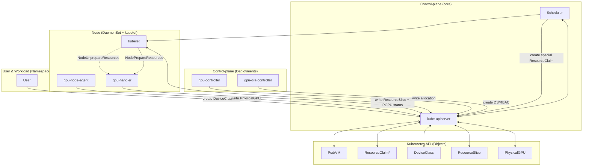

````md
# Техническое задание: GPU Provisioning + DRA Driver (Kubernetes ≥ 1.34)

Документ предназначен как **самодостаточное ТЗ** и рабочий план реализации.

---

## 0. Контекст и ключевые принципы

### 0.1 Базовые принципы дизайна (фиксируем как “не обсуждается”)

1. **As simple as possible**: минимум сущностей и минимум “своих велосипедов”, максимум стандартных Kubernetes‑механик.
2. **Одна ответственность — один компонент** (SRP): если компонент начинает делать “и инвентарь, и аллокацию, и драйверы” — это повод резать.
3. **Каноничный путь**: DRA как единственный путь аллокации GPU, чтобы:
   - нормальные квоты “по классам”;
   - Partitionable devices + shared counters (KEP‑4815) для MIG и похожих кейсов;
   - единый путь для контейнеров и VM (через подготовку устройства на ноде).

### 0.2 Факты и ограничения (из вводных)

- Kubernetes **с 1.34** (partitionable devices с раздельными slices — только **1.35+**).
- DRA API: `resource.k8s.io/v1`. Extended resources (KEP‑5004) **используем в v0**.
  - включаем `DeviceClass.spec.extendedResourceName` и опираемся на scheduler‑создаваемые ResourceClaim.
- Включены feature gates: `DRAPartitionableDevices` (KEP‑4815), `DRAConsumableCapacity` (KEP‑5075), `DRAExtendedResource` (KEP‑5004).
- **CDI включаем** на рантайме (containerd/CRI‑O).
- Для VM (KubeVirt) предполагаем **CDI + QEMU hook**.
- Пользовательский UX должен быть “на годы”, без постоянных изменений.
- NVIDIA:
  - В v0 инсталлер драйвера **опционален**: сначала делаем “валидатор/сигнализацию”, потом автоматизацию установки.
- Требуемые режимы выдачи:
  - `Physical` (контейнеры: CUDA)
  - `MIG` (контейнеры: CUDA, MIG partition)
  - `VFIO` — опция `Physical` при эксклюзивной аллокации (по аннотации Pod)

---

## 1. Цели и не‑цели (v0)

### 1.1 Цели (v0)

1. **Инвентаризация физики**: появление/исчезновение GPU → отражено в `PhysicalGPU` CR.
2. **Единый механизм выдачи**: DRA (ResourceSlice/DeviceClass/ResourceClaim).
3. **Partitionable devices (KEP‑4815)**:
   - для MIG — shared counters (v0: `memory`, `memory-slice-0..N`) и набор “виртуальных устройств‑оферов” под профили;
   - **Kubernetes 1.34**: `sharedCounters` публикуем **inline** вместе с устройствами (иначе API не валиден);
   - **Kubernetes 1.35+**: `sharedCounters` публикуем отдельным ResourceSlice (resourceSliceCount=2), а устройства с `consumesCounters` — отдельным;
   - если фича отключена или поля дропаются, деградируем до exclusive Physical без MIG.
4. **Collaborative sharing (KEP‑5075)**:
   - TimeSlicing/MPS реализуем через consumable capacity `sharePercent` + `allowMultipleAllocations`;
5. **Динамическая подстройка под claim**:
   - при подготовке ресурса (NodePrepare) нода может переключить режим карты (enable MIG), если карта свободна;
   - VFIO включается только по аннотации Pod и только при эксклюзивной аллокации;
6. **UX (v0, основной путь через Extended Resources)**:
   - Админ создаёт **DeviceClass** напрямую (DRA) и задаёт `spec.extendedResourceName`.
   - Пользователь запрашивает extended resource в Pod (`resources.requests/limits`).
   - Scheduler сам создаёт “special” ResourceClaim и пишет allocation.
   - **ResourceClaimTemplate** используем только когда нужны per‑claim параметры (например `sharePercent` для TimeSlicing/MPS).
7. **Observability**:
   - PhysicalGPU состояние и capabilities.
   - DRA‑аллокации и их метаданные (claim/pod/node).

### 1.2 Не‑цели (v0)

- Полноценный “GPU marketplace” с кастомными scheduler‑extender’ами, GPUConsumer и т.д. — **не делаем**, это заменяет DRA.
- Автоматическая установка драйверов по умолчанию — **не делаем** (только валидатор и сигнализация; инсталлер — как следующий этап).
- Полный FinOps “процент утилизации по подам” с точным attribution до контейнера — **не обещаем** в v0; в v0 даем:
  - “кто держит allocation” (ResourceClaim/Pod),
  - “как загружена физика” (DCGM),
  - базовые метрики времени аллокации/кол-ва выделений на класс.

---

## 2. Архитектура (целевое “каноничное” решение)

### 2.0 Принципы проектирования (почему так устроено)

**Главная идея:** собрать систему из независимых и простых компонентов, которые общаются только через API Kubernetes и DRA‑объекты, чтобы:
1) каждая часть делала один маленький кусок работы;
2) изменения были локальными (не ломают остальные части);
3) поведение было предсказуемым и тестируемым.

**Как мы декомпозируем:**
- **Control‑plane** управляет только API‑логикой (CRD lifecycle, генерация DeviceClass, оркестрация DaemonSet’ов).
- **Node‑agents** (thin/thick) делают работу на узлах: thin — инвентарь, thick — DRA publish + prepare/unprepare.
- **DRA allocation controller** отдельно принимает решения о размещении (allocation), не смешивая это с подготовкой устройств.

**Что это дает:**
- Нет “сквозной логики” между инвентарем, аллокацией и драйвером.
- Упростили ответственность: если проблема в инвентаре — лечим node‑agent, если в allocation — лечим allocator.
- Поведение объясняется по шагам, а не через «магические» поля.

**Базовые инженерные правила:**
- **Слои**: domain → ports → adapters → services. Ни один слой не “перепрыгивает” через другой.
- **Handler‑цепочки** для контроллеров: каждый шаг делает одно действие и легко тестируется.
- **Prepare/Unprepare**: фиксированный порядок шагов, StepTaker‑pipeline уже используется (state/step пакеты).
- **Состояние** описывается через статус и conditions.
- **K8s‑API — единственный источник истины**: всё общение через CRD, ResourceSlice, ResourceClaim.

### 2.1 Компоненты

#### A) `gpu-controller` (control-plane, Deployment, leader election)

Ответственность: **оркестрация** компонентов и управление CRD‑логикой.

Состав контроллеров (v0):

1. **AgentOrchestratorController**  
   - Watch: Cluster config (ConfigMap/CRD `GPUOperatorConfig`)  
   - Reconcile: выкатывает на ноды DaemonSet’ы:
     - `gpu-node-agent` (thin)
     - `gpu-handler` (node runtime: capabilities + DRA publish/prepare)
     - `dcgm` (только NVIDIA)
     - `dcgm-exporter` (только NVIDIA)
     - (в будущем) `driver-installer` (опционально)

2. **Admission Webhook**  
  - В v0 **не требуется**: основной путь — Extended Resources без мутаций Pod.

> Важно: control-plane **не участвует** в выдаче GPU в workload напрямую. Это делает DRA driver.

#### B) `gpu-node-agent` (thin-agent, DaemonSet на всех нодах кроме control-plane)

Ответственность: **только физическое обнаружение PCI и создание/удаление `PhysicalGPU` CR**.

- Сканирует `/sys/bus/pci/devices`.
- Находит GPU по class code (`0x0300` / `0x0302`) и vendor id (v0: только `10de`).
- Создает/патчит `PhysicalGPU`:
  - status.pciInfo.*
  - status.nodeInfo.*
  - labels: node/vendor/device (нормализованное имя)
- Заполняет `currentState.driverType` из binding драйвера (sysfs).
- Удаляет `PhysicalGPU`, если устройство исчезло (с финалайзером/garbage safety, см. ниже).
- Триггеры синхронизации (event‑driven):
  - udev netlink: события `SUBSYSTEM=pci` (горячее добавление/удаление PCI).
  - K8s watch: `PhysicalGPU` delete на своей ноде → пересоздание.
  - Один стартовый sync при запуске; дальше только по событиям.

#### C) DRA stack (control-plane + node runtime)

Состоит из двух под‑компонентов:

1. **`gpu-dra-controller`** (Deployment, leader election)  
   Ответственность: **аллокация** `ResourceClaim` → выбор устройства(устройств) из `ResourceSlice`, запись `ResourceClaim.status.allocation`.  
   Дополнительно: validating webhook для параметров `ResourceClaim`/`ResourceClaimTemplate` (driver‑specific config, strict decode).

2. **`gpu-handler`** (DaemonSet на GPU‑нодах)  
   Ответственность:
   - **публикация ResourceSlice** (инвентарь и оферы)
   - **NodePrepareResources/NodeUnprepareResources**:
     - MIG create/delete
     - VFIO bind/unbind
     - генерация CDI spec (контейнеры и virt-launcher)
     - (для VM) подготовка артефактов для QEMU hook

#### D) DCGM + DCGM Exporter (NVIDIA)

- `dcgm` DaemonSet собирает метрики с GPU.
- `dcgm-exporter` DaemonSet отдает метрики в Prometheus.
- Оператор разворачивает/конфигурирует, но **не делает** сам сбор метрик.

---

### 2.2 Сквозной поток (end-to-end)

#### 2.2.1 Инвентарь

1) `gpu-node-agent` на ноде обнаруживает PCI GPU (udev + watch delete) → создаёт `PhysicalGPU` CR.  
2) `gpu-handler` разворачивается **после `DriverReady=True`** (gate).
   После старта он на каждом цикле синхронизации проверяет `DriverReady`:
   - при `DriverReady=True` делает NVML‑снапшот, обогащает `PhysicalGPU.status`,
     выставляет `HardwareHealthy`, публикует `ResourceSlice` и принимает `NodePrepare/Unprepare`;
   - при `DriverReady=False/Unknown` выставляет `HardwareHealthy=Unknown` и
     **не** публикует ResourceSlice, ожидая следующего цикла.

#### 2.2.2 UX (v0, основной): DeviceClass → Extended Resource → Pod

1) Админ создаёт **DeviceClass** (DRA) и задаёт `spec.extendedResourceName`.
2) Пользователь запрашивает extended resource в Pod (`resources.requests/limits`).
3) Scheduler сам создаёт “special” `ResourceClaim` и пишет allocation.

#### 2.2.3 UX (v0, опционально): ResourceClaimTemplate для `sharePercent`

1) Пользователь создаёт **ResourceClaimTemplate** с `deviceClassName`, `count` и `capacity.requests.sharePercent`.
2) Pod ссылается на template через `spec.resourceClaims`.

#### 2.2.4 Allocation + Prepare

1) `gpu-dra-controller` видит `ResourceClaim` без allocation → выбирает конкретные DRA‑devices из ResourceSlice и пишет allocation.
2) Scheduler выбирает ноду, kubelet вызывает `NodePrepareResources` у `gpu-handler`.
3) `gpu-handler`:
   - обеспечивает правильный режим карты **по типу запрошенного устройства** (Physical/MIG),
   - при аннотации `gpu.deckhouse.io/vfio: "true"` и эксклюзивной аллокации
     выполняет VFIO bind (режим Physical),
   - создаёт реальные артефакты (MIG GI/CI; mdev device — **v1**),
   - генерит CDI spec через `nvcdi` (NVIDIA container toolkit) и пишет в `CDI_ROOT` на host
     (по умолчанию `/etc/cdi`, можно `/var/run/cdi`); путь драйвера трансформируется через
     `HOST_DRIVER_ROOT`, а при пустом `NVIDIA_CDI_HOOK_PATH` `nvidia-cdi-hook` копируется
     в каталог плагина и используется в spec,
   - (для VM) пишет “hook input” (json/yaml) для QEMU hook.
4) Workload стартует. На Unprepare всё очищается.

### 2.3 Логика работы проекта (как части складываются в одно целое)



**Кратко о взаимодействии:**
- Все компоненты общаются **только через Kubernetes API**.
- `gpu-node-agent` пишет `PhysicalGPU`, `gpu-handler` публикует `ResourceSlice`.
- Аллокатор выбирает **только** из `ResourceSlice`, а реальная подготовка происходит в `NodePrepare/NodeUnprepare`.

---

## 4. API: CRD `PhysicalGPU` (v1alpha1)

### 4.1 Назначение

`PhysicalGPU` = **инвентарь физической карты**, единый объект, который:
- появляется/исчезает вместе с PCI устройством,
- хранит health и driver readiness,
- хранит snapshot capabilities, на основе которых строим ResourceSlice.

### 4.2 Схема (предлагаемая)

```yaml
apiVersion: gpu.deckhouse.io/v1alpha1
kind: PhysicalGPU
metadata:
  name: <nodeName>-<index>-<vendorID>-<deviceID>   # стабильное имя
  labels:
    gpu.deckhouse.io/node: <nodeName>
    gpu.deckhouse.io/vendor: <nvidia|amd|intel>
    gpu.deckhouse.io/device: <a30-pcie>    # нормализованное имя
spec: {} # v0: desired-state отсутствует принципиально
status:
  nodeInfo:
    nodeName: <string>
    os:
      id: <string>
      version: <string>
      name: <string>              # необязательно
    kernelRelease: <string>       # uname -r
    bareMetal: <bool>

  pciInfo:
    address: "0000:02:00.0"
    class:
      code: "0302"
      name: "3D controller"
    vendor:
      id: "10de"
      name: "NVIDIA Corporation"
    device:
      id: "20b7"
      name: "GA100GL [A30 PCIe]"

  # Полный capability snapshot (в рамках доступных источников)
  capabilities:
    productName: "NVIDIA A30"
    memoryMiB: <int>
    vendor: Nvidia|Amd|Intel
    nvidia: # только если vendor: Nvidia
      computeCap: "8.0"
      productArchitecture: "Ampere"
      boardPartNumber: "900-21001-0040-100"
      computeTypes: [FP32, FP64, FP16, BF16, TF32, INT8, INT4, FP8]
      powerLimitMinW: 100
      powerLimitMaxW: 250
      migSupported: true | false
      mig:
        totalSlices: 4
        profiles:               # полный список поддерживаемых профилей (A30)
          - profileID: 14
            name: "1g.6gb"
            memoryMiB: 5949
            sliceCount: 1
            maxInstances: 4
          - profileID: 21
            name: "1g.6gb+me"
            memoryMiB: 5949
            sliceCount: 1
            maxInstances: 1
          - profileID: 5
            name: "2g.12gb"
            memoryMiB: 12032
            sliceCount: 2
            maxInstances: 2
          - profileID: 6
            name: "2g.12gb+me"
            memoryMiB: 12032
            sliceCount: 2
            maxInstances: 1
          - profileID: 0
            name: "4g.24gb"
            memoryMiB: 24125
            sliceCount: 4
            maxInstances: 1

  # Минимальные условия здоровья
  conditions:
    - type: DriverReady
      status: "True"|"False"|"Unknown"
      reason: <string>
      message: <string>
      lastTransitionTime: <rfc3339>
    - type: HardwareHealthy
      status: "True"|"False"|"Unknown"
      reason: <string>
      message: <string>
      lastTransitionTime: <rfc3339>

  currentState:
    driverType: Nvidia|VFIO|ROCm #и так далее
    nvidia: # здесь именно детализация вендор специфики в зависимости от поля driverType
      gpuUUID: "GPU-..."
      driverVersion: "580.76.05"
      cudaVersion: "13.0"
      powerLimitCurrentW: 165
      powerLimitEnforcedW: 165
      mig:
        mode: Enabled|Disabled|NotAvailable|Unknown # только если поддерживается и читается

````

### 4.2.1 Правила заполнения `currentState`

* `currentState.driverType` заполняется из sysfs (binding драйвера) и **может** появиться до `DriverReady`.
* `currentState.nvidia.*` заполняем **только** при `DriverReady=True` и `currentState.driverType=Nvidia`
  (доступен драйвер/NVML).
* `currentState.nvidia.mig` пишем только если `capabilities.nvidia.migSupported=true`
  и режим читается.
* Если `migSupported=false`, блок `capabilities.nvidia.mig` **полностью отсутствует** (включая `totalSlices`).
* `currentState.nvidia.powerLimitCurrentW` и `powerLimitEnforcedW` пишем только если NVML
  возвращает значения (мВт переводим в Вт).
* VFIO в статусе **не отражаем**: режим включается на `NodePrepare` по аннотации Pod и при эксклюзивной аллокации.

### 4.2.2 Условия заполнения полей `PhysicalGPU.status`

* `nodeInfo` — **по возможности** из `gpu-node-agent`:
  - `os.*` из `/etc/os-release`;
  - `kernelRelease` из `/proc/sys/kernel/osrelease` (эквивалент `uname -r`);
  - `bareMetal` из DMI‑эвристики.
  Если источник недоступен — поле не пишем.
* `metadata.name`: `<nodeName>-<index>-<vendorID>-<deviceID>`, где `index` — порядок по
  отсортированным PCI‑адресам. Имя основано на PCI, чтобы быть стабильным без NVML.
  GPU UUID сохраняем в `currentState.nvidia.gpuUUID` (когда доступен).
* `pciInfo` — всегда из sysfs + `pci.ids`:
  - `class.code`, `vendor.id`, `device.id` из `/sys/bus/pci/devices/<BDF>/*`;
  - `class.name`, `vendor.name`, `device.name` — по `pci.ids` (если нет — поле не пишем).
* `currentState.driverType` — из sysfs, при наличии binding.
* `currentState.nvidia.*` — **только** при `DriverReady=True` и `currentState.driverType=Nvidia`
  (доступен драйвер/NVML).
* `capabilities` — **только** при `DriverReady=True` и успешном NVML‑снапшоте.
  Для NVIDIA power limit берём из NVML `DeviceGetPowerManagementLimitConstraints` и пишем в Вт.
* `capabilities.nvidia` пишем только если `capabilities.vendor=Nvidia`.
* `conditions`:
  - `DriverReady` выставляет валидатор (`gpu-controller`);
  - `HardwareHealthy` выставляет `gpu-handler` по результату NVML;
  - при `DriverReady=False/Unknown` выставляем `HardwareHealthy=Unknown` с `reason=DriverNotReady`;
  - при недоступном NVML сначала выдерживаем grace‑период, затем выставляем
    `HardwareHealthy=Unknown` с `reason=NVMLUnavailable` и работаем с backoff‑ретраями;
  - при ошибке NVML‑запросов выставляем `HardwareHealthy=Unknown` с `reason=NVMLQueryFailed`;
  - при отсутствии `pciInfo.address` выставляем `HardwareHealthy=Unknown` с `reason=MissingPCIAddress`;
  - при `driverType` не равном `Nvidia` ставим `HardwareHealthy=Unknown`
    с `reason=DriverTypeNotNvidia`.

### 4.2.2.1 Статус реализации заполнения полей (capabilities/currentState)

* `capabilities.productName` — NVML `GetName` (ok).
* `capabilities.memoryMiB` — NVML `GetMemoryInfo.Total` (ok).
* `capabilities.vendor` — фиксируем `Nvidia` при успешном NVML‑снапшоте (ok).
* `capabilities.nvidia.computeCap` — NVML `GetCudaComputeCapability` (ok).
* `capabilities.nvidia.productArchitecture` — NVML `GetArchitecture` (ok).
* `capabilities.nvidia.boardPartNumber` — NVML `GetBoardPartNumber` (по возможности).
* `capabilities.nvidia.computeTypes` — фиксированный список типов (ok, без NVML).
* `capabilities.nvidia.powerLimitMinW/MaxW` — NVML `GetPowerManagementLimitConstraints` (по возможности).
* `capabilities.nvidia.migSupported` — NVML `GetMigMode` (ok).
* `capabilities.nvidia.mig.profiles` — NVML `GetGpuInstanceProfileInfoV3`, имя профиля берём из NVML (без довычислений суффиксов). Если NVML имя пустое — fallback к базовому `Ng.Xgb`.
* `capabilities.nvidia.mig.totalSlices` — вычисление по профилям (ok).
* `currentState.nvidia.gpuUUID` — NVML `GetUUID` (ok).
* `currentState.nvidia.driverVersion` — NVML `SystemGetDriverVersion` (ok).
* `currentState.nvidia.cudaVersion` — NVML `SystemGetCudaDriverVersion` (ok).
* `currentState.nvidia.powerLimitCurrentW/EnforcedW` — NVML `GetPowerManagementLimit`/`GetEnforcedPowerLimit` (по возможности).
* `currentState.nvidia.mig.mode` — NVML `GetMigMode` (по возможности).

### 4.2.3 Логика `HardwareHealthy` и ретраи NVML

* `gpu-handler` работает **event‑driven** (watch `PhysicalGPU`) и имеет heartbeat‑тикер
  для обнаружения “тихих” отказов NVML без событий в k8s.
* При первом сбое NVML фиксируем время, но **не меняем** `HardwareHealthy` в течение
  grace‑периода; в это время делаем ретраи с backoff.
* После grace‑периода выставляем `HardwareHealthy=Unknown` с `reason=NVMLUnavailable`,
  продолжаем ретраи с backoff; при успешном NVML‑снапшоте возвращаем `HardwareHealthy=True`.

### 4.2.4 Несколько GPU на одной ноде

* На **каждую физическую карту** создаётся отдельный `PhysicalGPU` (1 PCI‑device → 1 CR).
* `gpu-handler` на ноде обрабатывает **все** `PhysicalGPU` этой ноды:
  - сопоставляет NVML‑устройство по `pciInfo.address`;
  - обновляет `capabilities/currentState` **по карте**, без влияния на соседние карты.
* Ошибка или деградация одной карты **не блокирует** обработку остальных.

### 4.3 Важный принцип

* **Нет `spec.desiredMode` / `allowModeSwitch`**.
* Управление режимом происходит **имплицитно по типу аллокации** и выполняется на ноде в `NodePrepareResources`.

---

## 5. UX (v0)

### 5.1 Extended Resources (v0, основной UX)

Назначение: пользователь запрашивает GPU как extended resource, scheduler сам создаёт “special” `ResourceClaim`.

```yaml
apiVersion: v1
kind: Pod
metadata:
  name: cuda-job
spec:
  containers:
  - name: app
    image: nvidia/cuda:12.4.1-runtime-ubuntu22.04
    resources:
      requests:
        gpu.deckhouse.io/a30: "1"
      limits:
        gpu.deckhouse.io/a30: "1"
```

`gpu.deckhouse.io/a30` — это `DeviceClass.spec.extendedResourceName`
(или implicit `deviceclass.resource.kubernetes.io/<device-class-name>`).

### 5.2 ResourceClaimTemplate (DRA) — опционально

Используем только когда нужны **per‑claim параметры** (например `sharePercent` для TimeSlicing/MPS).

```yaml
apiVersion: resource.k8s.io/v1
kind: ResourceClaimTemplate
metadata:
  name: train-gpu
spec:
  spec:
    devices:
      requests:
      - name: gpu
        exactly:
          deviceClassName: nvidia-a30-mig-2g.12gb
          count: 4
          # capacity:
          #   requests:
          #     sharePercent: "50" # для TimeSlicing/MPS (KEP‑5075)
        # config: []  # необязательно, непрозрачные параметры для драйвера gpu.deckhouse.io
```

---

## 6. DRA: модель данных и ограничения

### 6.1 Ключевые сущности DRA (напоминание)

* `DeviceClass` — “класс устройств” + selector/config.
* `ResourceSlice` — “витрина” доступных устройств на нодах.
* `ResourceClaim` — “заявка” + allocation.
* Extended resources — основной UX в v0 (KEP‑5004).

### 6.2 Где находится `count`?

`count` — это часть запроса устройств (DeviceRequest) в DRA API: “ExactCount … count field”.

В v0 есть два пути:
1) **Extended Resources (основной путь)** — `count` берётся из запроса ресурса в Pod
   (`resources.requests/limits`), scheduler преобразует это в `DeviceRequest.exactly.count`.
2) **ResourceClaimTemplate (опционально)** — `count` задаётся в
   `ResourceClaimTemplate.spec.spec.devices.requests[].exactly.count`.

`sharePercent` (KEP‑5075) задаётся **только** через `ResourceClaimTemplate.spec.spec.devices.requests[].exactly.capacity.requests.sharePercent`
и используется при TimeSlicing/MPS.
Режим sharing (Exclusive/TimeSlicing/MPS) задаётся в `DeviceClass.spec.config`.

---

### 6.3 Labels PhysicalGPU и механизм выбора устройств

* **Выбор устройств делает DRA**, а не `PhysicalGPU`:
  - админ задаёт `DeviceClass` с CEL‑селектором;
  - `gpu-dra-controller` выбирает устройства из `ResourceSlice` по этому селектору и инвариантам.
* **Labels на `PhysicalGPU`** нужны для UX/диагностики,
  но **не участвуют** в аллокации.
* **Labels на Node** используются для простого управления публикацией MIG‑офферов (если нужно отключать MIG на части узлов).

## 7. Таблица атрибутов/капасити/каунтеров в ResourceSlice + CEL

> Это обязательный “Implementation Guide” блок №1.

### 7.1 Ограничения ResourceSlice, которые учитываем

* На device уровне: **attributes + capacity <= 32** ключа суммарно.
* В одном ResourceSlice: **devices <= 128**.
* `consumesCounters.counterSet` ссылается на counterSet, опубликованный в `sharedCounters` для того же `pool`/`generation`.
* Kubernetes 1.34: `sharedCounters` публикуем inline вместе с устройствами.
* Kubernetes 1.35+: `sharedCounters` публикуем отдельным ResourceSlice (counters‑slice), а устройства с `consumesCounters` — отдельным ResourceSlice (devices‑slice).
* `pool.resourceSliceCount` учитывает **все** ResourceSlice одного `pool`/`generation`, включая counters‑slice и devices‑slice.

**Что такое counters‑slice, partitionable devices‑slice и physical‑slice:**
* **Counters‑slice** — ResourceSlice только с `sharedCounters` (без устройств).
* **Partitionable devices‑slice** — ResourceSlice только с устройствами `consumesCounters` (MIG‑офферы).
* **Physical‑slice** — ResourceSlice только с `devices` (Physical‑офферы), без `sharedCounters`.
* Scheduler/allocator считает доступность counters по `counterSet` в рамках одного `pool`/`generation`: **available = sharedCounters − sum(consumesCounters)**.
* Все slice относятся к одному `pool` и одной `generation`, поэтому планирование видит их как единый набор данных.

### 7.2 Стандартные ключи (общие для всех вендоров)

| Категория      | Ключ                          |        Тип | Пример           | Назначение                    | Пример CEL‑селектора                                                  |
| -------------- | ----------------------------- | ---------: | ---------------- | ----------------------------- | --------------------------------------------------------------------- |
| attribute      | `gpu.deckhouse.io/vendor`     |     string | `"nvidia"`       | Фильтр вендора                | `device.attributes["gpu.deckhouse.io/vendor"] == "nvidia"`            |
| attribute      | `gpu.deckhouse.io/deviceType` |     string | `"MIG"`          | Physical/MIG                  | `device.attributes["gpu.deckhouse.io/deviceType"] == "MIG"`           |
| attribute      | `gpu.deckhouse.io/device`     |     string | `"a30-pcie"`     | нормализованная модель        | `device.attributes["gpu.deckhouse.io/device"] in ["a30-pcie","a100-pcie"]` |
| attribute      | `gpu.deckhouse.io/pciAddress` |     string | `"0000:02:00.0"` | Диагностика/трейсинг          | `device.attributes["gpu.deckhouse.io/pciAddress"].matches("0000:.*")` |
| capacity       | `memory`                      |   quantity | `24576Mi`        | VRAM минимум                  | `device.capacity["memory"].compareTo(quantity("12Gi")) >= 0`          |
| capacity       | `sharePercent`                |   quantity | `50`             | доля для TimeSlicing/MPS (KEP‑5075) | `device.capacity["sharePercent"] >= 10`                         |
| shared counter | `memory`                      |   quantity | `40Gi`           | общий пул памяти              | (используется при подсчете)                                           |
| shared counter | `memory-slice-<N>`            |        int | `1`              | MIG‑слайсы (KEP‑4815)         | (используется при подсчете)                                           |

*Примечание:* `sharePercent` используется только при `allowMultipleAllocations` (TimeSlicing/MPS) и задаётся в claim через `capacity.requests`.

### 7.3 NVIDIA‑специфика (nvidia.*)

| Категория      | Ключ                       |    Тип | Пример         | Назначение                              | CEL                                                               |   |                                                                                                   |
| -------------- | -------------------------- | -----: | -------------- | --------------------------------------- | ----------------------------------------------------------------- | - | ------------------------------------------------------------------------------------------------- |
| attribute      | `gpu_uuid`                 | string | `"GPU-..."`    | трассировка                             | `has(device.attributes["gpu_uuid"])`                              |   |                                                                                                   |
| attribute      | `driverVersion`            | string | `"565.77"`     | диагностика                             | `device.attributes["driverVersion"].startsWith("565")`            |   |                                                                                                   |
| attribute      | `cc_major`                 |    int | `8`            | compute capability                      | `device.attributes["cc_major"] >= 8`                              |   |                                                                                                   |
| attribute      | `cc_minor`                 |    int | `0`            | compute capability                      | `device.attributes["cc_major"] > 8                                |   | (device.attributes["cc_major"] == 8 && device.attributes["cc_minor"] >= 6)`                       |
| attribute      | `mig_profile`              | string | `"2g.12gb"`    | фильтр профиля                          | `device.attributes["mig_profile"] == "2g.12gb"`                   |   |                                                                                                   |
| shared counter | `multiprocessors`          |    int | `98`           | SMs (KEP‑4815)                          | (используется при подсчете)                                       |   |                                                                                                   |
| shared counter | `copy-engines`             |    int | `7`            | копирующие движки (KEP‑4815)            | (используется при подсчете)                                       |   |                                                                                                   |
| shared counter | `decoders`                 |    int | `5`            | декодеры (KEP‑4815)                     | (используется при подсчете)                                       |   |                                                                                                   |
| shared counter | `encoders`                 |    int | `0`            | энкодеры (KEP‑4815)                     | (используется при подсчете)                                       |   |                                                                                                   |
| shared counter | `jpeg-engines`             |    int | `1`            | JPEG (KEP‑4815)                         | (используется при подсчете)                                       |   |                                                                                                   |
| shared counter | `ofa-engines`              |    int | `1`            | OFA (KEP‑4815)                          | (используется при подсчете)                                       |   |                                                                                                   |

### 7.4 DeviceClass selectors (v0)

В v0 админ задаёт CEL‑выражение напрямую в `DeviceClass.spec.selectors`.
Пример фрагмента DeviceClass:

```yaml
spec:
  selectors:
  - cel:
      expression: |
        device.attributes["gpu.deckhouse.io/vendor"] == "nvidia" &&
        device.attributes["gpu.deckhouse.io/deviceType"] == "MIG" &&
        device.attributes["gpu.deckhouse.io/device"] == "a30-pcie" &&
device.attributes["mig_profile"] == "2g.12gb"
```

> Для классов с TimeSlicing/MPS можно добавить селектор `device.allowMultipleAllocations == true`.

---

### 7.5 Публикация ResourceSlice (KEP‑4815 + KEP‑5075)

**Базовые правила node‑side DRA runtime (`gpu-handler`):**
* Стартует `gpu-handler` и публикует ResourceSlice через `PublishResources`.
* Инвентаризация и офферы строятся **из `PhysicalGPU.status.capabilities`**.
* CDI: базовый spec синхронизируется при PublishResources (CDI_ROOT по умолчанию `/etc/cdi`, можно `/var/run/cdi`) + per‑claim spec на Prepare.
* Есть checkpoint подготовленных claim’ов, Prepare/Unprepare идемпотентны.
* Сериализация Prepare/Unprepare на ноде через lock‑file.
* MIG создаётся **динамически** в Prepare (по выбранному офферу).

**Как делаем мы (динамический провиженинг):**
* Публикуем офферы **только** для `PhysicalGPU` с `DriverReady=True` и `HardwareHealthy=True`.
* Physical‑офферы публикуем отдельным **physical‑slice** (только devices).
* Kubernetes 1.34: `sharedCounters` публикуем inline вместе с MIG‑офферами.
* Kubernetes 1.35+: `sharedCounters` публикуем отдельным **counters‑slice**; MIG‑офферы — отдельным **partitionable devices‑slice**.
* Публикуем **потенциальные оферы** для Physical/MIG одновременно,
  если карта поддерживает эти режимы.
* `sharedCounters` и устройства, которые на них ссылаются, публикуем раздельно
  (counters‑slice + devices‑slice), все в одном `pool`/`generation`
  и с общим `resourceSliceCount`.
* Публикация ResourceSlice делается через helper kubelet‑DRA API внутри `gpu-handler`,
  `pool.name = "gpus/<nodeName>"`.
* **Counters‑slice** (только `sharedCounters`):
  - `memory`, `memory-slice-0..N`,
    `multiprocessors`, `copy-engines`, `decoders`, `encoders`, `jpeg-engines`, `ofa-engines`.
* **Partitionable devices‑slice** (MIG `devices`):
  - содержит MIG‑офферы с `consumesCounters`.
* **Physical‑slice** (только `devices`):
  - содержит Physical‑офферы без `consumesCounters`.
* **Collaborative sharing (TimeSlicing/MPS)**:
  - режим задаётся в `DeviceClass.spec.config` (driver‑config: Exclusive/TimeSlicing/MPS);
  - для `TimeSlicing/MPS` у оффера `Physical` выставляем `allowMultipleAllocations: true`;
  - публикуем capacity `sharePercent` с `requestPolicy` (min=1, max=100, step=1, default=100);
  - пользователь задаёт долю через `capacity.requests.sharePercent` в claim.
* **VFIO — это опция Physical, а не отдельный оффер**:
  - включается **только** по аннотации Pod `gpu.deckhouse.io/vfio: "true"`;
  - требует **эксклюзивной** аллокации;
  - допускается **только** на bare‑metal (см. `nodeInfo.bareMetal`).
  - после Prepare/Unprepare выполняем репаблиш ResourceSlice при изменениях (MIG/VFIO),
    исключая офферы, несовместимые с текущим режимом (через NotifyResources шаги).
* **Как определяем bare‑metal (в `gpu-node-agent`):**
  - читаем `/sys/class/dmi/id/product_name` и `/sys/class/dmi/id/sys_vendor`;
  - эвристика “VM”: значения содержат `KVM`, `VMware`, `VirtualBox`, `QEMU`, `Bochs`, `Xen`, `Amazon EC2`, `Google`, `Microsoft Corporation`, `OpenStack`;
  - если DMI недоступен → считаем **VM** (fail‑closed);
  - результат пишем в `PhysicalGPU.status.nodeInfo.bareMetal`.
* **OS/Kernel для driver‑installer (в `gpu-node-agent`):**
  - читаем `/etc/os-release` → `ID` и `VERSION_ID`;
  - читаем `/proc/sys/kernel/osrelease` → версия ядра;
  - пишем в `PhysicalGPU.status.nodeInfo.os` и `PhysicalGPU.status.nodeInfo.kernelRelease`.
* **Аллокатор** группирует устройства по `counterSet` (`pgpu-<pciAddress>`) и не допускает смешивания
  типов на одной карте (invariant). SharedCounters учитываются при выборе (не допускаем превышение
  counters, а устройства с `consumesCounters` требуют наличия соответствующего `sharedCounters`).
* `NodePrepare` **включает MIG и создаёт GI/CI** только если карта свободна и
  аллокация требует MIG.

**Итог:**
* Scheduler видит все потенциальные режимы,
* но реальные изменения на ноде происходят только при allocation,
* и мы не допускаем конфликтов между Physical и MIG.

### 7.6 Формат ResourceSlice (что именно публикуем)

**Пример: NVIDIA A30 (4 MIG‑слайса)**

**Physical‑slice (только `devices`):**

```yaml
apiVersion: resource.k8s.io/v1
kind: ResourceSlice
metadata:
  name: gpu-<node>-physical
spec:
  driver: gpu.deckhouse.io
  pool:
    name: gpus/<node>
    generation: 1
    resourceSliceCount: 3
  nodeName: <node>
  devices:
  - name: gpu-0000-02-00-0
    attributes:
      gpu.deckhouse.io/vendor: "nvidia"
      gpu.deckhouse.io/device: "a30-pcie"
      gpu.deckhouse.io/deviceType: "Physical"
    capacity:
      memory: 24576Mi
      # Для TimeSlicing/MPS публикуем sharePercent и allowMultipleAllocations
      sharePercent:
        value: "100"
        requestPolicy:
          default: "100"
          validRange:
            min: "1"
            max: "100"
            step: "1"
    allowMultipleAllocations: true # только при TimeSlicing/MPS
```

**Counters‑slice (`sharedCounters`):**

```yaml
apiVersion: resource.k8s.io/v1
kind: ResourceSlice
metadata:
  name: gpu-<node>-counters
spec:
  driver: gpu.deckhouse.io
  pool:
    name: gpus/<node>
    generation: 1
    resourceSliceCount: 3
  nodeName: <node>
  sharedCounters:
  - name: pgpu-0000-02-00-0
    counters:
      memory: 24576Mi
      memory-slice-0: "1"
      memory-slice-1: "1"
      memory-slice-2: "1"
      memory-slice-3: "1"
```

**Partitionable devices‑slice (MIG `devices` + `consumesCounters`):**

```yaml
apiVersion: resource.k8s.io/v1
kind: ResourceSlice
metadata:
  name: gpu-<node>-partitionable
spec:
  driver: gpu.deckhouse.io
  pool:
    name: gpus/<node>
    generation: 1
    resourceSliceCount: 3
  nodeName: <node>
  devices:
  - name: mig-0000-02-00-0-p5-s0-n2
    attributes:
      gpu.deckhouse.io/vendor: "nvidia"
      gpu.deckhouse.io/device: "a30-pcie"
      gpu.deckhouse.io/deviceType: "MIG"
        mig_profile: "2g.12gb"
    capacity:
      memory: 12032Mi
    consumesCounters:
    - counterSet: pgpu-0000-02-00-0
      counters:
        memory: 12032Mi
        memory-slice-0: "1"
        memory-slice-1: "1"
```

**Примечания:**
- `allowMultipleAllocations` и `sharePercent` публикуем **только** для режимов TimeSlicing/MPS.
- Для Exclusive режима эти поля не публикуем.
- `memory-slice-<N>` в MIG‑оффере вычисляется из профиля MIG (NVML/driver), в CRD эти `placements` не храним.

---

### 7.7 Как посмотреть ResourceSlice в кластере

```bash
# список всех ResourceSlice (ресурс кластерный)
kubectl get resourceslices

# полный YAML конкретного слайса
kubectl get resourceslices <slice-name> -o yaml

# краткая сводка по драйверу/ноде/кол-ву devices
kubectl get resourceslices -o json | jq -r '
  .items[]
  | select(.spec.driver=="gpu.deckhouse.io")
  | [.metadata.name, .spec.nodeName, (.spec.devices | length)]
  | @tsv'

# devices конкретного слайса
kubectl get resourceslices <slice-name> -o json | jq '.spec.devices'
```

## 8. DRA driver: логика режимов (Physical/MIG)

### 8.1 Главная гарантия (safety invariant)

Для одной `PhysicalGPU` в любой момент времени:

1. Если есть allocation `MIG` → **разрешены только MIG allocations** (включая разные MIG профили).
2. Если есть allocation `Physical`:
   - при `Exclusive` → **эксклюзивно**;
   - при `TimeSlicing/MPS` → допускаем **несколько Physical** с одинаковой стратегией и параметрами.
3. VFIO — это **режим Physical**, включаемый по аннотации Pod и только при `Exclusive`.

Эта гарантия enforced на уровне **gpu-dra-controller allocation logic**.

### 8.2 Как достигаем “динамически под claim”

* Пользователь выбирает тип девайса через `DeviceClass` (v0).
* Тип устройства определяется по выбранному офферу (атрибут `deviceType`), config берётся из DeviceClass.
* NodePrepare на ноде переключает режим карты (если нужно) **только если карта свободна** (нет активных allocations и нет “внешних” клиентов — проверяется через vendor backend).

---

## 9. DRA: реализация (v0)

> Статус реализации: **в работе**. Каркас уже есть, дальше реализуем node‑side DRA (publish + prepare/unprepare), затем allocation controller.

### 9.1 `gpu-dra-controller`: Allocation Controller

**Watch**:

* `ResourceClaim` (и `ResourceClaimTemplate` если нужно для диагностик)
* `DeviceClass`
* `ResourceSlice`

**Reconcile (высокоуровнево)**:

1. Если claim уже allocated → exit.
2. Определить запрошенный `DeviceClass` (через claim spec; extended-resource mapping используем в v0).
3. Список кандидатов:

   * все ResourceSlices с `spec.driver == gpu.deckhouse.io`
   * все устройства, удовлетворяющие DeviceClass.selector (CEL)
4. Группируем кандидатов по нодам, внутри сортируем по имени устройства (стабильный порядок).
5. Для каждой ноды (first‑fit по устройствам) соблюдаем:

   * safety invariant (типовая совместимость: MIG vs Physical) по `counterSet`;
   * sharedCounters/consumesCounters для partitionable устройств (суммирование и проверка лимитов);
   * `allowMultipleAllocations` через `consumedCapacity` + `requestPolicy` (min/max/step).
6. Пишем `ResourceClaim.status.allocation` (SSA/status patch), включая `consumedCapacity` и `shareID` для shared‑устройств.
7. В случае гонок — retry на conflict.

### 9.2 `gpu-handler`: Node plugin

**Функции**:

* старт helper‑части DRA (gRPC plugin: driver name, plugin data dir, registrar dir);
* публикация ResourceSlice через helper (`pool.name = "gpus/<nodeName>"`);
* CDI: базовый spec синхронизируется при PublishResources + per‑claim spec на Prepare;
* NodePrepare:

  * выполняет “mutation” хоста:

    * MIG: enable MIG (если нужно), create GI/CI
    * Physical + аннотация `gpu.deckhouse.io/vfio: "true"`: bind VFIO (только при `Exclusive`)
    * TimeSlicing/MPS: применяет `sharePercent` по `shareID` из allocation
  * генерирует CDI spec
  * (VM) генерирует QEMU hook input
  * обновляет checkpoint (PrepareStarted/PrepareCompleted)
* NodeUnprepare:

  * reverse операции, cleanup, rebind drivers при необходимости.
  * обновляет checkpoint и репаблишит ResourceSlice при необходимости
* сериализация Prepare/Unprepare через lock‑file на ноде.

### 9.2.1 Runtime‑директории и сокеты kubelet‑plugin

* `PluginDataDirectoryPath`: `/var/lib/kubelet/plugins/gpu.deckhouse.io`  
  - внутри создаётся `dra.sock` (gRPC DRA API для kubelet);
  - путь **обязан** быть одинаковым внутри контейнера и на хосте;
  - директория должна существовать заранее.
* `RegistrarDirectoryPath`: `/var/lib/kubelet/plugins_registry`  
  - kubelet наблюдает этот каталог на предмет регистрационных сокетов;
  - имя по умолчанию: `gpu.deckhouse.io-reg.sock`  
    (при rolling‑update: `gpu.deckhouse.io-<uid>-reg.sock`).
* Лок‑файл для Prepare/Unprepare: `/var/lib/kubelet/plugins/gpu.deckhouse.io/pu.lock`.
* Checkpoint Prepare/Unprepare: `/var/lib/kubelet/plugins/gpu.deckhouse.io/checkpoint.json`.
* Минимальные hostPath‑монтирования в pod:
  - `/var/lib/kubelet/plugins`;
  - `/var/lib/kubelet/plugins_registry`.

### 9.2.1.1 gRPC интерфейсы

* DRA gRPC: `k8s.io/kubelet/pkg/apis/dra/v1`  
  (NodePrepareResources / NodeUnprepareResources / NodeGetInfo и т.п.).
* Регистрация плагина: `k8s.io/kubelet/pkg/apis/pluginregistration/v1`.

### 9.2.2 Детализация node‑side DRA (публикация, prepare/unprepare)

**Inventory и офферы (публикация ResourceSlice):**
1. Берём список `PhysicalGPU` своей ноды и используем `status.capabilities`
   как источник профилей и размеров (NVML уже обработан `gpu-handler`).
2. Для MIG формируем полный список **профилей и placements**,
   офферы считаются **потенциальными** (реальные MIG создаются в Prepare).
3. Публикуем **physical‑slice** и **partitionable‑slice** в одном `pool`/`generation`.
4. Physical‑offers публикуются всегда; MIG‑offers публикуются если карта поддерживает MIG.
5. При изменениях (prepare/unprepare, VFIO bind, MIG create/delete) — **репаблиш** ResourceSlice.

**Prepare (NodePrepareResources):**
1. Берём lock‑file `pu.lock` (node‑global) — чтобы prepare/unprepare не пересекались.
2. Читаем checkpoint; если claim уже `PrepareCompleted` — **идемпотентный noop** (ничего не делаем).
3. Вычисляем план:
   - Physical: без нарезки;
   - MIG: включить MIG (best‑effort), создать GI/CI по выбранному профилю и placement;
   - VFIO: проверить IOMMU, отвязать от `nvidia`, привязать `vfio-pci` (только `Exclusive`).
4. Если VFIO включён — проверяем, что GPU свободен (NVML: нет compute/graphics процессов).
5. Записываем `PrepareStarted` в checkpoint.
6. Выполняем план на хосте (MIG/VFIO).
7. Обновляем CDI:
   - базовый spec при старте;
   - per‑claim spec: nvcdi для Physical/MIG, отдельный spec для VFIO с `/dev/vfio/*`.
8. Записываем `PrepareCompleted` в checkpoint + список prepared‑devices.
9. Обновляем `ResourceClaim.status.devices` (KEP‑4817, если включено).
10. Репаблиш ResourceSlice при изменениях VFIO/MIG (после успешного Prepare).

**Unprepare (NodeUnprepareResources):**
1. Берём lock‑file `pu.lock`.
2. Читаем checkpoint; если claim отсутствует — noop (ничего не делаем).
3. Для MIG: удаляем CI/GI (если они были созданы).
4. Для VFIO: ребайндер назад на `nvidia` (если нужно).
5. Удаляем per‑claim CDI spec.
6. Обновляем checkpoint.
7. Очищаем `ResourceClaim.status.devices` (если включено).
8. Репаблиш ResourceSlice при изменениях (после успешного Unprepare).

### 9.2.3 CDI‑спеки (как и когда пишем)

* **Базовый spec** синхронизируется при PublishResources:
  - общий `commonEdits` (включая `NVIDIA_VISIBLE_DEVICES=void`);
  - device‑specs для Physical (MIG попадает в per‑claim на Prepare);
  - пишем в `CDI_ROOT` (по умолчанию `/etc/cdi`, можно `/var/run/cdi`).
* **Per‑claim spec** пишется на Prepare в том же `CDI_ROOT` и удаляется на Unprepare.
  Для VFIO используется отдельный CDI‑spec с `/dev/vfio/*`.
  Для MIG добавляем `nvidia-caps` device nodes на основе `/proc/driver/nvidia/capabilities`
  (GI/CI access).
* `nvidia-cdi-hook`: если `NVIDIA_CDI_HOOK_PATH` пуст, копируем `/usr/bin/nvidia-cdi-hook`
  в каталог плагина и используем в CDI spec.

### 9.2.4 MIG create/delete (динамика)

* MIG создаётся **только** в Prepare, когда:
  - карта свободна,
  - выбран MIG‑offer,
  - профиль/placement соответствуют доступным `GpuInstanceProfileInfo`.
* В v1 добавляем политику эвикта workload’ов **на уровне карты** для смены режима.
  В v0 проверка “карта свободна” пока не реализована (enable MIG — best‑effort).
* Последовательность:
  - `EnsureMode(enabled=true)` при необходимости;
  - `CreateGpuInstanceWithPlacement` → `CreateComputeInstance`;
  - поиск соответствующего MIG‑device UUID по GI/CI ID;
  - запись в prepared‑devices и CDI.
* На Unprepare удаляем CI → GI (в обратном порядке).

### 9.2.5 VFIO как опция Physical

* VFIO — **не отдельный deviceType**, а режим Physical при `Exclusive`.
* Включается по аннотации Pod `gpu.deckhouse.io/vfio: "true"`.
* Требует:
  - `nodeInfo.bareMetal=true`,
  - IOMMU включен,
  - нет VFs,
  - GPU свободен (проверяем через NVML: compute/graphics процессы).

### 9.3 Почему в ResourceSlice мы публикуем “оферы”, а не реальные устройства

Это и есть смысл Partitionable devices: в **пуле ResourceSlice** есть partitionable‑slice с `sharedCounters` и “виртуальными устройствами”, каждое из которых описывает, сколько ресурсов оно потребляет (`consumesCounters`).

### 9.4 Включение DRA feature‑gates на external‑managed control‑plane

Если `DeckhouseControlPlane.status.externalManagedControlPlane=true`, то `control-plane-manager` **не** управляет static‑pod манифестами. В таком режиме feature‑gates нужно включать прямо на master‑нодах.

**Что включаем (минимум для DRA v0):**
* `DRAPartitionableDevices=true`
* `DRAConsumableCapacity=true`
* `DRAExtendedResource=true`
* `DRADeviceBindingConditions=true`

**Где править (на каждой master‑ноде):**
* `/etc/kubernetes/manifests/kube-apiserver.yaml`
* `/etc/kubernetes/manifests/kube-scheduler.yaml`
* `/etc/kubernetes/manifests/kube-controller-manager.yaml`

**Как править через kubectl (пример):**
```
kubectl debug -n kube-system node/<master> --image=python:3.12-alpine -- /bin/sh -c 'python - <<\"PY\"
files = [
    \"/host/etc/kubernetes/manifests/kube-apiserver.yaml\",
    \"/host/etc/kubernetes/manifests/kube-scheduler.yaml\",
    \"/host/etc/kubernetes/manifests/kube-controller-manager.yaml\",
]
gates = [\"DRAPartitionableDevices\", \"DRAConsumableCapacity\", \"DRAExtendedResource\", \"DRADeviceBindingConditions\"]
for path in files:
    lines = open(path, \"r\", encoding=\"utf-8\").readlines()
    out = []
    for line in lines:
        if \"--feature-gates=\" in line:
            prefix, rest = line.split(\"--feature-gates=\", 1)
            current = [g.strip() for g in rest.strip().split(\",\") if g.strip()]
            seen = {}
            for g in current:
                k, v = (g.split(\"=\", 1) + [\"true\"])[:2]
                seen[k] = v
            for k in gates:
                seen[k] = \"true\"
            ordered = []
            for g in current:
                k = g.split(\"=\", 1)[0]
                ordered.append(f\"{k}={seen[k]}\")
                seen.pop(k, None)
            for k in gates:
                if k in seen:
                    ordered.append(f\"{k}=true\")
                    seen.pop(k, None)
            for k, v in seen.items():
                ordered.append(f\"{k}={v}\")
            out.append(prefix + \"--feature-gates=\" + \",\".join(ordered) + \"\\n\")
        else:
            out.append(line)
    open(path, \"w\", encoding=\"utf-8\").writelines(out)
PY'
```

**Проверка:**
```
kubectl -n kube-system get pod kube-apiserver-<master> -o jsonpath='{.spec.containers[0].command}' | tr ' ' '\n' | rg feature-gates
```

**После включения:** перезапустить `gpu-handler` (DaemonSet), чтобы заново опубликовать ResourceSlice.

---

## 10. Структура модуля (Deckhouse, целевая после миграции)

### 10.1 Паттерны контроллеров (обязательны)

**1) Composition root (`SetupController`)**
* Файл `<name>/setup.go` (composition root для контроллера).
* Внутри: сбор зависимостей, `eventrecord.NewEventRecorderLogger`, создание сервисов, списка handler’ов.
* `controller.New(..., controller.Options{RecoverPanic, CacheSyncTimeout, UsePriorityQueue, LogConstructor})`.
* Регистрация `indexer.IndexALL(...)`, `r.SetupController(...)`, webhook/metrics (если есть).
* **Почему так:** единая точка wiring снижает расхождения между контроллерами.

**2) Тонкий reconciler**
* Файл `<name>/reconciler.go` (тонкий reconciler).
* Алгоритм: `Resource.Fetch` → `state.New(...)` → `reconciler.NewBaseReconciler(handlers)` → `Resource.Update`.
* `ErrStopHandlerChain` для корректного early‑exit.
* Обновление `status.observedGeneration` — всегда в `Resource.Update`.
* `pkg/controller/reconciler/results.go` — `MergeResults(...)` для объединения результатов handler’ов.
* **Почему так:** логика читаема, легко тестируется через handlers.

**3) Resource wrapper**
* `pkg/controller/reconciler/resource.go` + `pkg/controller/reconciler/resource_update.go`: единая логика fetch/status/update/metadata patch.
* Status обновляется через `client.Status().Update`, metadata — через JSONPatch (finalizers/labels/annotations).
* `conditions` из `pkg/controller/conditions` (единая модель статусов/причин).
* **Почему так:** минимум конфликтов и одинаковые update‑паттерны во всех контроллерах.

**4) Handler chain**
* Каждый handler — отдельный файл, один шаг.
* Handler **не** работает с k8s‑клиентом напрямую — только через service.
* Можно реализовать `Finalize()` для post‑update действий.
* **Почему так:** SRP + маленькие unit‑тесты на каждый шаг.

**5) State + Service**
* `internal/state` — снимок только для чтения/вычисления без побочных эффектов.
* `internal/service` — I/O и внешние вызовы (k8s client, filesystem, exec).
* Интерфейсы сервисов — в `pkg/controller/service` (mocks через `moq`).
* **Почему так:** удобная подмена в тестах, отсутствие “скрытого” I/O.

**6) Watchers**
* Каждый watcher — отдельный файл (`internal/watcher/*`).
* Интерфейс: `Watch(mgr, ctr) error`.
* Для зависимостей по ссылкам — `pkg/controller/watchers/ObjectRefWatcher`
  с `UpdateEventsFilter` и `RequestEnqueuer`.
* **Почему так:** чистое разделение энкьюинга и бизнес‑логики.

**7) Indexer**
* `pkg/controller/indexer` хранит `IndexGetters` и `IndexALL`.
* Индексы используют `state` для быстрых list‑операций по связям.
* **Почему так:** стабильные связи и предсказуемая производительность.

**8) Validator checks (v0)**
* Валидатор реализован в `pkg/controller/physicalgpu/internal/service/validator.go`.
* Единый пайплайн валидаторов вынесем в отдельный пакет позже, когда появятся дополнительные проверки.
* **Почему так:** сейчас нужен один валидатор, дальше — унификация.

**9) ResourceBuilder**
* `pkg/common/resource_builder` — сборка k8s объектов (ownerRefs, annotations, finalizers).
* **Почему так:** единый стиль metadata и меньше ручной сборки.

**10) StepTaker pipeline**
* `pkg/common/steptaker` — детерминированные шаги Prepare/Unprepare.
* Используется в `pkg/dra/services/prepare`.
* **Почему так:** предсказуемость и безопасный rollback/cleanup.

**11) testutil**
* `pkg/common/testutil` — общие тестовые helpers (файловые фикстуры и простые утилиты).
* **Почему так:** уменьшает boilerplate в unit‑тестах.

**12) Размер файлов**
* 80–200 LOC на файл, максимум ~300.
* **Почему так:** проще ревью и точечные изменения.

### 10.2 Структура модуля (Deckhouse, целевая после миграции)

```
.
├── api/                                         # Go типы CRD
├── build/
│   └── base-images/deckhouse_images.yml         # базовые образы/дигесты для werf
├── crds/                                        # CRD + doc-ru (устанавливаются hook'ами)
├── docs/                                        # документация модуля
├── hooks/                                       # shell hooks (обычно пусто)
├── images/                                      # сборка и runtime-образы
│   ├── gpu-artifact/                            # исходники Go, сборка нескольких бинарников
│   ├── gpu-controller/                          # runtime образ control-plane
│   ├── gpu-node-agent/                          # runtime образ thin-agent
│   ├── gpu-dra-controller/                      # runtime образ DRA allocation controller
│   ├── gpu-handler/                             # runtime образ node-side handler (capabilities + DRA publish/prepare)
│   ├── gpu-handler-prestart/                    # runtime образ init‑контейнера для gpu-handler (NVML prestart)
│   ├── gpu-validator/                           # runtime образ валидатора драйвера (upstream)
│   ├── nvidia-dcgm/                             # runtime образ dcgm (upstream)
│   ├── nvidia-dcgm-exporter/                    # runtime образ exporter (upstream)
│   ├── hooks/                                   # Go hooks (module-sdk)
│   └── pre-delete-hook/                         # cleanup hook (CRD + ресурсы)
├── monitoring/                                  # alerts/dashboards/Prometheus rules
├── openapi/                                     # schema ModuleConfig
├── templates/                                   # Kubernetes манифесты
│   ├── bootstrap/                               # bootstrap-компоненты: validator/gfd/dcgm
│   ├── gpu-controller/                          # Deployment + Service + ServiceMonitor + RBAC
│   ├── gpu-node-agent/                          # DaemonSet + RBAC
│   ├── gpu-dra-controller/                      # Deployment + Service + ServiceMonitor + RBAC
│   ├── gpu-handler/                             # DaemonSet + RBAC (capabilities; init‑container gpu-handler-prestart)
│   ├── kube-api-rewriter/                       # sidecar helpers
│   ├── kube-rbac-proxy/                         # sidecar helpers
│   └── pre-delete-hook/                         # hook Job + RBAC
├── module.yaml                                  # метаданные модуля
└── werf.yaml                                    # сборка образов
```

**Что где хранится и зачем:**
* `images/` — все Docker-образы модуля. Каждый runtime-образ содержит ровно один бинарник (или upstream binary).
* `images/gpu-artifact` — единый исходник Go; в `/out` кладет несколько бинарников.
* `images/gpu-handler-prestart` — отдельный образ init‑контейнера для подготовки NVML‑окружения (предстартовая проверка).
* `images/hooks` — Go hooks (module-sdk): установка CRDs, валидация ModuleConfig, TLS, module status.
* `templates/` — Kubernetes-манифесты, по одному подкаталогу на компонент; так проще обновлять/масштабировать независимо.
* `templates/bootstrap` — запускает только upstream компоненты, без нашей бизнес-логики (validator/dcgm/dcgm-exporter).
* `crds/` — CRD-схемы и doc-ru.
* `build/base-images` — общий pinned набор base image digest, чтобы сборка была воспроизводимой.
* `openapi/` — schema ModuleConfig (валидация + docs).

**Legacy, которые остаются в репозитории до полного cutover (новый стек их не использует):**
* `images/gpu-control-plane-*`
* `images/nvidia-device-plugin`
* `images/nvidia-mig-manager`
* `images/gfd-extender`
* связанные шаблоны старого стека

### 10.2.1 Фактическая структура репозитория (на сейчас)

```
.
├── .codex/                                   # рабочие заметки/ADR для Codex
├── .github/                                  # CI/CD (GitHub Actions)
├── api/                                      # Go типы CRD
├── artifacts/                                # артефакты сборки/coverage
├── build/                                    # сборочные конфиги и base images
├── charts/                                   # packaged helm charts
├── crds/                                     # CRD + doc-ru
├── docs/                                     # документация
├── fixtures/                                 # тестовые фикстуры (bootstrap states, pci.ids)
├── hooks/                                    # module-sdk hooks
├── images/                                   # сборка и runtime-образы
├── monitoring/                               # alerts/dashboards/Prometheus rules
├── openapi/                                  # schema ModuleConfig
├── templates/                                # Kubernetes манифесты
├── tools/                                    # утилиты и install-скрипты
├── Chart.yaml                                # helm chart metadata
├── Makefile                                  # цели сборки/проверок
├── README.md                                 # описание модуля
├── README.ru.md                              # описание модуля (ru)
├── module.yaml                               # метаданные модуля
├── oss.yaml                                  # oss metadata
├── package.json                              # фронтенд-зависимости (если есть)
├── requirements.lock                         # lock для зависимостей
├── werf.yaml                                 # сборка образов
└── werf-giterminism.yaml                     # настройки giterminism
```

**Примечание:** локальные каталоги вроде `.bin/`, `.cache/`, `.werf/`, `node_modules/` и IDE‑конфиги здесь не фиксируем как часть целевой структуры, но они могут присутствовать в рабочем дереве.

### 10.3 Структура `images/gpu-artifact` (концепция и взаимодействие)

#### 10.3.1 Концептуальная схема (зачем такое ветвление)

**Ключевая мысль:** мы разводим control‑plane и node‑runtime не по “названиям”, а по типу ответственности.
Это делает код проще для поддержки и исключает сквозные зависимости.

* **`cmd/*`** — только wiring и запуск конкретного бинарника.
  Никакой бизнес‑логики; только сбор зависимостей и флаги.
* **`pkg/controller/*`** — control‑plane контроллеры.
  Они живут в manager‑процессе, используют reconcile‑цепочки и работают только с API.
* **`pkg/nodeagent/*`** — thin‑agent.
  Его задача — обнаружить PCI‑устройства, синхронизировать `PhysicalGPU` и завершиться по событиям.
* **`pkg/gpuhandler/*`** — node‑runtime.
  Он читает `PhysicalGPU`, делает NVML‑снапшот, заполняет `capabilities/currentState`,
  публикует ResourceSlice и выполняет `NodePrepare/Unprepare`.
* **`pkg/dra/*`** — DRA ядро (драйвер + аллокация).
  Здесь живут сервисы аллокации и DRA‑логика.
  Доменный слой (`pkg/dra/domain/*`) **не** содержит k8s‑типов.
  Все k8s‑типы и рендер в `resource.k8s.io` вынесены в адаптеры (`pkg/dra/adapters/k8s/*`).
  CGO‑код остаётся в `pkg/gpuhandler/internal/service/{nvml,capabilities,inventory}` и в DRA‑адаптерах
  `pkg/dra/adapters/cdi/nvcdi` + `pkg/dra/adapters/mig/nvml` (используется в `gpu-handler` и `gpu-handler`‑DRA).
* **`pkg/common/*`** — общие utilities (patch, resource_builder, steptaker).

**Как ветки взаимодействуют:**
1) `nodeagent` пишет `PhysicalGPU` →  
2) `gpuhandler` читает `PhysicalGPU`, дополняет capabilities, строит inventory →  
3) k8s‑адаптер `resourceslice` рендерит inventory в DRA‑витрину →  
4) `gpu-dra-controller` читает ResourceSlice и пишет allocation в ResourceClaim.

**Почему так:**
* Это минимизирует “сквозные” зависимости.
* Каждая ветка тестируется отдельно (unit‑tests по веткам логики).
* Нода‑код не тянет k8s‑controller runtime, а control‑plane не тянет CGO.

#### 10.3.2 Фактическая структура (с пояснениями по каждому файлу)

**Примечание:** в каждом пакете есть `doc.go` с кратким описанием ответственности.  
В дереве перечислены ключевые файлы, чтобы не раздувать листинг.

```
images/gpu-artifact/
├── README.md                                    # кратко о сборке и локальном запуске
├── Makefile                                     # генерация/тесты/CRD вывод в ../../crds
├── go.mod                                       # модуль Go (github.com/aleksandr-podmoskovniy/gpu)
├── go.sum                                       # зафиксированные зависимости
├── .golangci.yml                                # статические проверки кода
├── werf.inc.yaml                                # сборка артефакта для werf
├── bin/                                         # локальные артефакты сборки (бинарники, controller-gen)
├── hack/
│   └── boilerplate.go.txt                       # Apache header для controller-gen
├── api/
│   └── v1alpha1/
│       ├── groupversion_info.go                 # регистрация группы/версии/схемы
│       ├── common_types.go                      # общие enum/типы для CRD
│       ├── physicalgpu_types.go                 # спецификация CRD PhysicalGPU
│       └── zz_generated.deepcopy.go             # автоген deep-copy
├── cmd/
│   ├── gpu-controller/main.go                   # запуск control-plane manager
│   ├── gpu-node-agent/main.go                   # запуск thin-agent на нодах
│   ├── gpu-dra-controller/main.go               # запуск DRA allocation controller
│   ├── gpu-handler/main.go                      # запуск node-side handler (capabilities; DRA runtime в фазе DRA)
│   └── gpu-handler-prestart/main.go             # init‑контейнер для NVML prestart
├── pkg/
│   ├── logger/
│   │   ├── logger.go                              # единый конструктор логгера + интеграция с klog/controller-runtime
│   │   ├── attrs.go                               # slog-атрибуты (err/handler/controller)
│   │   ├── ctx.go                                 # loggers в context
│   │   └── constructor.go                         # LogConstructor для controller-runtime
│   ├── eventrecord/
│   │   └── eventrecorderlogger.go                 # recorder + логирование событий
│   ├── monitoring/
│   │   └── metrics/
│   │       ├── metrics.go                         # базовые описания метрик (namespace)
│   │       ├── promutil/dynamic.go                # динамические метрики (helper)
│   │       ├── promutil/labels.go                 # label helpers (sanitize/wrap)
│   │       └── physicalgpu/
│   │           ├── collector.go                   # Prometheus collector PhysicalGPU
│   │           ├── data_metric.go                 # модель метрик PhysicalGPU
│   │           ├── metrics.go                     # описания метрик PhysicalGPU
│   │           └── scraper.go                     # генерация метрик PhysicalGPU
│   ├── common/
│   │   ├── object/object.go                      # утилиты безопасного fetch из k8s
│   │   ├── patch/patch.go                        # JSONPatch helpers для metadata
│   │   ├── resource_builder/builder.go           # builder для k8s объектов
│   │   ├── resource_builder/builder_test.go      # unit-tests resource_builder
│   │   ├── steptaker/runner.go                   # шаги pipeline (deterministic)
│   │   └── testutil/
│   │       └── fs.go                             # helpers для файловых фикстур
│   ├── controller/
│   │   ├── conditions/builder.go                 # builder условий (status conditions)
│   │   ├── conditions/manager.go                 # совместимость/обертка для условий
│   │   ├── conditions/manager_test.go            # unit-tests manager условий
│   │   ├── conditions/stringer.go                # интерфейс типов/причин условий
│   │   ├── reconciler/reconciler.go              # базовый reconcile c цепочкой handler’ов
│   │   ├── reconciler/reconciler_helpers.go      # вспомогательные утилиты reconciler
│   │   ├── reconciler/reconciler_steps.go        # шаги reconcile (handlers/update/finalizers)
│   │   ├── reconciler/results.go                 # MergeResults helper
│   │   ├── reconciler/resource.go                # обертка над k8s-объектом (fetch)
│   │   ├── reconciler/resource_update.go         # update/status/metadata patch (обертки)
│   │   ├── reconciler/resource_patch.go          # jsonpatch‑операции для metadata
│   │   ├── watchers/object_ref_watcher.go        # универсальные watch по ссылкам
│   │   ├── indexer/indexer.go                    # общие индексы для cache
│   │   ├── service/interfaces.go                 # alias-интерфейсы для сервисов
│   │   ├── physicalgpu/setup.go                  # wiring PhysicalGPU controller
│   │   ├── physicalgpu/reconciler.go             # reconciler PhysicalGPU
│   │   ├── physicalgpu/internal/handler/validator.go # conditions DriverReady
│   │   ├── physicalgpu/internal/handler/validator_conditions.go # типы/причины условий
│   │   ├── physicalgpu/internal/handler/validator_events.go # события по DriverReady
│   │   ├── physicalgpu/internal/indexer/node_indexer.go # индексация PhysicalGPU по nodeName
│   │   ├── physicalgpu/internal/state/state.go   # state-снимок для PhysicalGPU
│   │   ├── physicalgpu/internal/service/validator.go # проверка готовности validator pods
│   │   └── physicalgpu/internal/watcher/node_watcher.go # watch Node -> PhysicalGPU (по индексу)
│   │   ├── dra/config.go                           # конфиг DRA controller (фичи/опции)
│   │   ├── dra/setup.go                           # wiring DRA allocation controller
│   │   ├── dra/reconciler.go                      # тонкий reconciler DRA controller
│   │   ├── dra/webhook/                           # validating webhook для DRA параметров
│   │   │   ├── doc.go                             # описание пакета webhook
│   │   │   ├── setup.go                           # регистрация webhook в manager
│   │   │   ├── handler.go                         # обработчик AdmissionReview
│   │   │   ├── validation.go                      # валидация device config
│   │   │   ├── helpers.go                         # вспомогательные утилиты webhook
│   │   │   └── resources.go                       # декодирование ResourceClaim(Template)
│   │   └── dra/internal/
│   │       ├── state/state.go                     # snapshot claim/class/slices
│   │       ├── handler/allocate.go                # шаг выбора устройств
│   │       ├── handler/events.go                  # причины/сообщения событий
│   │       ├── handler/feature_gate.go            # обработка DRA feature-gates
│   │       ├── handler/persist.go                 # запись allocation в статус
│   │       ├── service/allocator.go               # обёртка над dra/services/allocator
│   │       ├── service/resource_slices.go         # list ResourceSlice для allocator
│   │       ├── service/allocated_devices.go       # расчёт занятых устройств/ёмкостей
│   │       ├── service/allocation_writer.go       # запись ResourceClaim.status (SSA/status)
│   │       ├── service/deviceclass.go             # загрузка DeviceClass для claim
│   │       ├── watcher/deviceclass_watcher.go     # watch DeviceClass
│   │       └── watcher/resourceslice_watcher.go   # watch ResourceSlice
│   ├── dra/                                       # DRA ядро (драйвер + аллокация)
│   │   ├── adapters/
│   │   │   ├── cdi/
│   │   │   │   ├── composite/
│   │   │   │   │   └── writer.go                 # выбор CDI writer (VFIO vs nvcdi)
│   │   │   │   └── nvcdi/
│   │   │   │       ├── options.go                # параметры nvcdi (vendor/class/paths)
│   │   │   │       ├── writer.go                 # CDI writer: конструктор nvcdi
│   │   │   │       ├── writer_params.go          # нормализация параметров writer
│   │   │   │       ├── writer_factory.go         # фабрики nvcdi/cache/nvml
│   │   │   │       ├── writer_ops.go             # Write/Delete + init NVML
│   │   │   │       ├── edits.go                  # common CDI edits (nvcdi)
│   │   │   │       ├── devices_claim.go          # PrepareRequest → CDI devices
│   │   │   │       ├── devices_helpers.go        # MPS edits + attr helpers
│   │   │   │       ├── nvcaps.go                 # const пути/имена nvidia-caps
│   │   │   │       ├── nvcaps_device.go          # модель + deviceNode для nvidia-caps
│   │   │   │       ├── nvcaps_parse.go           # разбор /proc/driver/nvidia/capabilities
│   │   │   │       ├── nvcaps_mig.go             # MIG GI/CI device nodes
│   │   │   │       ├── base.go                   # базовый CDI spec (Physical devices)
│   │   │   │       ├── spec.go                   # сборка/запись CDI spec
│   │   │   │       ├── paths.go                  # поиск NVML/lib и dev root
│   │   │   │       └── writer_stub.go            # заглушка CDI writer (без nvml)
│   │   │   ├── checkpoint/
│   │   │   │   └── file/
│   │   │   │       └── store.go                  # JSON‑чекпойнт Prepare/Unprepare
│   │   │   ├── lock/
│   │   │   │   └── fslock/
│   │   │   │       └── lock.go                   # pu.lock на файловой системе
│   │   │   ├── mig/
│   │   │   │   └── nvml/
│   │   │   │       ├── manager.go                # MIG manager wiring
│   │   │   │       ├── prepare.go                # MIG create (NVML)
│   │   │   │       ├── prepare_helpers.go        # шаги создания MIG (helpers)
│   │   │   │       ├── prepare_validate.go       # валидация MigPrepareRequest
│   │   │   │       ├── unprepare.go              # MIG delete (NVML)
│   │   │   │       ├── existing.go               # поиск существующих GI/CI
│   │   │   │       ├── profiles.go               # профили/placements
│   │   │   │       ├── nvml.go                   # init NVML helpers
│   │   │   │       └── manager_stub.go           # stub без NVML
│   │   │   ├── mps/
│   │   │   │   ├── doc.go                         # пакет MPS control daemon
│   │   │   │   ├── manager.go                     # конструктор/настройки MPS
│   │   │   │   ├── manager_start.go               # запуск MPS + настройка лимитов
│   │   │   │   ├── manager_stop.go                # остановка MPS + cleanup
│   │   │   │   ├── helpers.go                     # пути/ENV/FS helpers для MPS
│   │   │   │   └── manager_stub.go                # stub без linux
│   │   │   ├── nvml/
│   │   │   │   ├── checker.go                    # NVML: проверка GPU на активные процессы
│   │   │   │   ├── library.go                    # поиск/нормализация NVML библиотеки
│   │   │   │   └── checker_stub.go               # stub без NVML
│   │   │   ├── nvmlutil/
│   │   │   │   └── paths.go                      # поиск NVML библиотеки
│   │   │   ├── timeslicing/
│   │   │   │   ├── doc.go                         # пакет time-slicing
│   │   │   │   ├── manager.go                     # конструктор/пути nvidia-smi + NVML
│   │   │   │   ├── manager_apply.go               # применение time-slicing через nvidia-smi
│   │   │   │   ├── helpers.go                     # поиск бинарей/LD_PRELOAD helpers
│   │   │   │   └── manager_stub.go                # stub без linux
│   │   │   ├── vfio/
│   │   │   │   ├── manager.go                    # VFIO manager wiring
│   │   │   │   ├── prepare.go                    # bind vfio-pci
│   │   │   │   ├── unprepare.go                  # restore original driver
│   │   │   │   ├── sysfs.go                      # sysfs helpers
│   │   │   │   ├── cdi.go                        # CDI spec для VFIO
│   │   │   │   ├── cdi_ops.go                    # Write/Delete VFIO CDI spec
│   │   │   │   ├── cdi_helpers.go                # helpers для VFIO CDI writer
│   │   │   │   ├── cdi_stub.go                   # CDI stub без linux
│   │   │   │   └── stub.go                       # stubs без linux
│   │   │   └── k8s/
│   │   │       ├── allocatable/
│   │   │       │   ├── render_devices.go          # рендер устройств allocatable → resource.k8s.io
│   │   │       │   ├── render_attributes.go       # рендер attributes
│   │   │       │   ├── render_capacity.go         # рендер capacity
│   │   │       │   ├── render_counters.go         # рендер counterSets/consumes
│   │   │       │   └── render_test.go             # unit-tests рендера
│   │   │       ├── resourceslice/
│   │   │       │   ├── render.go                  # рендер allocatable → ResourceSlice slices
│   │   │       │   ├── plan.go                    # группировка устройств/счетчиков по counterSet
│   │   │       │   ├── plan_render.go             # рендер slice‑плана в ResourceSlice slices
│   │   │       │   └── features.go                # фичегейты ResourceSlice (Partitionable/Consumable)
│   │   │       └── allocator/
│   │   │           ├── doc.go                     # описание пакета allocator (k8s adapter)
│   │   │           ├── requests.go                # claim/deviceclass → доменные запросы
│   │   │           ├── selectors.go               # CEL‑селекторы (k8s → domain)
│   │   │           ├── candidates.go              # ResourceSlice → кандидаты
│   │   │           ├── countersets.go             # ResourceSlice → sharedCounters
│   │   │           ├── pool_filter.go             # отбор полного набора slices по pool
│   │   │           ├── convert.go                 # маппинг Device/Attributes/Capacity/Consumes
│   │   │           ├── allocation_result.go       # domain allocation → k8s allocation
│   │   │           ├── allocation_quantity.go     # quantity helpers (capacity/counters)
│   │   │           ├── requests_test.go           # unit‑tests запросов
│   │   │           ├── slices_test.go             # unit‑tests кандидатов
│   │   │           └── allocation_test.go         # unit‑tests allocation рендера
│   │   │       └── prepare/
│   │   │           ├── request.go                 # claim + ResourceSlice → PrepareRequest
│   │   │           ├── index.go                   # индексация устройств по pool/generation
│   │   │           ├── filter.go                  # фильтрация allocation results по driver
│   │   │           ├── convert.go                 # преобразование атрибутов/ёмкостей
│   │   │           └── request_test.go            # unit-tests маппинга prepare
│   │   ├── configapi/
│   │   │   ├── doc.go                             # описание параметров DRA (driver-specific)
│   │   │   ├── api.go                             # схема/декодеры (strict/nonstrict)
│   │   │   ├── defaults.go                        # дефолтные конфиги GPU/MIG/VFIO
│   │   │   ├── sharing.go                         # TimeSlicing/MPS модели
│   │   │   ├── sharing_methods.go                 # методы доступа к sharing
│   │   │   ├── sharing_mps.go                     # MPS лимиты/нормализация
│   │   │   ├── sharing_timeslice.go               # конвертация интервала time-slicing
│   │   │   ├── validate.go                        # валидация параметров
│   │   │   ├── gpu.go                             # параметры GPU
│   │   │   ├── mig.go                             # параметры MIG
│   │   │   └── vfio.go                            # параметры VFIO
│   │   ├── featuregates/
│   │   │   ├── doc.go                             # описание feature-gate helpers
│   │   │   └── device_status.go                   # проверка поддержки ResourceClaimDeviceStatus
│   │   ├── driver/config.go                       # конфиг kubelet plugin
│   │   ├── driver/driver.go                       # Driver: Publish/Shutdown/HandleError
│   │   ├── driver/start.go                        # bootstrap kubelet plugin (без CGO)
│   │   ├── driver/start_paths.go                  # сбор путей/дефолтов для старта
│   │   ├── driver/start_prepare.go                # сборка prepare service
│   │   ├── driver/prepare.go                      # Prepare/Unprepare логика
│   │   ├── driver/prepare_claim.go                # Prepare/Unprepare одного claim
│   │   ├── driver/resourceslices.go               # list ResourceSlice helper
│   │   ├── driver/paths.go                         # пути для CDI root + pu.lock + checkpoint
│   │   ├── driver/cdi_hook.go                      # staging nvidia-cdi-hook
│   │   ├── driver/cdi_config.go                   # CDI конфиг для driver
│   │   ├── driver/cdi_options.go                  # вычисление vendor/class
│   │   ├── driver/cdi_nvml.go                     # CDI wiring (linux,cgo,nvml)
│   │   ├── driver/cdi_stub.go                     # CDI stub (без nvml)
│   │   ├── driver/annotations.go                  # разбор аннотаций (VFIO)
│   │   ├── driver/annotations_test.go             # unit-tests аннотаций
│   │   ├── driver/device_config_apply.go          # применение device config к PrepareRequest
│   │   ├── driver/device_config_decode.go         # strict decode + нормализация config
│   │   ├── driver/device_config_vfio.go           # проверка VFIO по config
│   │   ├── driver/device_status.go                # запись ResourceClaim.status.devices
│   │   ├── driver/device_status_build.go          # сборка/merge DeviceStatus
│   │   ├── domain/
│   │   │   ├── types.go                            # k8s-agnostic snapshot/alloc/prepare
│   │   │   ├── checkpoint.go                       # состояния Prepare/Unprepare
│   │   │   └── allocatable/
│   │   │       ├── device.go                      # интерфейс allocatable‑устройства
│   │   │       ├── device_base.go                 # базовая реализация Device
│   │   │       ├── gpu.go                         # Physical offer (device)
│   │   │       ├── mig.go                         # MIG offer (device)
│   │   │       ├── conditions.go                  # стандартные condition keys
│   │   │       ├── keys.go                        # ключи атрибутов/ёмкостей
│   │   │       ├── names.go                       # нормализация имён (DNS label)
│   │   │       ├── set.go                         # helpers для DeviceList
│   │   │       ├── types.go                       # типы attr/capacity/counters
│   │   │       └── device_test.go                 # unit‑tests allocatable
│   │   ├── ports/ports.go                         # интерфейсы портов
│   │   └── services/
│   │       ├── prepare/
│   │       │   ├── doc.go                         # описание пакета prepare
│   │       │   ├── service.go                     # Prepare/Unprepare orchestration (StepTaker)
│   │       │   ├── pipeline.go                    # сборка шагов prepare/unprepare
│   │       │   ├── checkpoint/
│   │       │   │   ├── doc.go                     # описание checkpoint helpers
│   │       │   │   └── checkpoint.go              # загрузка/нормализация checkpoint
│   │       │   ├── internal/device/
│   │       │   │   ├── doc.go                     # helpers для device‑атрибутов
│   │       │   │   └── device.go                  # attr helpers + parse MIG device name
│   │       │   ├── state/
│   │       │   │   ├── doc.go                     # описание state пакета
│   │       │   │   ├── prepare.go                 # PrepareState
│   │       │   │   └── unprepare.go               # UnprepareState
│   │       │   └── step/
│   │       │       ├── doc.go                     # шаги prepare/unprepare
│   │       │       └── *.go                       # lock/checkpoint/plan/mig/vfio/time_slicing/mps/cdi/notify/final
│   │       └── allocator/
│   │           ├── doc.go                         # описание доменного allocator
│   │           ├── types.go                       # доменные типы allocator (Input/Request/Selector)
│   │           ├── allocation_state.go            # инициализация состояния аллокации
│   │           ├── node_grouping.go               # группировка устройств по нодам
│   │           ├── node_allocation.go             # основной цикл аллокации на ноде
│   │           ├── node_allocation_helpers.go     # шаги аллокации на устройстве
│   │           ├── selector_match.go              # матчинг селекторов
│   │           ├── capacity.go                    # расчёт consumedCapacity
│   │           ├── capacity_helpers.go            # вспомогательная логика capacity
│   │           ├── capacity_quantity.go           # конвертация unit/quantity
│   │           ├── counters.go                    # учёт sharedCounters/consumesCounters
│   │           ├── grouping.go                    # метаданные устройств для групп
│   │           ├── grouping_types.go              # типы/enum для группировки
│   │           ├── grouping_meta.go               # вычисление метаданных групп
│   │           ├── grouping_state.go              # state и проверки конфликтов
│   │           ├── strings.go                     # клонирование строковых слайсов
│   │           ├── service.go                     # allocation pipeline (domain)
│   │           └── service_test.go                # unit-tests allocator
│   ├── nodeagent/
│   │   ├── agent.go                              # wiring thin-agent
│   │   ├── config.go                             # конфиг nodeagent
│   │   ├── run.go                                # запуск loop + sync
│   │   ├── bootstrap.go                          # init inventory steps
│   │   ├── sources.go                            # источники триггеров (udev/watch)
│   │   ├── loop.go                               # event-driven sync loop
│   │   ├── eventrecorder.go                      # event recorder + логирование событий
│   │   └── internal/
│   │       ├── state/state.go                    # snapshot (NodeInfo, Devices, Expected)
│   │       ├── state/labels.go                   # вычисление лейблов PhysicalGPU
│   │       ├── state/name.go                     # формирование имени PhysicalGPU
│   │       ├── state/labels_test.go              # unit‑tests лейблов
│   │       ├── state/name_test.go                # unit‑tests имени
│   │       ├── builder/physicalgpu.go            # builder PhysicalGPU (metadata, labels)
│   │       ├── service/hostinfo.go               # сбор OS/kernel/baremetal
│   │       ├── service/pci.go                    # оркестрация PCI: sysfs reader + pci.ids + фильтры
│   │       ├── service/store.go                  # CRUD для PhysicalGPU (k8s client)
│   │       ├── handler/handler.go                # интерфейс handler + stop-sentinel
│   │       ├── handler/steps.go                  # steptaker pipeline (handler steps)
│   │       ├── handler/steps_test.go             # unit-tests handler pipeline
│   │       ├── handler/discover/discover.go      # шаг discovery (PCI + hostinfo)
│   │       ├── handler/apply/apply.go            # шаг upsert PhysicalGPU
│   │       ├── handler/apply/apply_device.go     # обработка одного PhysicalGPU
│   │       ├── handler/apply/apply_helpers.go    # лог/ивенты apply
│   │       ├── handler/apply/apply_labels.go     # обновление лейблов
│   │       ├── handler/apply/apply_status.go     # сборка status
│   │       ├── handler/apply/apply_driver.go     # разбор driverType
│   │       ├── handler/apply/events.go           # причины/сообщения событий apply
│   │       ├── handler/apply/apply_test.go       # unit-test для apply
│   │       ├── handler/apply/apply_status_test.go # unit‑tests веток status
│   │       ├── handler/cleanup/cleanup.go        # шаг удаления «устаревших» объектов
│   │       ├── handler/cleanup/cleanup_helpers.go # лог/ивенты cleanup
│   │       ├── handler/cleanup/events.go         # причины/сообщения событий cleanup
│   │       ├── handler/cleanup/cleanup_test.go   # unit-test для cleanup
│   │       ├── trigger/trigger.go                # интерфейс источника триггеров
│   │       ├── trigger/udev_pci_linux.go         # udev netlink watcher (SUBSYSTEM=pci, linux)
│   │       ├── trigger/udev_pci_stub.go          # no-op watcher (non-linux)
│   │       ├── trigger/udev_pci_parse.go         # общий парсер uevent payload
│   │       ├── trigger/udev_pci_test.go          # unit-test для парсинга uevent
│   │       ├── trigger/physicalgpu_watch.go      # watch PhysicalGPU delete → sync
│   │       └── service/pci_test.go               # unit-test для PCI scan
│   ├── gpuhandler/
│   │   ├── agent.go                              # wiring gpu-handler
│   │   ├── run.go                                # запуск loop + sync
│   │   ├── notifier.go                           # сигнализация событий синка
│   │   ├── bootstrap.go                          # bootstrap типы/конструктор
│   │   ├── bootstrap_start.go                    # старт драйвера + handler steps
│   │   ├── bootstrap_helpers.go                  # helpers для bootstrap (фичи/драйвер/CDI)
│   │   ├── config.go                             # конфиг gpu-handler
│   │   ├── constants.go                          # общие константы компонента
│   │   ├── eventrecorder.go                      # event recorder + логирование событий
│   │   ├── loop.go                               # event-driven sync loop
│   │   ├── featuregates/                          # обработка DRA фичегейтов
│   │   │   ├── doc.go                             # описание пакета
│   │   │   ├── service.go                         # сервис фичегейтов
│   │   │   ├── config.go                          # конфигурация DRA фичегейтов
│   │   │   ├── errors.go                          # реакция на dropped fields
│   │   │   ├── events.go                          # события по фичегейтам
│   │   │   ├── tracker.go                         # трекинг отключенных DRA фичегейтов
│   │   │   ├── consumable_capacity.go             # режим DRAConsumableCapacity (auto/flag)
│   │   │   ├── shared_counters_layout.go          # выбор layout sharedCounters
│   │   │   └── constants.go                       # имена/фичи/константы фичегейтов
│   │   ├── prestart/                             # библиотека init‑контейнера (NVML prestart)
│   │   │   ├── os.go                             # FS/exec адаптеры (I/O)
│   │   │   ├── paths.go                          # пути поиска nvidia-smi / libnvidia-ml.so.1
│   │   │   ├── probe.go                          # один проход: поиск, содержимое /driver-root, flags
│   │   │   ├── hints.go                          # генерация диагностических подсказок
│   │   │   ├── runner.go                         # конфиг + конструктор runner
│   │   │   ├── run.go                            # цикл ретраев + оркестрация шагов
│   │   │   ├── hints_test.go                     # unit‑tests подсказок
│   │   │   ├── probe_test.go                     # unit‑tests probe
│   │   │   └── runner_test.go                    # unit‑tests runner
│   │   └── internal/
│   │       ├── state/state.go                    # snapshot (All/Ready PhysicalGPU)
│   │       ├── state/nvml_failures.go            # backoff/grace для NVML ошибок
│   │       ├── state/nvml_failures_test.go       # unit‑tests retry‑логики
│   │       ├── service/physicalgpu.go            # чтение PhysicalGPU по node label
│   │       ├── service/capabilities/             # чтение capabilities/currentState
│   │       │   ├── errors.go                     # ошибки NVML reader
│   │       │   ├── interfaces.go                 # интерфейсы reader/session
│   │       │   ├── types.go                      # snapshot capabilities/currentState
│   │       │   ├── nvml_reader.go                # NVML reader (Open)
│   │       │   ├── nvml_session.go               # NVML session (Close/Read)
│   │       │   ├── nvml_reader_errors.go         # ошибки NVML reader (тип/конструктор)
│   │       │   ├── nvml_reader_caps.go           # сборка capabilities
│   │       │   ├── nvml_reader_state.go          # сборка currentState
│   │       │   ├── nvml_reader_helpers.go        # утилиты NVML reader
│   │       │   ├── nvml_reader_mig.go            # MIG режим и caps
│   │       │   ├── nvml_reader_mig_names.go      # нормализация MIG имён
│   │       │   ├── nvml_reader_mig_profiles.go   # сборка MIG профилей
│   │       │   ├── nvml_reader_mig_profiles_helpers.go # helpers для MIG профилей
│   │       │   ├── nvml_reader_test.go           # unit‑tests NVML reader
│   │       │   └── nvml_types.go                 # alias NVML интерфейсов
│   │       ├── service/nvml/                     # обертка над go‑nvml
│   │       │   ├── nvml.go                       # интерфейсы NVML
│   │       │   ├── service.go                    # NVML service (init/DeviceByPCI)
│   │       │   ├── device.go                     # NVML device wrapper
│   │       │   ├── library.go                    # поиск NVML библиотеки
│   │       │   └── nvml_test.go                  # unit‑tests helper функций
│   │       ├── service/inventory/
│   │       │   ├── aliases.go                     # alias-ы типов для внешних импортов
│   │       │   ├── builder.go                     # сборщик allocatable inventory (оркестрация)
│   │       │   ├── factory.go                     # выбор device builders (strategy/factory)
│   │       │   ├── factory_test.go                # unit-tests выбора builders
│   │       │   ├── placements.go                  # wiring NVML placement reader (linux,cgo,nvml)
│   │       │   ├── common/                        # общие helpers инвентаря
│   │       │   │   ├── attrs.go                   # общие атрибуты оферов
│   │       │   │   ├── attrs_identity.go          # device/vendor/PCI атрибуты
│   │       │   │   ├── attrs_helpers.go           # helpers парсинга/нормализации
│   │       │   │   └── capacity.go                # конструкторы ёмкостей
│   │       │   ├── mig/                           # MIG инвентарь и placements
│   │       │   │   ├── builder.go                 # MIG builder
│   │       │   │   ├── devices.go                 # сбор MIG устройств
│   │       │   │   ├── counters.go                # shared counters + consumes
│   │       │   │   ├── names.go                   # генерация имен MIG устройств
│   │       │   │   ├── support.go                 # проверки MIG support
│   │       │   │   ├── placements_nvml.go         # чтение MIG placements из NVML
│   │       │   │   ├── placements_session.go      # NVML session для MIG placements
│   │       │   │   └── errors.go                  # ошибки NVML placements
│   │       │   ├── physical/                      # Physical offers
│   │       │   │   └── device.go                  # сбор Physical устройств
│   │       │   └── types/                         # типы и интерфейсы инвентаря
│   │       │       ├── types.go                   # контексты/результаты/интерфейсы
│   │       │       ├── plan.go                    # результат выбора (builders + context)
│   │       │       └── mig_placement.go           # интерфейсы MIG placements
│   │       ├── service/cdi/
│   │       │   ├── doc.go                          # описание пакета CDI sync
│   │       │   └── base_sync.go                    # синхронизация base CDI spec
│   │       ├── service/resourceslice/
│   │           ├── builder.go                     # сборка DriverResources
│   │           ├── features.go                    # включение фичей и layout counters
│   │           ├── pool.go                        # формирование имени пула
│   │           ├── builder_test.go                # unit‑tests ResourceSlice builder
│   │           └── pool_test.go                   # unit‑tests PoolName
│   │       ├── handler/doc.go                    # описание пакета pipeline
│   │       ├── handler/condition_types.go        # общие типы условий (DriverReady/HardwareHealthy)
│   │       ├── handler/handler.go                # интерфейс handler + stop‑sentinel
│   │       ├── handler/interfaces.go             # интерфейсы handler‑уровня
│   │       ├── handler/steps.go                  # steptaker pipeline (handler steps)
│   │       ├── handler/steps_test.go             # unit-tests handler pipeline
│   │       ├── handler/inventory/
│   │       │   ├── doc.go                        # описание пакета inventory
│   │       │   ├── discover.go                   # шаг чтения PhysicalGPU
│   │       │   ├── filter_ready.go               # шаг фильтра DriverReady
│   │       │   └── filter_ready_test.go          # unit-test фильтрации
│   │       ├── handler/health/
│   │       │   ├── doc.go                        # описание пакета health
│   │       │   ├── capabilities.go               # wiring NVML handler
│   │       │   ├── capabilities_handle.go        # шаг NVML обработки
│   │       │   ├── capabilities_helpers.go       # helpers для capabilities handler
│   │       │   ├── capabilities_update.go        # обновление status/conditions
│   │       │   ├── capabilities_events.go        # события/condition helpers
│   │       │   ├── capabilities_test.go          # unit-tests handler-оркестрации
│   │       │   ├── capabilities_branches_test.go # unit-tests веток capabilities
│   │       │   ├── reasons.go                    # причины HardwareHealthy
│   │       │   ├── conditions.go                 # сравнение/изменение условий
│   │       │   ├── filter_healthy.go             # шаг фильтра HardwareHealthy
│   │       │   ├── filter_healthy_test.go        # unit-test фильтрации
│   │       │   ├── mark_not_ready.go             # выставление HardwareHealthy=Unknown
│   │       │   ├── mark_not_ready_helpers.go      # helpers mark_not_ready
│   │       │   └── mark_not_ready_test.go        # unit-tests mark_not_ready
│   │       ├── handler/publish/
│   │       │   ├── doc.go                        # описание пакета publish
│   │       │   ├── publish_resources.go          # публикация ResourceSlice (handle)
│   │       │   ├── publish_events.go             # события/логи публикации
│   │       │   ├── publish_mig_mismatch.go       # события о MIG placement mismatch
│   │       │   ├── publish_helpers.go            # helpers публикации
│   │       │   └── publish_resources_test.go     # unit-tests публикации
│   │       ├── trigger/trigger.go                # интерфейс триггеров
│   │       └── trigger/physicalgpu_watch.go      # watch PhysicalGPU → sync
│   └── sys/
│       ├── hostinfo/
│       │   ├── hostinfo.go                       # обертка discovery (OS/kernel/baremetal)
│       │   ├── os_release.go                     # чтение /etc/os-release
│       │   ├── kernel.go                         # чтение kernel release
│       │   ├── baremetal.go                      # детекция bare‑metal по DMI/CPU
│       │   └── hostinfo_test.go                  # unit-test для парсеров hostinfo
│       ├── pci/
│       │   ├── pci.go                            # чтение sysfs /sys/bus/pci/devices + нормализация ID
│       │   ├── helpers.go                        # helpers нормализации/чтения sysfs
│       │   └── pci_test.go                       # unit-test для sysfs reader
│       └── pciids/
│           ├── pciids.go                         # парсер pci.ids и резолвер имён
│           ├── load.go                           # загрузка pci.ids
│           ├── parse.go                          # парсинг pci.ids
│           ├── parse_helpers.go                  # вспомогательные парсеры
│           ├── pciids_test.go                    # unit-test для pci.ids
│           └── testdata/
│               └── pci.ids                       # минимальный pci.ids для тестов
```

### 10.4 NVIDIA driver root и prestart

Чтобы NVML работал стабильно, `gpu-handler` использует init‑контейнер `gpu-handler-prestart`
с **Go‑бинарём** `gpu-handler-prestart` (логика 1:1 с NVIDIA DRA prestart).

**Ключевые правила:**
* `NVIDIA_DRIVER_ROOT` — корень установки драйвера на **хосте**.
  - По умолчанию `"/"` (драйвер установлен в стандартные пути хоста).
  - Если драйвер ставится контейнером и кладётся в `/run/nvidia/driver`, то
    используем `internal.nvidiaDriverRoot="/run/nvidia/driver"`.
* Внутри контейнера драйвер доступен по пути `/driver-root` (симлинк на host‑root).
* Бинарь ищет `nvidia-smi` и `libnvidia-ml.so.1` **строго** в стандартных подпутях
  `NVIDIA_DRIVER_ROOT` (например `/usr/lib/x86_64-linux-gnu/libnvidia-ml.so.1`).

**Как монтируется host‑root:**
* Если `NVIDIA_DRIVER_ROOT="/"` → `driver-root-parent` монтирует `/` read‑only,
  без mountPropagation; симлинк `/driver-root` указывает на `/`.
* Если `NVIDIA_DRIVER_ROOT!="/"` → `driver-root-parent` монтирует `dir(NVIDIA_DRIVER_ROOT)`
  c `mountPropagation: HostToContainer`, `driver-root` монтирует сам `NVIDIA_DRIVER_ROOT`.

Это позволяет работать одинаково и при установке драйвера на хост в стандартные пути,
и при “контейнерной” установке драйвера в `/run/nvidia/driver`.

**Структура кода prestart (as simple as possible):**
```
pkg/gpuhandler/prestart/
  os.go             # FS/exec адаптеры (I/O)
  paths.go          # списки путей поиска nvidia-smi / libnvidia-ml.so.1
  probe.go          # один проход: поиск, содержимое /driver-root, flags
  hints.go          # генерация диагностических подсказок
  runner.go         # конфиг + конструктор runner
  run.go            # цикл ретраев + оркестрация шагов
  *_test.go         # unit‑tests по веткам probe/hints
```

----

## 13. План работ (v0)

1. CRD: PhysicalGPU. (DeviceClass — нативный DRA объект, создаётся админом напрямую.)
2. thin-agent:

   * sysfs scan PCI,
   * create/update/delete PhysicalGPU.
3. gpu-controller (оркестрация):

   * выкладка node‑агентов.
4. DRA stack (наш):

   * gpu-dra-controller: allocation
   * gpu-handler: publisher + prepare/unprepare
   * NVIDIA backend: Physical + MIG
5. DCGM + exporter wiring (NVIDIA).
6. Документация и примеры.

---

## 14. Acceptance criteria (что считается “готово”)

1. Подключили GPU к ноде → появился PhysicalGPU в kubectl.
2. Создали DeviceClass (DRA) с `extendedResourceName`.
3. Pod запросил extended resource:

   * scheduler создал special ResourceClaim,
   * claim allocated,
   * pod запускается,
   * в контейнере доступен GPU (CUDA/MIG).
4. VM + VFIO (концептуально):

   * allocation эксклюзивный,
   * vfio bind выполнен,
   * QEMU hook получает корректный payload,
   * VM стартует (в рамках окружения).
5. Метрики:

   * DCGM exporter работает (NVIDIA),
   * наши метрики аллокаций присутствуют.

---

```
```
