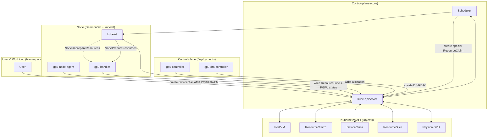

# Техническое задание: GPU Provisioning + DRA Driver (Kubernetes ≥ 1.34)

Документ предназначен как **самодостаточное ТЗ** и одновременно как **Implementation Guide** для последующей генерации кода (GPT‑5.2 Codex) и реальной разработки.

---

## 0. Контекст и ключевые принципы

### 0.1 Базовые принципы дизайна (фиксируем как “не обсуждается”)

1. **As simple as possible**: минимум сущностей и минимум “своих велосипедов”, максимум стандартных Kubernetes‑механик.
2. **Одна ответственность — один компонент** (SRP): если компонент начинает делать “и инвентарь, и аллокацию, и драйверы” — это повод резать.
3. **Каноничный путь**: DRA как единственный путь аллокации GPU, чтобы:
   - нормальные квоты “по классам”;
   - Partitionable devices + shared counters (KEP‑4815) для MIG и похожих кейсов;
   - единый путь для контейнеров и VM (через подготовку устройства на ноде).

### 0.2 Факты и ограничения (из вводных)

- Kubernetes **с 1.34**.
- DRA API: `resource.k8s.io/v1`. Extended resources (KEP‑5004) **используем в v0**.
  - включаем `DeviceClass.spec.extendedResourceName` и опираемся на scheduler‑создаваемые ResourceClaim.
- Включены feature gates: `DRAPartitionableDevices` (KEP‑4815), `DRAConsumableCapacity` (KEP‑5075), `DRAExtendedResource` (KEP‑5004).
- **CDI включаем** на рантайме (containerd/CRI‑O).
- Для VM (KubeVirt) предполагаем **CDI + QEMU hook**.
- Пользовательский UX должен быть “на годы”, без постоянных изменений.
- NVIDIA:
  - В v0 инсталлер драйвера **опционален**: сначала делаем “валидатор/сигнализацию”, потом автоматизацию установки.
- Требуемые режимы выдачи:
  - `Physical` (контейнеры: CUDA)
  - `MIG` (контейнеры: CUDA, MIG partition)
  - `VFIO` — опция `Physical` при эксклюзивной аллокации (по аннотации Pod)

---

## 1. Цели и не‑цели (v0)

### 1.1 Цели (v0)

1. **Инвентаризация физики**: появление/исчезновение GPU → отражено в `PhysicalGPU` CR.
2. **Единый механизм выдачи**: DRA (ResourceSlice/DeviceClass/ResourceClaim), без отдельного “GPU CRD как сущности выдачи”.
3. **Partitionable devices (KEP‑4815)**:
   - для MIG — shared counters (например `memory`, `memorySlice0..N`, `multiprocessors`, `copy-engines` и т.п.) и набор “виртуальных устройств‑оферов” под профили;
4. **Collaborative sharing (KEP‑5075)**:
   - TimeSlicing/MPS реализуем через consumable capacity `sharePercent` + `allowMultipleAllocations`;
5. **Динамическая подстройка под claim**:
   - при подготовке ресурса (NodePrepare) нода может переключить режим карты (enable MIG), если карта свободна;
   - VFIO включается только по аннотации Pod и только при эксклюзивной аллокации;
   - режим не задается пользователем через CRD (“desiredMode” **не вводим**).
6. **UX (v0, основной путь через Extended Resources)**:
   - Админ создаёт **DeviceClass** напрямую (DRA) и задаёт `spec.extendedResourceName`.
   - Пользователь запрашивает extended resource в Pod (`resources.requests/limits`).
   - Scheduler сам создаёт “special” ResourceClaim и пишет allocation.
   - **ResourceClaimTemplate** используем только когда нужны per‑claim параметры (например `sharePercent` для TimeSlicing/MPS).
   - `GPUClass` — **после v0** (v1, как «сахар» для админов).
7. **Observability**:
   - PhysicalGPU состояние и capabilities.
   - DRA‑аллокации и их метаданные (claim/pod/node).
   - NVIDIA: поддержка DCGM + DCGM Exporter как стандартного способа метрик (deploy & wiring).

### 1.2 Не‑цели (v0)

- Полноценный “GPU marketplace” с кастомными scheduler‑extender’ами, GPUConsumer и т.д. — **не делаем**, это заменяет DRA.
- Автоматическая установка драйверов по умолчанию — **не делаем** (только валидатор и сигнализация; инсталлер — как следующий этап).
- Полный FinOps “процент утилизации по подам” с точным attribution до контейнера — **не обещаем** в v0; в v0 даем:
  - “кто держит allocation” (ResourceClaim/Pod),
  - “как загружена физика” (DCGM),
  - базовые метрики времени аллокации/кол-ва выделений на класс.

---

## 2. Архитектура (целевое “каноничное” решение)

### 2.0 Принципы проектирования (почему так устроено)

**Главная идея:** собрать систему из независимых и простых компонентов, которые общаются только через API Kubernetes и DRA‑объекты, чтобы:
1) каждая часть делала один маленький кусок работы;
2) изменения были локальными (не ломают остальные части);
3) поведение было предсказуемым и тестируемым.

**Как мы декомпозируем:**
- **Control‑plane** управляет только API‑логикой (CRD lifecycle, генерация DeviceClass, оркестрация DaemonSet’ов).
- **Node‑agents** (thin/thick) делают работу на узлах: thin — инвентарь, thick — DRA publish + prepare/unprepare.
- **DRA allocation controller** отдельно принимает решения о размещении (allocation), не смешивая это с подготовкой устройств.

**Что это дает:**
- Нет “сквозной логики” между инвентарем, аллокацией и драйвером.
- Упростили ответственность: если проблема в инвентаре — лечим node‑agent, если в allocation — лечим allocator.
- Поведение объясняется по шагам, а не через «магические» поля.

**Базовые инженерные правила:**
- **Слои**: domain → ports → adapters → services. Ни один слой не “перепрыгивает” через другой.
- **Handler‑цепочки** для контроллеров: каждый шаг делает одно действие и легко тестируется.
- **StepTaker pipeline** для Prepare/Unprepare: фиксированный порядок шагов, без “условной магии”.
- **Состояние** описывается через статус и conditions. Никаких “desiredMode” в PhysicalGPU.
- **K8s‑API — единственный источник истины**: всё общение через CRD, ResourceSlice, ResourceClaim.

### 2.1 Компоненты

#### A) `gpu-controller` (control-plane, Deployment, leader election)

Ответственность: **оркестрация** компонентов и управление CRD‑логикой.

Состав контроллеров (v0):

1. **AgentOrchestratorController**  
   - Watch: Cluster config (ConfigMap/CRD `GPUOperatorConfig`)  
   - Reconcile: выкатывает на ноды DaemonSet’ы:
     - `gpu-node-agent` (thin)
     - `gpu-handler` (node runtime: capabilities; DRA skeleton)
     - `dcgm` (только NVIDIA)
     - `dcgm-exporter` (только NVIDIA)
     - (в будущем) `driver-installer` (опционально)

2. **Admission Webhook** (опционально, v1+)  
  - В v0 **не требуется**: основной путь — Extended Resources без мутаций Pod.

**GPUClassController (v1, future):**  
- Watch: `GPUClass` (наш CRD)  
- Reconcile: создаёт/обновляет `DeviceClass` (DRA) + публикует параметры драйверу через `spec.config`.
- `extendedResourceName` — обязателен для UX через extended resources (в v1 включаем автоматически).

> Важно: control-plane **не участвует** в выдаче GPU в workload напрямую. Это делает DRA driver.

#### B) `gpu-node-agent` (thin-agent, DaemonSet на всех нодах кроме control-plane)

Ответственность: **только физическое обнаружение PCI и создание/удаление `PhysicalGPU` CR**.

- Сканирает `/sys/bus/pci/devices`.
- Находит GPU по class code (`0x0300` / `0x0302`) и vendor id (v0: только `10de`).
- Создает/патчит `PhysicalGPU`:
  - status.pciInfo.*
  - status.nodeInfo.*
  - labels: node/vendor/device (нормализованное имя)
- Заполняет `currentState.driverType` из binding драйвера (sysfs).
- Удаляет `PhysicalGPU`, если устройство исчезло (с финалайзером/garbage safety, см. ниже).
- Триггеры синхронизации (event‑driven):
  - udev netlink: события `SUBSYSTEM=pci` (горячее добавление/удаление PCI).
  - K8s watch: `PhysicalGPU` delete на своей ноде → пересоздание.
  - Один стартовый sync при запуске; дальше только по событиям.

#### C) DRA stack (control-plane + node runtime)

Состоит из двух под‑компонентов:

1. **`gpu-dra-controller`** (Deployment, leader election)  
   Ответственность: **аллокация** `ResourceClaim` → выбор устройства(устройств) из `ResourceSlice`, запись `ResourceClaim.status.allocation`.

2. **`gpu-handler`** (DaemonSet на GPU‑нодах или на всех нодах)  
   Ответственность (в фазе DRA):
   - **публикация ResourceSlice** (инвентарь и оферы)
   - **NodePrepareResources/NodeUnprepareResources**:
     - MIG create/delete
     - VFIO bind/unbind
     - генерация CDI spec (контейнеры и virt-launcher)
     - (для VM) подготовка артефактов для QEMU hook

> В v0 эти компоненты присутствуют как каркас (**skeleton only**) и включаются в отдельной фазе DRA.

#### D) DCGM + DCGM Exporter (NVIDIA)

- `dcgm` DaemonSet собирает метрики с GPU.
- `dcgm-exporter` DaemonSet отдает метрики в Prometheus.
- Оператор разворачивает/конфигурирует, но **не делает** сам сбор метрик.

---

### 2.2 Сквозной поток (end-to-end)

#### 2.2.1 Инвентарь

1) `gpu-node-agent` на ноде обнаруживает PCI GPU (udev + watch delete) → создаёт `PhysicalGPU` CR.  
2) `gpu-handler` читает `PhysicalGPU` своей ноды и, когда `DriverReady=True`, обогащает `PhysicalGPU.status` через vendor backend (NVML/ROCm/Intel). Публикация `ResourceSlice` включается в фазе DRA.

#### 2.2.2 UX (v0, основной): DeviceClass → Extended Resource → Pod

1) Админ создаёт **DeviceClass** (DRA) и задаёт `spec.extendedResourceName`.
2) Пользователь запрашивает extended resource в Pod (`resources.requests/limits`).
3) Scheduler сам создаёт “special” `ResourceClaim` и пишет allocation.

#### 2.2.3 UX (v0, опционально): ResourceClaimTemplate для `sharePercent`

1) Пользователь создаёт **ResourceClaimTemplate** с `deviceClassName`, `count` и `capacity.requests.sharePercent`.
2) Pod ссылается на template через `spec.resourceClaims`.

#### 2.2.4 Allocation + Prepare

1) `gpu-dra-controller` видит `ResourceClaim` без allocation → выбирает конкретные DRA‑devices из ResourceSlice и пишет allocation.
2) Scheduler выбирает ноду, kubelet вызывает `NodePrepareResources` у `gpu-handler`.
3) `gpu-handler`:
   - обеспечивает правильный режим карты **по типу запрошенного устройства** (Physical/MIG),
   - при аннотации `gpu.deckhouse.io/vfio: "true"` и эксклюзивной аллокации
     выполняет VFIO bind (режим Physical),
   - создаёт реальные артефакты (MIG GI/CI; mdev device — **v1**),
   - генерит CDI spec,
   - (для VM) пишет “hook input” (json/yaml) для QEMU hook.
4) Workload стартует. На Unprepare всё очищается.

### 2.3 Логика работы проекта (как части складываются в одно целое)



**Кто с кем говорит:**
- Все компоненты общаются **только через Kubernetes API**. Никаких прямых RPC между pod’ами.
- Node‑agent пишет `PhysicalGPU.status` → gpu‑controller и gpu‑handler используют это как базу.
- DeviceClass + extended resource request — это цепочка UX (админ → пользователь → scheduler).
- ResourceSlice — единственная “витрина” устройств для scheduler/DRA allocator.

**Правило витрины (v0):**
- Публикуем в ResourceSlice **потенциальные офферы** на основе `PhysicalGPU.capabilities`.
- Аллокатор выбирает **только** из ResourceSlice.
- Реальная нарезка/переконфигурация выполняется **только** в `NodePrepare/NodeUnprepare`, затем gpu‑handler репаблишит ResourceSlice.

**Последовательность работы (упрощенно):**
1. `gpu-node-agent` обнаруживает PCI и создает/обновляет `PhysicalGPU`.
2. `gpu-handler` читает `PhysicalGPU`, формирует оферы и публикует `ResourceSlice`.
3. Админ создает `DeviceClass` (DRA) с `spec.extendedResourceName` и нужными селекторами.
4. Пользователь создает Pod с extended resource request.
5. Scheduler создает “special” `ResourceClaim`, `gpu-dra-controller` allocates → выбирает оферы из `ResourceSlice`.
6. kubelet вызывает `NodePrepareResources` у `gpu-handler` → реальное создание MIG или VFIO (если аннотация и эксклюзивный режим) + CDI.
7. При завершении workload выполняется `NodeUnprepareResources` и cleanup.

**Гарантии инвариантов:**
- Совместимость режимов (Physical/MIG) enforced в allocation‑логике.
- Нода никогда не “режет карту” без реального запроса (действие происходит только в NodePrepare).
- Любая информация “для человека” — в статусе/метриках, без скрытых side‑effects.

---

## 3. Почему мы НЕ делаем CRD `GPU` (и что будет вместо этого)

### 3.1 Проблема GPU CRD в DRA‑мире

Если DRA уже создает:
- `ResourceSlice` (витрина оферов),
- `ResourceClaim` (учёт allocation и “кто занял”),

то отдельный CRD `GPU` становится:
- дублированием источника истины,
- источником рассинхронизации,
- ещё одной сущностью, которую нужно согласовывать с claim lifecycle.

### 3.2 Оптимальный v0‑вариант

**В v0 CRD `GPU` не вводим.**  
Вместо этого:

- “Кто занял” и “что именно занял” берём из `ResourceClaim.status.allocation` + Pod metadata.
- “Что в физике” берём из `PhysicalGPU`.
- “Утилизация” берём из DCGM exporter (NVIDIA) и аналогов для других вендоров.
- Для FinOps/аудита добавляем метрики и события:
  - `gpu_dra_allocations_total{class=..., node=..., deviceType=...}`
  - `gpu_dra_allocation_seconds_total{...}`
  - события на ResourceClaim/PhysicalGPU (allocation created/released, prepare failed).

---

## 4. API: CRD `PhysicalGPU` (v1alpha1)

### 4.1 Назначение

`PhysicalGPU` = **инвентарь физической карты**, единый объект, который:
- появляется/исчезает вместе с PCI устройством,
- хранит health и driver readiness,
- хранит snapshot capabilities, на основе которых строим ResourceSlice.

### 4.2 Схема (предлагаемая)

```yaml
apiVersion: gpu.deckhouse.io/v1alpha1
kind: PhysicalGPU
metadata:
  name: <nodeName>-<index>-<vendorID>-<deviceID>   # стабильное имя
  labels:
    gpu.deckhouse.io/node: <nodeName>
    gpu.deckhouse.io/vendor: <nvidia|amd|intel>
    gpu.deckhouse.io/device: <a30-pcie>    # нормализованное имя
spec: {} # v0: desired-state отсутствует принципиально
status:
  nodeInfo:
    nodeName: <string>
    os:
      id: <string>
      version: <string>
      name: <string>              # необязательно
    kernelRelease: <string>       # uname -r
    bareMetal: <bool>

  pciInfo:
    address: "0000:02:00.0"
    class:
      code: "0302"
      name: "3D controller"
    vendor:
      id: "10de"
      name: "NVIDIA Corporation"
    device:
      id: "20b7"
      name: "GA100GL [A30 PCIe]"

  # Полный capability snapshot (в рамках доступных источников)
  capabilities:
    productName: "NVIDIA A30"
    memoryMiB: <int>
    vendor: Nvidia|Amd|Intel
    nvidia: # только если vendor: Nvidia
      computeCap: "8.0"
      productArchitecture: "Ampere"
      boardPartNumber: "900-21001-0040-100"
      computeTypes: [FP32, FP64, FP16, BF16, TF32, INT8, INT4, FP8]
      powerLimitMinW: 100
      powerLimitMaxW: 250
      migSupported: true | false
      mig:
        totalSlices: 4
        profiles:               # полный список поддерживаемых профилей (A30)
          - profileID: 14
            name: "1g.6gb"
            memoryMiB: 5949
            sliceCount: 1
            maxInstances: 4
          - profileID: 21
            name: "1g.6gb+me"
            memoryMiB: 5949
            sliceCount: 1
            maxInstances: 1
          - profileID: 5
            name: "2g.12gb"
            memoryMiB: 12032
            sliceCount: 2
            maxInstances: 2
          - profileID: 6
            name: "2g.12gb+me"
            memoryMiB: 12032
            sliceCount: 2
            maxInstances: 1
          - profileID: 0
            name: "4g.24gb"
            memoryMiB: 24125
            sliceCount: 4
            maxInstances: 1

  # Минимальные условия здоровья
  conditions:
    - type: DriverReady
      status: "True"|"False"|"Unknown"
      reason: <string>
      message: <string>
      lastTransitionTime: <rfc3339>
    - type: HardwareHealthy
      status: "True"|"False"|"Unknown"
      reason: <string>
      message: <string>
      lastTransitionTime: <rfc3339>

  currentState:
    driverType: Nvidia|VFIO|ROCm #и так далее
    nvidia: # здесь именно детализация вендор специфики в зависимости от поля driverType
      gpuUUID: "GPU-..."
      driverVersion: "580.76.05"
      cudaVersion: "13.0"
      powerLimitCurrentW: 165
      powerLimitEnforcedW: 165
      mig:
        mode: Enabled|Disabled|NotAvailable|Unknown # только если поддерживается и читается

````

### 4.2.1 Правила заполнения `currentState`

* `currentState.driverType` заполняется из sysfs (binding драйвера) и **может** появиться до `DriverReady`.
* `currentState.nvidia.*` заполняем **только** при `DriverReady=True` и `currentState.driverType=Nvidia`
  (доступен драйвер/NVML).
* `currentState.nvidia.mig` пишем только если `capabilities.nvidia.migSupported=true`
  и режим читается.
* Если `migSupported=false`, блок `capabilities.nvidia.mig` **полностью отсутствует** (включая `totalSlices`).
* `currentState.nvidia.powerLimitCurrentW` и `powerLimitEnforcedW` пишем только если NVML
  возвращает значения (мВт переводим в Вт).
* VFIO в статусе **не отражаем**: режим включается на `NodePrepare` по аннотации Pod и при эксклюзивной аллокации.

### 4.2.2 Условия заполнения полей `PhysicalGPU.status`

* `nodeInfo` — **по возможности** из `gpu-node-agent`:
  - `os.*` из `/etc/os-release`;
  - `kernelRelease` из `/proc/sys/kernel/osrelease` (эквивалент `uname -r`);
  - `bareMetal` из DMI‑эвристики.
  Если источник недоступен — поле не пишем.
* `metadata.name`: `<nodeName>-<index>-<vendorID>-<deviceID>`, где `index` — порядок по
  отсортированным PCI‑адресам.
* `pciInfo` — всегда из sysfs + `pci.ids`:
  - `class.code`, `vendor.id`, `device.id` из `/sys/bus/pci/devices/<BDF>/*`;
  - `class.name`, `vendor.name`, `device.name` — по `pci.ids` (если нет — поле не пишем).
* `currentState.driverType` — из sysfs, при наличии binding.
* `currentState.nvidia.*` — **только** при `DriverReady=True` (доступен драйвер/NVML).
* `capabilities` — **только** при `DriverReady=True` (NVML доступен); все поля внутри пишем без дополнительных оговорок.
  Для NVIDIA power limit берём из NVML `DeviceGetPowerManagementLimitConstraints` и пишем в Вт.
* `capabilities.nvidia` пишем только если `capabilities.vendor=Nvidia`.
* `conditions`:
  - `DriverReady` и `HardwareHealthy` выставляет валидатор (как в gpu-control-plane);
  - до результата валидатора — `Unknown`;
  - при ошибке — `False` с `reason`/`message`.

### 4.3 Важный принцип

* **Нет `spec.desiredMode` / `allowModeSwitch`**.
* Управление режимом происходит **имплицитно по типу аллокации** и выполняется на ноде в `NodePrepareResources`.

---

## 5. API: CRD `GPUClass` (v1, future) — “синтаксический сахар” и долговечный UX

> В v0 **не используем** `GPUClass`. Админ работает напрямую с `DeviceClass`. Этот раздел — для v1.

### 5.1 Задача GPUClass

GPUClass — единственный объект, который админ будет поддерживать годами.

Он описывает:

* **какой тип девайса нужен** (Physical/MIG),
* **какие требования** (device/vendor/minMemory/cc/etc),
* **какая политика sharing** (Exclusive/TimeSlicing/MPS),
* и автоматически превращается в DRA `DeviceClass` (extendedResourceName обязателен для extended resources).

> Важно: VFIO для Physical задаётся аннотацией Pod, отдельного `deviceType` для этого не требуется.

### 5.2 Схема (предлагаемая)

```yaml
apiVersion: gpu.deckhouse.io/v1alpha1
kind: GPUClass
metadata:
  name: nvidia-a30-mig-2g.12gb
spec:
  vendor: Nvidia|Amd|Intel
  deviceType: Physical|MIG

  # Требования (минимально; всё остальное — через селектор/профиль)
  requirements:
    minMemory: 12Gi                # необязательно
    minComputeCapability: "8.0"    # необязательно, формат <major>.<minor>

  # MIG профили (только если deviceType=MIG)
  nvidia:
    mig:
      profile: "2g.12gb"           # required if deviceType=MIG

  # Collaborative sharing (по умолчанию Exclusive)
  sharing:
    strategy: Exclusive|TimeSlicing|MPS
    timeSlicing:
      interval: Default|Short|Medium|Long
    mps:
      defaultActiveThreadPercentage: 1..100
  # Доля задаётся пользователем в ResourceClaim через capacity.requests.sharePercent

  # Где можно брать (селектор по PhysicalGPU labels -> конвертим в CEL по device attributes)
  selector:
    matchLabels:
      gpu.deckhouse.io/vendor: nvidia
      gpu.deckhouse.io/device: a30-pcie
  names: ["node1-0-10de-20b7"]    # необязательный список разрешенных

status:
  valid: true|false
  message: <string>
  generated:
    deviceClassName: <string>
    extendedResourceName: gpu.deckhouse.io/<GPUClassName> # обязательно при UX через extended resources
```

### 5.3 Автогенерация DeviceClass

GPUClassController создаёт DeviceClass:

* `metadata.name = gpuclass.<GPUClassName>` (или тот же name)
* `spec.selector` = CEL выражение по нашим device attributes/capacity
* `spec.config` = opaque параметры для `gpu.deckhouse.io` драйвера (sharing и т.п.)
* `spec.extendedResourceName` — **обязателен** для UX через extended resources (v0).

**Мотивация**: пользователь работает с DRA объектами напрямую; GPUClass остаётся единственной “доменной” сущностью.

---

### 5.4 Extended Resources (v0, основной UX)

Назначение: пользователь запрашивает GPU как extended resource, scheduler сам создаёт “special” `ResourceClaim`.

```yaml
apiVersion: v1
kind: Pod
metadata:
  name: cuda-job
spec:
  containers:
  - name: app
    image: nvidia/cuda:12.4.1-runtime-ubuntu22.04
    resources:
      requests:
        gpu.deckhouse.io/a30: "1"
      limits:
        gpu.deckhouse.io/a30: "1"
```

`gpu.deckhouse.io/a30` — это `DeviceClass.spec.extendedResourceName`
(или implicit `deviceclass.resource.kubernetes.io/<device-class-name>`).

### 5.5 ResourceClaimTemplate (DRA) — опционально

Используем только когда нужны **per‑claim параметры** (например `sharePercent` для TimeSlicing/MPS).

```yaml
apiVersion: resource.k8s.io/v1
kind: ResourceClaimTemplate
metadata:
  name: train-gpu
spec:
  spec:
    devices:
      requests:
      - name: gpu
        exactly:
          deviceClassName: nvidia-a30-mig-2g.12gb
          count: 4
          # capacity:
          #   requests:
          #     sharePercent: "50" # для TimeSlicing/MPS (KEP‑5075)
        # config: []  # необязательно, непрозрачные параметры для драйвера gpu.deckhouse.io
```

---

## 6. DRA: модель данных и ограничения

### 6.1 Ключевые сущности DRA (напоминание)

* `DeviceClass` — “класс устройств” + selector/config.
* `ResourceSlice` — “витрина” доступных устройств на нодах.
* `ResourceClaim` — “заявка” + allocation.
* Extended resources — основной UX в v0 (KEP‑5004).

### 6.2 Где находится `count`?

`count` — это часть запроса устройств (DeviceRequest) в DRA API: “ExactCount … count field”.

В v0 есть два пути:
1) **Extended Resources (основной путь)** — `count` берётся из запроса ресурса в Pod
   (`resources.requests/limits`), scheduler преобразует это в `DeviceRequest.exactly.count`.
2) **ResourceClaimTemplate (опционально)** — `count` задаётся в
   `ResourceClaimTemplate.spec.spec.devices.requests[].exactly.count`.

`sharePercent` (KEP‑5075) задаётся **только** через `ResourceClaimTemplate.spec.spec.devices.requests[].exactly.capacity.requests.sharePercent`
и используется при TimeSlicing/MPS.

---

### 6.3 Labels PhysicalGPU и механизм выбора устройств

* **Выбор устройств делает DRA**, а не `PhysicalGPU`:
  - админ задаёт `DeviceClass` с CEL‑селектором;
  - `gpu-dra-controller` выбирает устройства из `ResourceSlice` по этому селектору и инвариантам.
* **Labels на `PhysicalGPU`** нужны для UX/диагностики и будущего GPUClass (v1),
  но **не участвуют** в аллокации.
* **Labels на Node** используются для простого управления публикацией MIG‑офферов (если нужно отключать MIG на части узлов).

## 7. Таблица атрибутов/капасити/каунтеров в ResourceSlice + CEL

> Это обязательный “Implementation Guide” блок №1.

### 7.1 Ограничения ResourceSlice, которые учитываем

* На device уровне: **attributes + capacity <= 32** ключа суммарно.
* В одном ResourceSlice: **devices <= 128**.
* `sharedCounters` публикуются в **отдельном** ResourceSlice (без `devices`), а `consumesCounters` — внутри `devices` в другом ResourceSlice того же `pool`/`generation` (KEP‑4815).
* `pool.resourceSliceCount` учитывает **оба** ResourceSlice (counter‑slice + device‑slice).

**Что такое counter‑slice и device‑slice:**
* **Counter‑slice** — ResourceSlice, который содержит только `sharedCounters` (общий пул ресурсов физической карты).
* **Device‑slice** — ResourceSlice, который содержит только `devices`, каждый офер указывает `consumesCounters` из counter‑slice.
* Scheduler/allocator считает доступность так: **available = sharedCounters − sum(consumesCounters)**.
* Оба slice относятся к одному `pool` и одной `generation`, поэтому планирование видит их как единый набор данных.

### 7.2 Стандартные ключи (общие для всех вендоров)

| Категория      | Ключ                          |        Тип | Пример           | Назначение                    | Пример CEL‑селектора                                                  |
| -------------- | ----------------------------- | ---------: | ---------------- | ----------------------------- | --------------------------------------------------------------------- |
| attribute      | `gpu.deckhouse.io/vendor`     |     string | `"nvidia"`       | Фильтр вендора                | `device.attributes["gpu.deckhouse.io/vendor"] == "nvidia"`            |
| attribute      | `gpu.deckhouse.io/deviceType` |     string | `"MIG"`          | Physical/MIG                  | `device.attributes["gpu.deckhouse.io/deviceType"] == "MIG"`           |
| attribute      | `gpu.deckhouse.io/device`     |     string | `"a30-pcie"`     | нормализованная модель        | `device.attributes["gpu.deckhouse.io/device"] in ["a30-pcie","a100-pcie"]` |
| attribute      | `gpu.deckhouse.io/pciAddress` |     string | `"0000:02:00.0"` | Диагностика/трейсинг          | `device.attributes["gpu.deckhouse.io/pciAddress"].matches("0000:.*")` |
| capacity       | `memory`                      |   quantity | `24576Mi`        | VRAM минимум                  | `device.capacity["memory"].compareTo(quantity("12Gi")) >= 0`          |
| capacity       | `sharePercent`                |   quantity | `50`             | доля для TimeSlicing/MPS (KEP‑5075) | `device.capacity["sharePercent"] >= 10`                         |
| shared counter | `memory`                      |   quantity | `40Gi`           | общий пул памяти              | (используется при подсчете)                                           |
| shared counter | `memorySlice<N>`              |        int | `1`              | MIG‑слайсы (KEP‑4815)         | (используется при подсчете)                                           |

*Примечание:* `sharePercent` используется только при `allowMultipleAllocations` (TimeSlicing/MPS) и задаётся в claim через `capacity.requests`.

### 7.3 NVIDIA‑специфика (nvidia.*)

| Категория      | Ключ                       |    Тип | Пример         | Назначение                              | CEL                                                               |   |                                                                                                   |
| -------------- | -------------------------- | -----: | -------------- | --------------------------------------- | ----------------------------------------------------------------- | - | ------------------------------------------------------------------------------------------------- |
| attribute      | `nvidia.com/gpu.uuid`      | string | `"GPU-..."`    | трассировка                             | `has(device.attributes["nvidia.com/gpu.uuid"])`                   |   |                                                                                                   |
| attribute      | `nvidia.com/driverVersion` | string | `"565.77"`     | диагностика                             | `device.attributes["nvidia.com/driverVersion"].startsWith("565")` |   |                                                                                                   |
| attribute      | `nvidia.com/cc.major`      |    int | `8`            | compute capability                      | `device.attributes["nvidia.com/cc.major"] >= 8`                   |   |                                                                                                   |
| attribute      | `nvidia.com/cc.minor`      |    int | `0`            | compute capability                      | `device.attributes["nvidia.com/cc.major"] > 8                     |   | (device.attributes["nvidia.com/cc.major"] == 8 && device.attributes["nvidia.com/cc.minor"] >= 6)` |
| attribute      | `nvidia.com/mig.profile`   | string | `"2g.12gb"`    | фильтр профиля                          | `device.attributes["nvidia.com/mig.profile"] == "2g.12gb"`        |   |                                                                                                   |
| shared counter | `copy-engines`             |    int | `7`            | копирующие движки (KEP‑4815)            | (используется при подсчете)                                       |   |                                                                                                   |
| shared counter | `decoders`                 |    int | `5`            | декодеры (KEP‑4815)                     | (используется при подсчете)                                       |   |                                                                                                   |
| shared counter | `encoders`                 |    int | `0`            | энкодеры (KEP‑4815)                     | (используется при подсчете)                                       |   |                                                                                                   |
| shared counter | `jpeg-engines`             |    int | `1`            | JPEG (KEP‑4815)                         | (используется при подсчете)                                       |   |                                                                                                   |
| shared counter | `multiprocessors`          |    int | `98`           | SMs (KEP‑4815)                          | (используется при подсчете)                                       |   |                                                                                                   |
| shared counter | `ofa-engines`              |    int | `1`            | OFA (KEP‑4815)                          | (используется при подсчете)                                       |   |                                                                                                   |

### 7.4 DeviceClass selectors (v0)

В v0 админ задаёт CEL‑выражение напрямую в `DeviceClass.spec.selectors`.
Пример фрагмента DeviceClass:

```yaml
spec:
  selectors:
  - cel:
      expression: |
        device.attributes["gpu.deckhouse.io/vendor"] == "nvidia" &&
        device.attributes["gpu.deckhouse.io/deviceType"] == "MIG" &&
        device.attributes["gpu.deckhouse.io/device"] == "a30-pcie" &&
        device.attributes["nvidia.com/mig.profile"] == "2g.12gb"
```

> Для классов с TimeSlicing/MPS можно добавить селектор `device.allowMultipleAllocations == true`.
> В v1 (future) `GPUClass` будет генерировать такие selectors автоматически.

---

### 7.5 Публикация ResourceSlice (KEP‑4815 + KEP‑5075)

**Что делает reference DRA kubelet‑plugin:**
* Стартует kubelet DRA plugin и публикует ResourceSlice через `PublishResources` из in‑memory списка устройств.
* Инвентаризация через NVML:
  - если MIG выключен — публикует Physical GPU;
  - если MIG включен — публикует только существующие MIG‑устройства;
  - VFIO публикует только когда MIG не включен и prechecks пройдены.
* Для MIG профиля добавляет capacity `memorySlice<N>` по placements.
* Использует CDI: базовый spec при старте + per‑claim spec на Prepare.
* Хранит checkpoint подготовленных claim’ов, Prepare/Unprepare идемпотентны.
* Сериализует Prepare/Unprepare на ноде через lock‑file.
* Динамический MIG в реализации отсутствует (TODO).

**Как делаем мы (для динамического провиженинга):**
* Публикуем офферы **только** для `PhysicalGPU` с `DriverReady=True` и `HardwareHealthy=True`.
* В device‑slice **всегда** есть оффер Physical; отдельный ResourceSlice для Physical не делаем.
* Публикуем **потенциальные оферы** для Physical/MIG одновременно,
  если карта поддерживает эти режимы.
* **SharedCounters и devices публикуем в разных ResourceSlice** (KEP‑4815),
  но в одном `pool`/`generation` и с общим `resourceSliceCount`.
* Публикация ResourceSlice делается через kubelet DRA plugin helper, pool = `nodeName`.
* **Counter‑slice** (только `sharedCounters`):
  - `memory`, `memorySlice0..N`, `multiprocessors`, `copy-engines`, `decoders`,
    `encoders`, `jpeg-engines`, `ofa-engines`.
* **Device‑slice** (только `devices`):
  - каждый офер содержит `consumesCounters` и ссылается на counterSet.
* **Collaborative sharing (TimeSlicing/MPS)**:
  - для оффера `Physical` выставляем `allowMultipleAllocations: true`;
  - публикуем capacity `sharePercent` с `requestPolicy` (min=1, max=100, step=1, default=100);
  - пользователь задаёт долю через `capacity.requests.sharePercent` в claim.
* **VFIO — это опция Physical, а не отдельный оффер**:
  - включается **только** по аннотации Pod `gpu.deckhouse.io/vfio: "true"`;
  - требует **эксклюзивной** аллокации;
  - допускается **только** на bare‑metal (см. `nodeInfo.bareMetal`).
  - после Prepare выполняем репаблиш ResourceSlice (исключаем siblings).
* **Как определяем bare‑metal (в `gpu-node-agent`):**
  - читаем `/sys/class/dmi/id/product_name` и `/sys/class/dmi/id/sys_vendor`;
  - эвристика “VM”: значения содержат `KVM`, `VMware`, `VirtualBox`, `QEMU`, `Bochs`, `Xen`, `Amazon EC2`, `Google`, `Microsoft Corporation`, `OpenStack`;
  - если DMI недоступен → считаем **VM** (fail‑closed);
  - результат пишем в label `gpu.deckhouse.io/baremetal=true|false`.
* **OS/Kernel для driver‑installer (в `gpu-node-agent`):**
  - читаем `/etc/os-release` → `ID` и `VERSION_ID`;
  - читаем `/proc/sys/kernel/osrelease` → версия ядра;
  - пишем в node‑лейблы:
    - `gpu.deckhouse.io/os.id`
    - `gpu.deckhouse.io/os.version`
    - `gpu.deckhouse.io/kernel.version`
* **Декларативные node‑лейблы для управления публикацией оферов:**
  - `gpu.deckhouse.io/allow-mig=true|false` (по умолчанию: true, если MIG поддерживается);
  - Physical публикуем всегда; MIG — только при разрешении лейблом.
* **Аллокатор** группирует устройства по `physicalGPU` и не допускает смешивания
  типов на одной карте (invariant).
* `NodePrepare` **включает MIG и создаёт GI/CI** только если карта свободна и
  аллокация требует MIG.

**Итог:**
* Scheduler видит все потенциальные режимы,
* но реальные изменения на ноде происходят только при allocation,
* и мы не допускаем конфликтов между Physical и MIG.

### 7.6 Формат ResourceSlice (что именно публикуем)

**Пример: NVIDIA A30 (4 MIG‑слайса)**

**Counter‑slice (только `sharedCounters`):**

```yaml
apiVersion: resource.k8s.io/v1
kind: ResourceSlice
metadata:
  name: gpu-<node>-counters
spec:
  driver: gpu.deckhouse.io
  pool:
    name: gpus/<node>
    generation: 1
    resourceSliceCount: 2
  nodeName: <node>
  sharedCounters:
  - name: pgpu-<node>-0000:02:00.0
    counters:
      memory: 24576Mi
      memorySlice0: "1"
      memorySlice1: "1"
      memorySlice2: "1"
      memorySlice3: "1"
      multiprocessors: "56"
      copy-engines: "4"
      decoders: "2"
      encoders: "0"
      jpeg-engines: "0"
      ofa-engines: "0"
```

**Device‑slice (только `devices`):**

```yaml
apiVersion: resource.k8s.io/v1
kind: ResourceSlice
metadata:
  name: gpu-<node>-devices
spec:
  driver: gpu.deckhouse.io
  pool:
    name: gpus/<node>
    generation: 1
    resourceSliceCount: 2
  nodeName: <node>
  devices:
  - name: gpu0-physical
    attributes:
      gpu.deckhouse.io/vendor: "nvidia"
      gpu.deckhouse.io/device: "a30-pcie"
      gpu.deckhouse.io/deviceType: "Physical"
    capacity:
      memory: 24576Mi
      # Для TimeSlicing/MPS публикуем sharePercent и allowMultipleAllocations
      sharePercent:
        value: "100"
        requestPolicy:
          default: "100"
          validRange:
            min: "1"
            max: "100"
            step: "1"
    allowMultipleAllocations: true # только при TimeSlicing/MPS
    consumesCounters:
    - counterSet: pgpu-<node>-0000:02:00.0
      counters:
        memory: 24576Mi
        memorySlice0: "1"
        memorySlice1: "1"
        memorySlice2: "1"
        memorySlice3: "1"
        multiprocessors: "56"
        copy-engines: "4"
        decoders: "2"
        encoders: "0"
        jpeg-engines: "0"
        ofa-engines: "0"
  - name: gpu0-mig-2g.12gb-0-1
    attributes:
      gpu.deckhouse.io/vendor: "nvidia"
      gpu.deckhouse.io/device: "a30-pcie"
      gpu.deckhouse.io/deviceType: "MIG"
      nvidia.com/mig.profile: "2g.12gb"
    capacity:
      memory: 12032Mi
    consumesCounters:
    - counterSet: pgpu-<node>-0000:02:00.0
      counters:
        memory: 12032Mi
        memorySlice0: "1"
        memorySlice1: "1"
        multiprocessors: "28"
        copy-engines: "2"
        decoders: "2"
        encoders: "0"
        jpeg-engines: "0"
        ofa-engines: "0"
```

**Примечания:**
- `allowMultipleAllocations` и `sharePercent` публикуем **только** для режимов TimeSlicing/MPS.
- Для Exclusive режима эти поля не публикуем.
- `memorySlice<N>` в MIG‑оффере вычисляется из профиля MIG (NVML/driver), в CRD эти `placements` не храним.

---

### 7.6 Как посмотреть ResourceSlice в кластере

```bash
# список всех ResourceSlice (ресурс кластерный)
kubectl get resourceslices

# полный YAML конкретного слайса
kubectl get resourceslices <slice-name> -o yaml

# краткая сводка по драйверу/ноде/кол-ву devices
kubectl get resourceslices -o json | jq -r '
  .items[]
  | select(.spec.driver=="gpu.deckhouse.io")
  | [.metadata.name, .spec.nodeName, (.spec.devices | length)]
  | @tsv'

# devices конкретного слайса
kubectl get resourceslices <slice-name> -o json | jq '.spec.devices'
```

## 8. DRA driver: логика режимов (Physical/MIG)

### 8.1 Главная гарантия (safety invariant)

Для одной `PhysicalGPU` в любой момент времени:

1. Если есть allocation `MIG` → **разрешены только MIG allocations** (включая разные MIG профили).
2. Если есть allocation `Physical`:
   - при `Exclusive` → **эксклюзивно**;
   - при `TimeSlicing/MPS` → допускаем **несколько Physical** с одинаковой стратегией и параметрами.
3. VFIO — это **режим Physical**, включаемый по аннотации Pod и только при `Exclusive`.

Эта гарантия enforced на уровне **gpu-dra-controller allocation logic**, а не через пользовательские CRD “desiredMode”.

### 8.2 Как достигаем “динамически под claim”

* Пользователь выбирает тип девайса через `DeviceClass` (v0).
* Тип устройства определяется по выбранному офферу (атрибут `deviceType`), config берётся из DeviceClass.
* NodePrepare на ноде переключает режим карты (если нужно) **только если карта свободна** (нет активных allocations и нет “внешних” клиентов — проверяется через vendor backend).

---

## 9. Реализация DRA: как мы это проектируем “по‑кубернетисовски”

> Статус реализации: **skeleton only**. Каркас DRA присутствует в коде, но фактическая реализация allocation/publish/prepare включается в отдельной фазе.

### 9.1 `gpu-dra-controller`: Allocation Controller

**Watch**:

* `ResourceClaim` (и `ResourceClaimTemplate` если нужно для диагностик)
* `DeviceClass`
* `ResourceSlice`

**Reconcile (высокоуровнево)**:

1. Если claim уже allocated → exit.
2. Определить запрошенный `DeviceClass` (через claim spec; extended-resource mapping используем в v0).
3. Список кандидатов:

   * все ResourceSlices с `spec.driver == gpu.deckhouse.io`
   * все устройства, удовлетворяющие DeviceClass.selector (CEL)
4. Группируем кандидатов по `physicalGpuId` (атрибут/часть имени counterSet).
5. Для каждого physicalGpuId:

   * берём sharedCounters из counter‑slice того же `pool`/`generation`;
   * вычисляем потребление по уже выделенным claims (по allocation status) и consumesCounters;
   * если `allowMultipleAllocations=true`, считаем доступный `sharePercent` по `consumedCapacity` и применяем `requestPolicy` (min/max/step);
   * проверяем safety invariant (типовая совместимость: MIG vs Physical).
6. Выбираем лучший кандидат (стратегия v0):

   * **BestFit по числу memorySlice**, затем по memory, затем stable tie-break (pciAddress lexicographically).
7. Пишем `ResourceClaim.status.allocation` (SSA/status patch), включая `consumedCapacity` и `shareID` для shared‑устройств.
8. В случае гонок — retry на conflict.

### 9.2 `gpu-handler`: Node plugin

**Функции**:

* старт kubelet DRA plugin helper (driver name, plugin data dir, registrar dir);
* публикация ResourceSlice через helper (pool = `nodeName`);
* CDI: базовый spec при старте + per‑claim spec на Prepare;
* NodePrepare:

  * выполняет “mutation” хоста:

    * MIG: enable MIG (если нужно), create GI/CI
    * Physical + аннотация `gpu.deckhouse.io/vfio: "true"`: bind VFIO (только при `Exclusive`)
    * TimeSlicing/MPS: применяет `sharePercent` по `shareID` из allocation
  * генерирует CDI spec
  * (VM) генерирует QEMU hook input
  * обновляет checkpoint (PrepareStarted/PrepareCompleted)
* NodeUnprepare:

  * reverse операции, cleanup, rebind drivers при необходимости.
  * обновляет checkpoint и репаблишит ResourceSlice при необходимости
* сериализация Prepare/Unprepare через lock‑file на ноде.

### 9.3 Почему в ResourceSlice мы публикуем “оферы”, а не реальные устройства

Это и есть смысл Partitionable devices: в **пуле ResourceSlice** есть отдельный counter‑slice с `sharedCounters` и device‑slice с “виртуальными устройствами”, каждое из которых описывает, сколько ресурсов оно потребляет (`consumesCounters`).

---

## 10. Go‑интерфейсы и скелеты reconcile (Implementation Guide блок №2)

> Это обязательный блок “для Codex”.

### 10.1 Доменные интерфейсы (скелет)

```go
// VendorBackend — единая точка расширения на NVIDIA/AMD/Intel.
type VendorBackend interface {
    Name() string // варианты: "nvidia" | "amd" | "intel"

    // Обнаружение и инвентаризация
    Discover(ctx context.Context) ([]PhysicalDevice, error)
    EnrichPhysicalGPUStatus(ctx context.Context, dev PhysicalDevice) (VendorStatus, error)

    // Формирование DRA оферов для этой карты (Physical/MIG)
    BuildOffers(ctx context.Context, dev PhysicalDevice, want WantedProfiles) ([]DeviceOffer, CounterSet, error)

    // Prepare/Unprepare (подготовка/очистка) реального устройства на ноде для аллокации
    Prepare(ctx context.Context, req PrepareRequest) (PrepareResult, error)
    Unprepare(ctx context.Context, req UnprepareRequest) error

    // Валидация здоровья/драйвера
    ValidateNode(ctx context.Context, dev PhysicalDevice) ([]Condition, error)
}

type MigManager interface {
    Supported(ctx context.Context, dev PhysicalDevice) (bool, error)
    CurrentMode(ctx context.Context, dev PhysicalDevice) (MigMode, error)
    EnsureMode(ctx context.Context, dev PhysicalDevice, enabled bool) error

    ListProfiles(ctx context.Context, dev PhysicalDevice) ([]MigProfile, error)
    CreateInstance(ctx context.Context, dev PhysicalDevice, profile MigProfile) (MigInstance, error)
    DeleteInstance(ctx context.Context, dev PhysicalDevice, inst MigInstance) error
    ListInstances(ctx context.Context, dev PhysicalDevice) ([]MigInstance, error)
}

type VgpuManager interface {
    Supported(ctx context.Context, dev PhysicalDevice) (bool, error)
    ListTypes(ctx context.Context, dev PhysicalDevice) ([]VgpuType, error)
    CreateMdev(ctx context.Context, dev PhysicalDevice, t VgpuType) (MdevInstance, error)
    DeleteMdev(ctx context.Context, inst MdevInstance) error
}

type VfioBinder interface {
    Bind(ctx context.Context, pciAddress string) (IOMMUGroup, error)
    RebindOriginal(ctx context.Context, pciAddress string) error
    CurrentDriver(ctx context.Context, pciAddress string) (string, error)
}

type ResourceSliceBuilder interface {
    BuildSlices(nodeName string, poolName string, counterSet CounterSet, offers []DeviceOffer) []*resourcev1.ResourceSlice
}
```

### 10.2 Модели (минимально)

```go
type PhysicalDevice struct {
    NodeName    string
    PCIAddress  string // "0000:02:00.0"
    Vendor      string // варианты: nvidia|amd|intel
    ProductName string
    // плюс стабильные ID: GPU UUID для NVIDIA и т.д.
}

type CounterSet struct {
    Name     string            // стабильно для одного PhysicalGPU
    Counters map[string]any     // memory, memorySlice0..N, multiprocessors и т.п.
}

type DeviceOffer struct {
    Name       string // стабильное имя офера внутри ResourceSlice
    DeviceType string // Physical|MIG
    Attributes map[string]any // строка/число/булево
    Capacity   map[string]any // memory, sharePercent (+requestPolicy)
    AllowMultipleAllocations bool
    Consumes   map[string]any // потребление из общих счётчиков
    // плюс vendor подструктура при необходимости (profile/type = профиль/тип)
}

type PrepareRequest struct {
    ClaimUID     types.UID
    PodUID       types.UID
    Offer        DeviceOffer
    DeviceConfig any // декодированный opaque‑config (sharing/совместное использование и т.п.)
    ShareID      *types.UID
    ConsumedCapacity map[string]resource.Quantity
}

type PrepareResult struct {
    CDIArtifacts []CDIArtifact
    // Для VM:
    QemuHookPayload []byte
    // Для диагностики:
    ActualDeviceIDs map[string]string // например MIG UUID, ID GI/CI, UUID mdev
}
```

### 10.3 Kubernetes‑style reconcile циклы (псевдокод)

#### 10.3.1 GPUClassController (v1, future)

```go
func (r *GPUClassReconciler) Reconcile(ctx context.Context, req ctrl.Request) (ctrl.Result, error) {
    gc := &gpuv1alpha1.GPUClass{}
    if err := r.Get(ctx, req.NamespacedName, gc); err != nil {
        return ctrl.Result{}, client.IgnoreNotFound(err)
    }

    // 1) Валидируем spec (быстро, без побочных эффектов)
    issues := ValidateGPUClass(gc.Spec)
    if len(issues) > 0 {
        PatchStatusInvalid(ctx, r.Client, gc, issues)
        return ctrl.Result{RequeueAfter: 30 * time.Second}, nil
    }

    // 2) Рендерим DeviceClass
    extName := MaybeExtendedResourceName(gc) // в v1 используем extendedResourceName всегда
    dc := RenderDeviceClassFromGPUClass(gc, extName)
    // - dc.Spec.Selector = CEL выражение
    // - dc.Spec.Config = opaque параметры для драйвера gpu.deckhouse.io

    // 3) Применяем через Server-Side Apply (SSA), ownerRef -> GPUClass
    if err := ApplyDeviceClass(ctx, r.Client, dc); err != nil {
        return ctrl.Result{}, err
    }

    // 4) Обновляем статус
    PatchStatusValid(ctx, r.Client, gc, dc.Name, extName)
    return ctrl.Result{}, nil
}
```

#### 10.3.2 DRA Allocation Controller (gpu-dra-controller)

```go
func (r *ClaimAllocator) Reconcile(ctx context.Context, req ctrl.Request) (ctrl.Result, error) {
    claim := &resourcev1.ResourceClaim{}
    if err := r.Get(ctx, req.NamespacedName, claim); err != nil {
        return ctrl.Result{}, client.IgnoreNotFound(err)
    }

    if IsAllocated(claim) {
        return ctrl.Result{}, nil
    }

    // 1) Определяем DeviceClass (из claim spec)
    dc, err := ResolveDeviceClass(ctx, r.Client, claim)
    if err != nil {
        // можно повторить, если dc ещё не найден
        return ctrl.Result{RequeueAfter: 2 * time.Second}, nil
    }

    // 2) Берём кандидатов из кеша ResourceSlice
    candidates := r.Inventory.FindCandidates(dc, claim)

    // 3) Выбираем аллокацию с проверкой инвариантов
    alloc, err := r.Allocator.Allocate(claim, candidates)
    if err != nil {
        // нет ёмкости: повторяем (следим за ResourceSlice)
        return ctrl.Result{RequeueAfter: 2 * time.Second}, nil
    }

    // 4) Патчим claim.status.allocation (SSA/status)
    if err := PatchClaimAllocation(ctx, r.Client, claim, alloc); err != nil {
        if apierrors.IsConflict(err) {
            return ctrl.Result{Requeue: true}, nil
        }
        return ctrl.Result{}, err
    }

    return ctrl.Result{}, nil
}
```

#### 10.3.3 Node inventory publisher (gpu-handler loop)

```go
func (p *Publisher) Run(ctx context.Context) error {
    ticker := time.NewTicker(30 * time.Second)
    defer ticker.Stop()

    for {
        select {
        case <-ctx.Done():
            return ctx.Err()
        case <-ticker.C:
            devices := p.backend.Discover(ctx)
            for _, dev := range devices {
                // обновляем статус PhysicalGPU
                status := p.backend.EnrichPhysicalGPUStatus(ctx, dev)
                p.physicalGPUWriter.PatchStatus(ctx, dev, status)

                // собираем ResourceSlice
                want := p.profileResolver.WantedProfiles(ctx) // из DeviceClass в кластере (v0)
                offers, counterSet := p.backend.BuildOffers(ctx, dev, want)
                slices := p.sliceBuilder.BuildSlices(dev.NodeName, "gpus", counterSet, offers)
                p.sliceWriter.ApplyAll(ctx, slices)
            }
        }
    }
}
```

---

### 10.4 Паттерны контроллеров (обязательны)

**1) Composition root (`SetupController`)**
* Файл `<name>/setup.go` (composition root для контроллера).
* Внутри: сбор зависимостей, `eventrecord.NewEventRecorderLogger`, создание сервисов, списка handler’ов.
* `controller.New(..., controller.Options{RecoverPanic, CacheSyncTimeout, UsePriorityQueue, LogConstructor})`.
* Регистрация `indexer.IndexALL(...)`, `r.SetupController(...)`, webhook/metrics (если есть).
* **Почему так:** единая точка wiring снижает расхождения между контроллерами.

**2) Тонкий reconciler**
* Файл `<name>/reconciler.go` (тонкий reconciler).
* Алгоритм: `Resource.Fetch` → `state.New(...)` → `reconciler.NewBaseReconciler(handlers)` → `Resource.Update`.
* `ErrStopHandlerChain` для корректного early‑exit.
* Обновление `status.observedGeneration` — всегда в `Resource.Update`.
* **Почему так:** логика читаема, легко тестируется через handlers.

**3) Resource wrapper**
* `pkg/controller/reconciler/resource.go`: единая логика fetch/status/update/metadata patch.
* Status обновляется через `client.Status().Update`, metadata — через JSONPatch (finalizers/labels/annotations).
* `conditions` из `pkg/controller/conditions` (единая модель статусов/причин).
* **Почему так:** минимум конфликтов и одинаковые update‑паттерны во всех контроллерах.

**4) Handler chain**
* Каждый handler — отдельный файл, один шаг.
* Handler **не** работает с k8s‑клиентом напрямую — только через service.
* Можно реализовать `Finalize()` для post‑update действий.
* **Почему так:** SRP + маленькие unit‑тесты на каждый шаг.

**5) State + Service**
* `internal/state` — снимок только для чтения/вычисления без побочных эффектов.
* `internal/service` — I/O и внешние вызовы (k8s client, filesystem, exec).
* Интерфейсы сервисов — в `pkg/controller/service` (mocks через `moq`).
* **Почему так:** удобная подмена в тестах, отсутствие “скрытого” I/O.

**6) Watchers**
* Каждый watcher — отдельный файл (`internal/watcher/*`).
* Интерфейс: `Watch(mgr, ctr) error`.
* Для зависимостей по ссылкам — `pkg/controller/watchers/ObjectRefWatcher`
  с `UpdateEventsFilter` и `RequestEnqueuer`.
* **Почему так:** чистое разделение энкьюинга и бизнес‑логики.

**7) Indexer**
* `pkg/controller/indexer` хранит `IndexGetters` и `IndexALL`.
* Индексы используют `state` для быстрых list‑операций по связям.
* **Почему так:** стабильные связи и предсказуемая производительность.

**8) Validator checks (v0)**
* Валидатор реализован в `pkg/controller/physicalgpu/internal/service/validator.go`.
* Единый пайплайн валидаторов вынесем в отдельный пакет позже, когда появятся дополнительные проверки.
* **Почему так:** сейчас нужен один валидатор, дальше — унификация.

**9) ResourceBuilder**
* `pkg/common/resource_builder` — сборка k8s объектов (ownerRefs, annotations, finalizers).
* **Почему так:** единый стиль metadata и меньше ручной сборки.

**10) StepTaker pipeline**
* `pkg/common/steptaker` — детерминированные шаги Prepare/Unprepare.
* Используется в `pkg/dra/services/prepare`.
* **Почему так:** предсказуемость и безопасный rollback/cleanup.

**11) testutil**
* `pkg/common/testutil` — общие тестовые helpers (файловые фикстуры и простые утилиты).
* **Почему так:** уменьшает boilerplate в unit‑тестах.

**12) Размер файлов**
* 80–200 LOC на файл, максимум ~300.
* **Почему так:** проще ревью и точечные изменения.

### 10.5 Переиспользование логики reference DRA kubelet‑plugin

Мы **копируем и адаптируем** рабочую логику в наши слои `adapters/services`, а не
встраиваем «как есть» в контроллеры.

**Берём и адаптируем (копируем исходники с Apache header):**
* NVML discovery + device attributes (инвентарь и атрибуты устройств).
* VFIO bind/unbind (перевод PCI в режим passthrough).
* CDI генерация (базовый spec + per‑claim spec).
* Checkpoint manager (идемпотентный Prepare/Unprepare).
* Health monitor (NVML events).
* Формы sharing/MPS/time‑slicing (настройки политики шеринга).

**Не переносим как есть:**
* Контроллер аллокации — у нас отдельный `gpu-dra-controller`.
* Helm templates/deployments — интеграция через шаблоны модуля.
* UX‑слой — основной путь через extended resources, ResourceClaimTemplate нужен только для `sharePercent`.

**Что делаем иначе:**
* Архитектура слоёв: **domain/ports/adapters/services** + описанные здесь паттерны контроллеров.
* Динамический MIG: добавляем create/delete GI/CI и placements, покрываем unit‑тестами.
* vGPU — **не в первой фазе** (v0), переносим в v1 после стабилизации MIG/Physical.
* Конфиги приводим к нашим `DeviceClass`/`ResourceClaimTemplate`.

### 10.6 Уроки из монолитного DRA драйвера (фиксируем, чтобы не повторить)

**Что не так в монолитном подходе (верхнеуровнево):**
* Смешаны слои: доменная логика, NVML, CDI, checkpoint и k8s клиенты живут в одних файлах.
* Дублирование между подсистемами и режимами.
* Мало unit‑тестов на ключевые правила (mapping config → devices, порядок prepare/unprepare).
* Любое изменение тянет цепную реакцию.

**Наши обязательные меры:**
* Жесткое разделение **domain/ports/adapters/services**, запрет на “сквозные” импорты слоев.
* **StepTaker pipeline** для Prepare/Unprepare с фиксированным порядком шагов и тестами на каждый шаг.
* **ResourceBuilder** для сборки k8s объектов (минимум ручной сборки в reconcile).
* **testutil + fakes/mocks** для портов; unit‑тесты на доменные правила.
* `cmd/*` — только wiring, без бизнес‑логики.
* Если понадобится compute-domain — он должен быть набором шагов в общей pipeline, без копипаста ядра.

## 11. Реализация на operator-sdk: репозиторий, команды, структура

### 11.1 Структура модуля (Deckhouse, целевая после миграции)

> Примечание: пока старые компоненты работают, они остаются в репозитории как legacy (`gpu-control-plane-*`, `device-plugin`, `mig-manager`). Мы выключим их в самый последний момент. Ниже структура целевого состояния и точек интеграции.

```
.
├── api/                                         # legacy Go API (текущая версия модуля)
├── build/
│   └── base-images/deckhouse_images.yml         # базовые образы/дигесты для werf
├── crds/                                        # CRD + doc-ru (устанавливаются hook'ами)
├── docs/                                        # документация модуля
├── hooks/                                       # shell hooks (обычно пусто)
├── images/                                      # сборка и runtime-образы
│   ├── gpu-artifact/                            # исходники Go, сборка нескольких бинарников
│   ├── gpu-controller/                          # runtime образ control-plane
│   ├── gpu-node-agent/                          # runtime образ thin-agent
│   ├── gpu-dra-controller/                      # runtime образ DRA controller (skeleton only)
│   ├── gpu-handler/                             # runtime образ node-side handler (capabilities; DRA skeleton)
│   ├── gpu-validator/                           # runtime образ валидатора драйвера (upstream)
│   ├── gfd-extender/                            # runtime образ gfd-extender (upstream)
│   ├── nvidia-dcgm/                             # runtime образ dcgm (upstream)
│   ├── nvidia-dcgm-exporter/                    # runtime образ exporter (upstream)
│   ├── hooks/                                   # Go hooks (module-sdk)
│   └── pre-delete-hook/                         # cleanup hook (CRD + ресурсы)
├── monitoring/                                  # alerts/dashboards/Prometheus rules
├── openapi/                                     # schema ModuleConfig
├── templates/                                   # Kubernetes манифесты
│   ├── bootstrap/                               # bootstrap-компоненты: validator/gfd/dcgm
│   ├── gpu-controller/                          # Deployment + Service + ServiceMonitor + RBAC
│   ├── gpu-node-agent/                          # DaemonSet + RBAC
│   ├── gpu-dra-controller/                      # Deployment + Service + ServiceMonitor + RBAC
│   ├── gpu-handler/                             # DaemonSet + RBAC (capabilities; DRA skeleton)
│   ├── kube-api-rewriter/                       # sidecar helpers
│   ├── kube-rbac-proxy/                         # sidecar helpers
│   └── pre-delete-hook/                         # hook Job + RBAC
├── module.yaml                                  # метаданные модуля
└── werf.yaml                                    # сборка образов
```

**Что где хранится и зачем:**
* `images/` — все Docker-образы модуля. Каждый runtime-образ содержит ровно один бинарник (или upstream binary).
* `images/gpu-artifact` — единый исходник Go; в `/out` кладет несколько бинарников.
* `images/hooks` — Go hooks (module-sdk): установка CRDs, валидация ModuleConfig, TLS, module status.
* `templates/` — Kubernetes-манифесты, по одному подкаталогу на компонент; так проще обновлять/масштабировать независимо.
* `templates/bootstrap` — запускает только upstream компоненты, без нашей бизнес-логики (validator/gfd/dcgm).
* `crds/` — CRD-схемы и doc-ru (включая legacy до полного cutover).
* `build/base-images` — общий pinned набор base image digest, чтобы сборка была воспроизводимой.
* `openapi/` — schema ModuleConfig (валидация + docs).

### 11.2 Структура `images/gpu-artifact` (фактическая, с пояснениями по каждому файлу)

```
images/gpu-artifact/
├── README.md                                    # кратко о сборке и локальном запуске
├── Makefile                                     # генерация/тесты/CRD вывод в ../../crds
├── go.mod                                       # модуль Go (github.com/aleksandr-podmoskovniy/gpu)
├── go.sum                                       # зафиксированные зависимости
├── .golangci.yml                                # статические проверки кода
├── werf.inc.yaml                                # сборка артефакта для werf
├── hack/
│   └── boilerplate.go.txt                       # Apache header для controller-gen
├── api/
│   └── v1alpha1/
│       ├── groupversion_info.go                 # регистрация группы/версии/схемы
│       ├── common_types.go                      # общие enum/типы для CRD
│       ├── physicalgpu_types.go                 # спецификация CRD PhysicalGPU
│       └── zz_generated.deepcopy.go             # автоген deep-copy
├── cmd/
│   ├── gpu-controller/main.go                   # запуск control-plane manager
│   ├── gpu-node-agent/main.go                   # запуск thin-agent на нодах
│   ├── gpu-dra-controller/main.go               # запуск DRA allocation controller
│   └── gpu-handler/main.go                      # запуск node-side handler (capabilities; DRA skeleton)
├── pkg/
│   ├── logger/
│   │   ├── logger.go                              # единый конструктор логгера + интеграция с klog/controller-runtime
│   │   ├── attrs.go                               # slog-атрибуты (err/handler/controller)
│   │   ├── ctx.go                                 # loggers в context
│   │   └── constructor.go                         # LogConstructor для controller-runtime
│   ├── eventrecord/
│   │   └── eventrecorderlogger.go                 # recorder + логирование событий
│   ├── monitoring/
│   │   └── metrics/
│   │       ├── metrics.go                         # базовые описания метрик (namespace)
│   │       ├── promutil/dynamic.go                # динамические метрики (helper)
│   │       ├── promutil/labels.go                 # label helpers (sanitize/wrap)
│   │       └── physicalgpu/
│   │           ├── collector.go                   # Prometheus collector PhysicalGPU
│   │           ├── data_metric.go                 # модель метрик PhysicalGPU
│   │           ├── metrics.go                     # описания метрик PhysicalGPU
│   │           └── scraper.go                     # генерация метрик PhysicalGPU
│   ├── common/
│   │   ├── object/object.go                      # утилиты безопасного fetch из k8s
│   │   ├── patch/patch.go                        # JSONPatch helpers для metadata
│   │   ├── resource_builder/builder.go           # builder для k8s объектов
│   │   ├── steptaker/runner.go                   # шаги pipeline (deterministic)
│   │   └── testutil/
│   │       └── fs.go                             # helpers для файловых фикстур
│   ├── controller/
│   │   ├── conditions/builder.go                 # builder условий (status conditions)
│   │   ├── conditions/manager.go                 # совместимость/обертка для условий
│   │   ├── conditions/stringer.go                # интерфейс типов/причин условий
│   │   ├── reconciler/reconciler.go              # базовый reconcile c цепочкой handler’ов
│   │   ├── reconciler/resource.go                # обертка над k8s-объектом (fetch/update)
│   │   ├── watchers/object_ref_watcher.go        # универсальные watch по ссылкам
│   │   ├── indexer/indexer.go                    # общие индексы для cache
│   │   ├── service/interfaces.go                 # alias-интерфейсы для сервисов
│   │   ├── physicalgpu/setup.go                  # wiring PhysicalGPU controller
│   │   ├── physicalgpu/reconciler.go             # reconciler PhysicalGPU
│   │   ├── physicalgpu/internal/handler/validator.go # conditions DriverReady/HardwareHealthy
│   │   ├── physicalgpu/internal/indexer/node_indexer.go # индексация PhysicalGPU по nodeName
│   │   ├── physicalgpu/internal/state/state.go   # state-снимок для PhysicalGPU
│   │   ├── physicalgpu/internal/service/validator.go # проверка готовности validator pods
│   │   └── physicalgpu/internal/watcher/node_watcher.go # watch Node -> PhysicalGPU (по индексу)
│   ├── dra/                                       # каркас DRA (skeleton only до фазы DRA)
│   │   ├── runtime.go                             # сборка сервисов DRA (allocator/publisher/prepare)
│   │   ├── domain/types.go                        # доменные структуры (snapshot/requests)
│   │   ├── ports/ports.go                         # интерфейсы портов
│   │   ├── adapters/
│   │   │   ├── nvml/inventory.go                  # inventory adapter (noop)
│   │   │   ├── cdi/writer.go                      # CDI writer (noop)
│   │   │   ├── checkpoint/store.go                # checkpoint store (noop)
│   │   │   └── k8s/writers.go                     # k8s writers (noop)
│   │   ├── services/
│   │   │   ├── allocator/service.go               # allocation pipeline (RunOnce)
│   │   │   ├── allocator/service_test.go          # unit-tests allocator service
│   │   │   ├── publisher/service.go               # ResourceSlice builder/publisher
│   │   │   ├── publisher/service_test.go          # unit-tests publisher service
│   │   │   ├── prepare/service.go                 # prepare pipeline (steptaker)
│   │   │   └── prepare/service_test.go            # unit-tests prepare pipeline
│   │   └── kubevirt/hook_writer.go                # VM hook writer (noop)
│   ├── nodeagent/
│   │   ├── agent.go                              # цикл синхронизации thin-agent
│   │   └── internal/
│   │       ├── state/state.go                    # snapshot (NodeInfo, Devices, Expected)
│   │       ├── service/hostinfo.go               # сбор OS/kernel/baremetal
│   │       ├── service/pci.go                    # оркестрация PCI: sysfs reader + pci.ids + фильтры
│   │       ├── service/store.go                  # CRUD для PhysicalGPU (k8s client)
│   │       ├── handler/handler.go                # цепочка шагов + early-stop
│   │       ├── handler/discover.go               # шаг discovery (PCI + hostinfo)
│   │       ├── handler/apply.go                  # шаг upsert PhysicalGPU status/labels
│   │       ├── handler/cleanup.go                # шаг удаления «устаревших» объектов
│   │       ├── handler/apply_test.go             # unit-test для apply
│   │       ├── handler/cleanup_test.go           # unit-test для cleanup
│   │       ├── trigger/trigger.go                # интерфейс источника триггеров
│   │       ├── trigger/udev_pci_linux.go         # udev netlink watcher (SUBSYSTEM=pci, linux)
│   │       ├── trigger/udev_pci_stub.go          # no-op watcher (non-linux)
│   │       ├── trigger/udev_pci_parse.go         # общий парсер uevent payload
│   │       ├── trigger/udev_pci_test.go          # unit-test для парсинга uevent
│   │       ├── trigger/physicalgpu_watch.go      # watch PhysicalGPU delete → sync
│   │       └── service/pci_test.go               # unit-test для PCI scan
│   ├── gpuhandler/
│   │   ├── agent.go                              # цикл синхронизации gpu-handler
│   │   └── internal/
│   │       ├── state/state.go                    # snapshot (All/Ready PhysicalGPU)
│   │       ├── service/physicalgpu.go            # чтение PhysicalGPU по node label
│   │       ├── handler/handler.go                # цепочка шагов + early-stop
│   │       ├── handler/discover.go               # шаг чтения PhysicalGPU
│   │       ├── handler/filter_ready.go           # шаг фильтра DriverReady
│   │       ├── handler/capabilities_stub.go      # заглушка следующей фазы
│   │       ├── handler/filter_ready_test.go      # unit-test фильтрации
│   │       ├── trigger/trigger.go                # интерфейс триггеров
│   │       └── trigger/physicalgpu_watch.go      # watch PhysicalGPU → sync
│   └── sys/
│       ├── hostinfo/
│       │   ├── hostinfo.go                       # низкоуровневое чтение OS/kernel/DMI
│       │   └── hostinfo_test.go                  # unit-test для парсеров hostinfo
│       ├── pci/
│       │   ├── pci.go                            # чтение sysfs /sys/bus/pci/devices + нормализация ID
│       │   └── pci_test.go                       # unit-test для sysfs reader
│       └── pciids/
│           ├── pciids.go                         # парсер pci.ids и резолвер имён
│           └── pciids_test.go                    # unit-test для pci.ids
│           └── testdata/
│               └── pci.ids                       # минимальный pci.ids для тестов
```

**Коротко, как это работает в целом:**
* `gpu-node-agent` собирает PCI + OS/kernel/baremetal и синкает по событиям udev/K8s → пишет `PhysicalGPU.status`.
* `gpu-handler` читает `PhysicalGPU` своей ноды, отбирает `DriverReady` и готовит почву для фазы capabilities (пока без NVML).
* `gpu-controller` оркестрирует компоненты; DeviceClass создаётся админом напрямую (v0), webhook не используется.
* DRA-компоненты (`gpu-dra-controller`, DRA-часть `gpu-handler`) — **skeleton only** до фазы DRA.
* В фазе DRA: `gpu-dra-controller` аллоцирует `ResourceClaim` по `ResourceSlice`.
* В фазе DRA: `gpu-handler` публикует `ResourceSlice` и выполняет prepare/unprepare на ноде.

### 11.3 Взаимодействие компонентов (как получается единый механизм)

* `gpu-node-agent` на ноде обнаруживает PCI GPU и пишет `PhysicalGPU.status` (udev + watch delete).
* `gpu-controller` реагирует на `PhysicalGPU` и оркестрирует daemonset’ы; в v0 DeviceClass создаётся админом напрямую (GPUClass — v1).
* В фазе DRA: `gpu-handler` на ноде публикует `ResourceSlice` и выполняет `NodePrepare/Unprepare` (реальный prepare на хосте).
* В фазе DRA: `gpu-dra-controller` аллоцирует `ResourceClaim` на основе `ResourceSlice` и инвариантов (Physical/MIG, VFIO как опция Physical).
* Bootstrap компоненты (`validator`, `gfd-extender`, `dcgm`, `dcgm-exporter`) не несут нашей логики: они лишь подготавливают окружение и метрики, а модуль принимает их сигнал в conditions/labels.
* `DriverReady` вычисляется `gpu-controller` по готовности Pod’ов `validator` (PodReady). `/run/nvidia/validations` мы **не читаем**.
* `HardwareHealthy` в v0 остаётся `Unknown` до появления отдельного health‑потока.
* Rollout‑гейт: `internal.bootstrap` строится по `PhysicalGPU.conditions` и используется в `gpuControlPlane.bootstrap.affinity`.
  - `validator` запускается на всех узлах с инвентарём.
  - `gfd-extender`/`dcgm`/`dcgm-exporter`/`gpu-handler` запускаются **только** на узлах с `DriverReady=True`.
  - Никаких новых node‑labels: gate основан на списке `kubernetes.io/hostname` внутри `internal.bootstrap`.

### 11.4 Логи, метрики и kube-rbac-proxy

**Логи (единый стандарт):**
* `pkg/logger` использует `github.com/deckhouse/deckhouse/pkg/log` и `slog`.
* Уровень логирования задаётся через ModuleConfig `logLevel` и прокидывается в компоненты через `LOG_LEVEL` (default: `Info`).
* ENV‑параметры:
  - `LOG_LEVEL` (Debug/Info/Warn/Error),
  - `LOG_OUTPUT` (stdout/stderr),
  - `LOG_DEBUG_VERBOSITY` (число для deep debug),
  - `LOG_DEBUG_CONTROLLER_LIST` (список контроллеров для форс‑debug).
* При `logLevel=debug` включаем `PPROF_BIND_ADDRESS=:8081` и выставляем `LOG_DEBUG_VERBOSITY=10`.
* `logger.SetDefaultLogger()` подключает логгер к controller-runtime и klog.
* Каждый controller получает свой scoped‑логгер через `logger.NewControllerLogger(...)`.

**Метрики:**
* Используем `prometheus/client_golang` + `metrics.Registry` от controller-runtime.
* Коллекторы лежат в `pkg/monitoring/metrics/<domain>`, читают данные из cache (без прямых API‑запросов).
* Базовый namespace метрик: `gpu_*` (см. `MetricNamespace = "gpu"`).
* Первый collector — `physicalgpu` (инвентарь) регистрируется в `physicalgpu.SetupController`.
* Эндпоинт метрик живёт в namespace модуля (`d8-gpu-control-plane`), `ServiceMonitor`/`PodMonitor` — в `d8-monitoring`.
* После MVP добавляем операционные метрики:
  - `reconcile_*`, `api_methods_*`, `utils_commands_*` (метки `controller`/`node`);
  - узловые метрики по «железу» берём из DCGM (мы только включаем DS).

**kube-rbac-proxy и TLS:**
* Метрики доступны **только** через `kube-rbac-proxy` sidecar.
* `kube-rbac-proxy` слушает HTTPS, сертификаты берёт из секрета `gpu-control-plane-controller-metrics-tls` (tls.crt/tls.key).
* Авторизация — через `d8:rbac-proxy` ClusterRole (ClusterRoleBinding создаётся для SA контроллера).
* Prometheus скрейпит через `ServiceMonitor` c `scheme: https` и `insecureSkipVerify: true`.
* RBAC на чтение `deployments/prometheus-metrics` прописан в `templates/monitoring-rbac.yaml` для наших deployment’ов.

### 11.5 Скаффолдинг operator-sdk (минимальный)

```bash
operator-sdk init --domain deckhouse.io --repo github.com/aleksandr-podmoskovniy/gpu

operator-sdk create api --group gpu --version v1alpha1 --kind PhysicalGPU --resource --controller
operator-sdk create api --group gpu --version v1alpha1 --kind GPUClass --resource --controller # v1, future
```

---

## 12. Примеры: DeviceClass + Pod/VM (v0)

### 12.1 DeviceClass: NVIDIA A30 MIG 2g.12gb

```yaml
apiVersion: resource.k8s.io/v1
kind: DeviceClass
metadata:
  name: nvidia-a30-mig-2g.12gb
spec:
  extendedResourceName: gpu.deckhouse.io/a30
  selectors:
  - cel:
      expression: |
        device.attributes["gpu.deckhouse.io/vendor"] == "nvidia" &&
        device.attributes["gpu.deckhouse.io/deviceType"] == "MIG" &&
        device.attributes["gpu.deckhouse.io/device"] == "a30-pcie" &&
        device.attributes["nvidia.com/mig.profile"] == "2g.12gb"
```

### 12.2 Extended Resources + Pod (v0 основной UX)

```yaml
apiVersion: v1
kind: Pod
metadata:
  name: cuda-job
spec:
  containers:
  - name: app
    image: nvidia/cuda:12.4.1-runtime-ubuntu22.04
    command: ["bash","-lc","nvidia-smi && sleep 3600"]
    resources:
      requests:
        gpu.deckhouse.io/a30: "1"
      limits:
        gpu.deckhouse.io/a30: "1"
```

### 12.3 ResourceClaimTemplate + Pod (опционально для `sharePercent`)

```yaml
apiVersion: resource.k8s.io/v1
kind: ResourceClaimTemplate
metadata:
  name: train-gpu
spec:
  spec:
    devices:
      requests:
      - name: gpu
        exactly:
          deviceClassName: nvidia-a30-mig-2g.12gb
          count: 1
          # capacity:
          #   requests:
          #     sharePercent: "50" # для TimeSlicing/MPS (KEP‑5075)
---
apiVersion: v1
kind: Pod
metadata:
  name: cuda-job-share
spec:
  resourceClaims:
  - name: gpu
    source:
      resourceClaimTemplateName: train-gpu
  containers:
  - name: app
    image: nvidia/cuda:12.4.1-runtime-ubuntu22.04
    resources:
      claims:
      - name: gpu
```

### 12.4 VM + VFIO (концептуально)

```yaml
apiVersion: v1
kind: Pod
metadata:
  name: vm-vfio
  annotations:
    gpu.deckhouse.io/vfio: "true"
spec:
  containers:
  - name: virt-launcher
    image: kubevirt/virt-launcher:latest
    resources:
      requests:
        gpu.deckhouse.io/a30: "1"
      limits:
        gpu.deckhouse.io/a30: "1"
```

---

## 13. DCGM и метрики

### 13.1 Что разворачиваем

* `dcgm` DaemonSet на NVIDIA‑нодах.
* `dcgm-exporter` DaemonSet на NVIDIA‑нодах.
* Лейблы/селекторы — по `PhysicalGPU.labels.gpu.deckhouse.io/vendor=nvidia`.
* Важно: **мы не пишем собственный код для DCGM**. Это bootstrap‑компоненты, которые раскатываются готовыми templates/образами; модуль лишь задает правила включения и placement.

### 13.2 Что экспортируем мы сами (обязательно)

* `gpu_physicalgpu_info{node, pci, vendor, device, uuid}` = 1
* `gpu_dra_resourceslice_offers{node, physicalgpu, deviceType, profile}` = count
* `gpu_dra_claim_allocations_total{class, deviceType, node}` = gauge
* `gpu_dra_prepare_failures_total{reason, deviceType, vendor}` = counter

### 13.3 Валидаторы и GFD (bootstrap, без собственной логики)

* `gpu-validator` и `gfd-extender` разворачиваются как upstream компоненты.
* Мы не модифицируем их логику: только конфиг/args/placement через templates.
* `gpu-controller` (PhysicalGPU controller) проверяет готовность validator‑pod на ноде и обновляет `PhysicalGPU.conditions`:
  * `DriverReady=True` только когда validator‑pod на ноде Ready.
  * `HardwareHealthy` в v0 остаётся `Unknown` и будет выставляться драйвером/health‑монитором позже.

---

## 14. Критическая оценка “неправильного” подхода (фиксируем, чтобы не вернуться)

### 14.1 Почему `spec.desiredMode` в PhysicalGPU — плохая идея

* Это превращает PhysicalGPU из “инвентаря” в “декларативную конфигурацию”, что:

  * конфликтует с DRA lifecycle (mode должен следовать allocation, а не вручную);
  * усложняет безопасность (кто имеет право менять desiredMode?);
  * создаёт гонки между контроллером и kubelet plugin.

Поэтому:

* PhysicalGPU spec пустой (v0),
* режим — **операционное состояние**, меняется только в NodePrepare.

### 14.2 Почему отдельный GPU CRD для выдачи — не нужен в v0

DRA already gives:

* витрину (`ResourceSlice`),
* аллокацию и “кто занял” (`ResourceClaim`).

Дублировать это в CRD “GPU” — дорого и рискованно.

---

## 15. План работ (v0 → v1)

### 15.1 v0 (MVP)

1. CRD: PhysicalGPU. (DeviceClass — нативный DRA объект, создаётся админом напрямую.)
2. thin-agent:

   * sysfs scan PCI,
   * create/update/delete PhysicalGPU.
3. gpu-controller (оркестрация):

   * выкладка node‑агентов.
4. DRA stack (наш):

   * gpu-dra-controller: allocation
   * gpu-handler: publisher + prepare/unprepare
   * NVIDIA backend: Physical + MIG
5. DCGM + exporter wiring (NVIDIA).
6. Документация и примеры.

### 15.2 v1 (следующий этап)

* GPUClass + GPUClassController (как «сахар» для DeviceClass)
* driver-installer (опционально): сборка/установка драйверов
* расширение vendor backends (AMD/Intel)
* vGPU (первый релиз) + последующее улучшение модели ограничений
* полноценный FinOps attribution (process/cgroup mapping)

---

## 16. Acceptance criteria (что считается “готово”)

1. Подключили GPU к ноде → появился PhysicalGPU в kubectl.
2. Создали DeviceClass (DRA) с `extendedResourceName`.
3. Pod запросил extended resource:

   * scheduler создал special ResourceClaim,
   * claim allocated,
   * pod запускается,
   * в контейнере доступен GPU (CUDA/MIG).
4. VM + VFIO (концептуально):

   * allocation эксклюзивный,
   * vfio bind выполнен,
   * QEMU hook получает корректный payload,
   * VM стартует (в рамках окружения).
5. vGPU (v1):

   * mdev создается,
   * в VM прокидывается,
   * при удалении workload cleanup срабатывает.
6. Метрики:

   * DCGM exporter работает (NVIDIA),
   * наши метрики аллокаций присутствуют.

---
