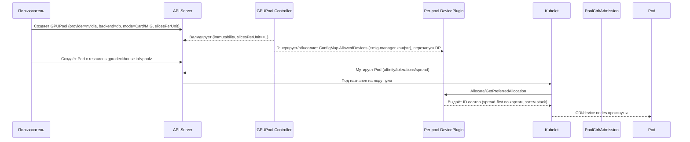
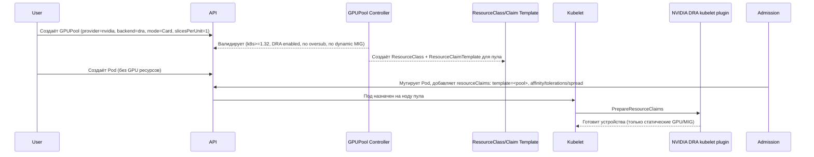
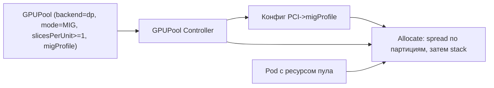

# GPUPool: режимы, бэкенды и требования

## Вендор и бэкенды

- `provider`: сейчас только `nvidia`.
- `backend`: `device-plugin` (по умолчанию) или `dra`.
  - `device-plugin` доступен на всех поддерживаемых версиях k8s.
  - `dra` доступен только при k8s >= 1.32 и включённых фичах DRA; иначе webhook пула отклоняет.

## Режимы аллокации

- `mode=Card` поддерживается в обоих бэкендах.
- `mode=MIG`:
  - `device-plugin`: поддерживаем MIG и MIG+TimeSlicing (переподписка через `slicesPerUnit`, гибкая аллокация в нашем DP).
  - `dra`: только статически нарезанные MIG (без динамической нарезки и без time-slicing/oversubscription; ограничение драйвера).
- `slicesPerUnit` (переподписка) задаётся всегда, дефолт = 1 (эксклюзив). При `backend=dra` и/или `mode=MIG` в DRA переподписка запрещена.
- MPS не закладываем: отсутствует изоляция, требования к hostIPC/UID, лимит клиентов; оставляем только Time Slicing как базовую переподписку.

## Правила селектора/иммутабельности пула

- Иммутабельны после создания: `resource`, `allocation` (mode, migProfile, slicesPerUnit, maxDevicesPerNode), `deviceSelector`, `nodeSelector`, `backend`, `provider`.
- Селектор устройств (include/exclude): `inventoryIDs`, `products`, `pciVendors`, `pciDevices`, `migCapable`, `migProfiles`.
- Валидации пула:
  - `slicesPerUnit >= 1`; `backend=dra` → `slicesPerUnit` должен быть 1; при `mode=MIG` в DRA — только migCapable=true и профиль поддерживается статически.
  - `backend=dra` → версия кластера >=1.32, фича DRA включена.

## Admission и мутации Pod

- Общие проверки: доступ (namespaces/SA/DexGroups), запрос ресурса только для существующего пула, отсутствие Faulted/Ignore устройств, нода не InfraDegraded/HasFaulted.
- Для `device-plugin`:
  - Pod использует `resources.{requests,limits}.gpu.deckhouse.io/<pool>`.
  - Мутация: добавляем nodeSelector/nodeAffinity на узлы пула, tolerations под пуловый taint, topologySpreadConstraints при стратегии Spread. BinPack — без дополнительных хинтов.
  - Разрешаем переподписку: `slicesPerUnit` > 1 → DP публикует слоты; внутри ноды DP стремится разложить слоты по разным картам (spread-first).
- Для `dra`:
  - Pod не задаёт GPU-ресурсы; вместо этого добавляется `resourceClaims` с ссылкой на `ResourceClaimTemplate` пула (один шаблон на пул).
  - Мутация: те же affinity/tolerations/spread-хинты, чтобы ограничить размещение на узлы пула.
  - Запрещаем одновременное использование GPU-ресурса и DRA-клейма одного пула.

## Контроллеры/объекты

- `device-plugin` backend:
  - Пер-пул DaemonSet device-plugin с AllowedDevices, учитывающий `slicesPerUnit` и MIG профиль. MIG-manager общий на ноду с картой PCI→профиль.
- `dra` backend:
  - Генерируем `ResourceClass` и `ResourceClaimTemplate` под пул (Card). MIG допускаем только статический (без переподписки).
  - Полагаться на upstream DRA kubelet plugin; аллокацию/prepare выполняет драйвер NVIDIA.

## Риски и ограничения

- MPS не используем (нет изоляции, требования hostIPC/UID, лимит клиентов).
- DRA сегодня не умеет динамический MIG и oversubscription; для этих сценариев остаёмся на device-plugin.
- Переподписка (Time Slicing) — только через `device-plugin`, с явным контролем числа слотов (`slicesPerUnit`).

## Потоки и последовательности

### Device-Plugin backend (Card/MIG, с переподпиской)

### DRA backend (Card, без переподписки)

### Поток MIG (DP) с переподпиской

